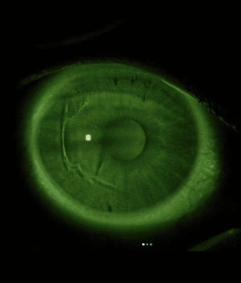

Операция началась, все подготовили, поставили аппарат на глаз и запустили, он резал резал и якобы остановился (со слов врача) по непонятной для них причине. Я спросила на операцию столе не ослепну ли я, врач сказала что нет, такие случаи бывают, через месяц переделаем на фрк. Приложили мне разрезанных кусок глаза обратно чтобы прирастал, но из за глубины его давлением начало выпячивать. Они пытались мягкой линзой прижать но без результатно. Уже сразу мой глаз не видел. Прошёл месяц, к операции меня не допускают, говорят надо ещё покапать капли и наблюдаться. Прошёл второй месяц за который я вообще ослепла. Они даче два месяца спустя к операции не допускают, говорят походи к нам наблюдайся третий месяц, а потом будем принимать решения. Я не согласилась ждать третий месяц и  
полетела в москву. Только там я заехав в зону значка. Видимо врач просто не контролировала процесс а в носу коворяла. В операционной было трое: ещё инженер техник и мед Сестра. Кто виноват будет выяснять СК, может техник неверные параметры ввёл, может медсестра шнур зацепила тли лезвие криво заправили изначально. В любом случае всю ответственность за происходящее Несет врач. Раз такие случаи у них бывают, значит это норма для них  
калечить людей.

Источник: <a href="https://instagram.com/nnninafom" target="_blank" rel="noreferrer noopener">https://instagram.com/nnninafom</a>

&nbsp;