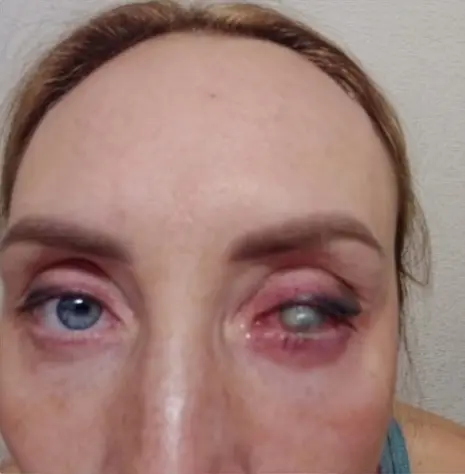

Жительница Оренбурга Ирина хотела улучшить зрение с помощью коррекции, но операция прошла неудачно, и глаз пришлось удалить. Во время операции она испытала сильнейшую боль. Врачи уверили её, что это нормальное явление, и отпустили домой сразу после процедуры. На следующий день состояние ухудшилось, и женщину записали на приём лишь через неделю. Однако к назначенному времени врача не оказалось, и её осмотрели только медсёстры.

<blockquote>
  

    – В августе 2022 года со зрением минус три я решила избавиться от очков и, как обещали, жить спокойно, – <strong>говорит Ирина.</strong> – В сети Интернет, где я постаралась прочитать все, что только можно, писали: это достаточно легкая косметическая процедура, не представляющая никакой опасности.
  

</blockquote>

Положительные отзывы благодарных пациентов различных офтальмологических клиник добавили уверенности. Ирина выбрала для себя, как ей казалось, лучшую. На сайте областной клиники не было негативных комментариев. К тому же она сетевая, имеются филиалы не только в областном центре, но и в других городах. Процедура у девушки опасений не вызывала. Проведенное обследование противопоказаний к хирургическому вмешательству не выявило, и о том, что могут возникнуть какие-то осложнения или воспалительные процессы, доктора не предупреждали. Сама коррекция проходила под местной анестезией. Пока делали&nbsp;левый глаз, лазерная манипуляция казалась достаточно терпимой, а вот с правым явно что-то пошло не так.

<blockquote>
  

    – Как только лазер перешел на другой глаз, сразу возникла ужасная боль, –<strong> вспоминает орчанка.</strong> – Адская резь, которую невозможно было терпеть. Я начала кричать, ноги и руки поджимались. Врачи говорили: «Терпи, сейчас все пройдет, это нормально». Коррекция идет достаточно быстро, примерно шесть минут. После того как я встала с операционного стола, боль в правом глазу не проходила, зрение в нем пропало. Хирург заверял, что у всех организмы разные, так должно быть, просто нужно время. Левый глаз тоже видел мутно, но идти по коридору могла, различала предметы.
  

</blockquote>

Боль не прекратилась и на следующий день, несмотря на все рекомендации врача, выполняемые дома. Не выдержав мучений, Ирина позвонила в клинику и попросила соединить с хирургом, на что получила категорический отказ. Следующий прием только через неделю. Тем временем левый глаз шел на поправку. Ситуация с правым складывалась с точностью до наоборот. Он покраснел. Развивалось сильнейшее воспаление. Пришлось перейти на обезболивающие препараты. На протяжении месяца орчанка ездила в Оренбург каждые три дня. Причем попасть на прием к доктору удавалось далеко не всегда. Порой осмотр проводили сотрудники с ресепшена, делали фото и якобы отправляли специалисту.

На глазу появилось белое пятно, а после повторной операции начался гной и воспаление. Врачи пытались спасти зрение, но после пересадки роговицы глаз лопнул, и женщине пришлось установить протез. В клинике ей предложили 200 тысяч рублей в качестве компенсации и попросили не раздувать скандал, но она&nbsp;<a href="/sudebnye-dela/pyat-millionov-rublej-prosit-vzyskat-orchanka-za-neudachnuyu-operacziyu-korrekczii-zreniya/" target="_blank" rel="noreferrer noopener">решила обратиться в суд</a>.

Источники:   
[Орчанка потеряла глаз после лазерной коррекции зрения][1]  
[Глаз лопнул, зрение пропало. Россиянка потеряла глаз после неудачной коррекции зрения.][2]

[1]: https://orskayagazeta.ru/intervyu/orchanka-poteryala-glaz-posle-lazernoj-korrektsii-zreniya/
[2]: https://dzen.ru/a/Z7w4Vqd1x0HzUMEH
