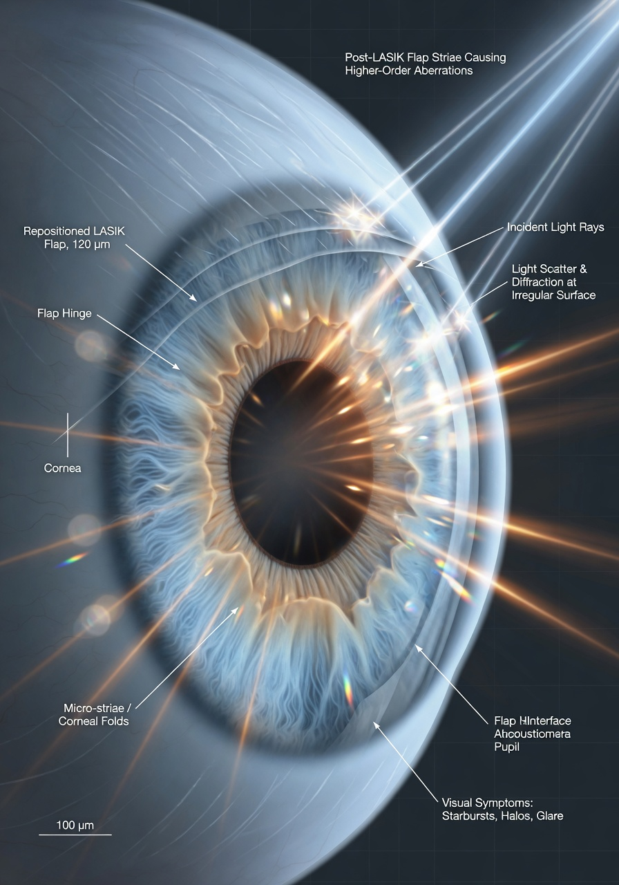

Сдвиг (дислокация) роговичного лоскута после LASIK — одно из самых острых осложнений, которое требует экстренной хирургической помощи. В большинстве случаев лоскут успешно репонизируют — возвращают на место, разглаживают, фиксируют. Зрение постепенно восстанавливается. Казалось бы — всё позади.

Но затем пациент замечает то, чего не было ни до операции, ни сразу после репозиции: **блики, ореолы, засветы и лучи от источников света**. Фары встречных машин превращаются в звёзды, вокруг лампочек в помещении плывут радужные кольца, а ночной городской пейзаж напоминает кадр из фильма с расфокусированной камерой.

Эта статья объясняет, **почему** после смещения лоскута появляются световые искажения, какие механизмы за этим стоят, какие обследования нужно пройти и — главное — что с этим можно сделать.

## Почему после смещения лоскута остаются световые искажения: 6 механизмов

Здоровая роговица прозрачна потому, что её поверхность оптически гладкая, а слои имеют однородный показатель преломления. Вся эта тонкая архитектура нарушается, когда лоскут сдвигается, а затем возвращается на место. Разберём шесть ключевых механизмов.

### 1. Микроскладки (микрострии, striae)

Даже после идеально выполненной репозиции на лоскуте могут остаться микроскладки — тончайшие, иногда невидимые невооружённым глазом волны и заломы. Каждая складка — это **граница раздела сред с разной кривизной**. Свет, проходя через такую границу, преломляется не так, как через гладкую поверхность, — часть лучей отклоняется в сторону, создавая блики, «звёзды» (starbursts) и ореолы.

Микрострии могут быть настолько тонкими, что при обычном осмотре на щелевой лампе их не видно — только при ретроиллюминации (подсветке с отражением от глазного дна) или на оптической когерентной томографии (AS-OCT).

**Ключевой момент:** даже одна-единственная складка, пересекающая оптическую зону (область зрачка), может давать выраженные блики. А если складок несколько — светорассеяние суммируется.

Подробнее о стриях мы писали в отдельной статье: [Складки флэпа и микрострии после LASIK и SMILE](https://korrektsiya-zreniya.github.io/oslozhneniya/skladki-flepa-mikrostrii-lasik-smile/).

### 2. Неровность интерфейса

Интерфейс — это пространство между внутренней поверхностью лоскута и стромальным ложем (поверхностью, с которой его срезали). В норме после LASIK лоскут прилегает к ложу настолько плотно, что интерфейс оптически «исчезает» — свет проходит через него, не рассеиваясь.

После дислокации и репозиции в интерфейс может попасть:

- **Эпителиальные клетки** — с края лоскута, особенно если он был приподнят неаккуратно.
- **Слёзная жидкость** — которая затекает под лоскут и создаёт «озеро» с другим показателем преломления.
- **Воспалительные клетки** — лимфоциты, макрофаги, которые мигрируют в ответ на травму.
- **Микропузырьки воздуха** — оставшиеся после репозиции.

Все эти включения создают участки с **разным показателем преломления**. Свет, попадая на границу такого участка, рассеивается — пациент видит это как блики, дымку или «грязное стекло».

### 3. Эпителиальное врастание

Если при дислокации был нарушен край лоскута (надрыв, неполное прилегание), эпителий с поверхности глаза начинает **врастать под лоскут**. Это состояние называется *эпителиальным врастанием* (epithelial ingrowth).

Эпителиальные островки под лоскутом:

- Имеют другой показатель преломления, чем строма.
- Часто имеют неровные, фестончатые края.
- Могут вызывать локальные возвышения лоскута (приподнимают его изнутри).
- Создают диффузное и фокальное светорассеяние.

Даже если врастание остановилось и не прогрессирует, его оптический «след» в виде бликов может оставаться годами. Подробнее: [Врастание эпителия под лоскут после LASIK](https://korrektsiya-zreniya.github.io/oslozhneniya/vrastanie-epiteliya-pod-loskut-posle-lasik/).

### 4. Иррегулярный астигматизм

После смещения лоскут не всегда возвращается **точно** в ту же позицию и форму, которую занимал изначально. Даже микронное смещение или микроскопическое «сминание» ткани может привести к тому, что поверхность роговицы становится **рябой** — её кривизна различается не по двум перпендикулярным осям (как при обычном астигматизме), а хаотично в разных точках.

Такой иррегулярный астигматизм не исправляется очками. Свет, проходя через «рябую» роговицу, фокусируется не в одну точку на сетчатке, а в несколько — отсюда множественные контуры, размытие и блики вокруг ярких объектов.

### 5. Изменение асферичности (Q-значения)

Здоровая роговица не сферическая — она **асферическая** (форма, близкая к вытянутому эллипсоиду). Асферичность описывается Q-значением (Q-value). В норме Q слегка отрицательное — это означает, что периферия роговицы чуть более плоская, чем центр. Такая форма минимизирует **сферические аберрации** — расфокусировку лучей, проходящих через центр и периферию оптической зоны.

После лазерной коррекции Q-значение меняется — становится более положительным. После дислокации и репозиции лоскута это изменение может быть ещё более выраженным из-за неидеального прилегания и биомеханического стресса. Как следствие — сферические аберрации, которые пациент воспринимает как ореолы и размытие вокруг источников света, особенно ночью при расширенном зрачке.

### 6. Муцинозные отложения

В пространстве под лоскутом со временем могут скапливаться продукты метаболизма — муцинозные отложения, которые формируют **тонкую мутную плёнку** в интерфейсе. Это явление известно как *муцинозные депозиты интерфейса* (interface mucinosis). Они рассеивают свет диффузно — пациент видит не отдельные блики, а общее «свечение» или «запотевание» изображения.

## Как именно пациент видит блики: описание симптомов

Блики после дислокации лоскута отличаются от обычных ночных гало, которые присутствуют у многих пациентов после LASIK. Вот как их описывают пациенты:

- **Starbursts («звёздные лучи»).** От каждого точечного источника света (фары, уличный фонарь, лампочка) во все стороны расходятся лучи — словно смотришь на свет через исцарапанное стекло. Лучи могут быть симметричными (если причина — микрострии) или асимметричными (если иррегулярный астигматизм).

- **Ореолы (halos).** Вокруг каждого источника света — широкое светящееся кольцо. Ореолы от дислокации часто имеют неровные, рваные края — в отличие от ровных кругов при обычных сферических аберрациях.

- **Двоение контуров (ghosting).** Текст на тёмном фоне двоится и троится кверху или книзу. Особенно заметно при чтении белых букв на чёрном фоне (например, субтитров в кино).

- **Световые «дорожки».** При движении взгляда мимо источника света за ним тянется световая полоса — эффект, похожий на замедленное послесвечение.

- **Усиление при расширении зрачка.** Все перечисленные эффекты резко усиливаются в темноте, когда зрачок расширяется и захватывает неровные участки роговицы, лежащие за пределами центральной оптической зоны.

## Могут ли блики пройти сами: временной фактор

Самый частый вопрос, который задают пациенты: «Это навсегда?». Ответ зависит от срока, прошедшего после репозиции.

**Первые 1–3 месяца.** Часть бликов действительно исчезает самостоятельно — за счёт ремоделирования эпителия и адаптации лоскута к стромальному ложу. Эпителий способен «зашлифовывать» микронеровности, заполняя их и выравнивая поверхность. Мелкие интерфейсные включения могут рассасываться. Увлажняющие капли в этот период особенно эффективны — они сглаживают слёзную плёнку, временно маскируя неровности.

**3–6 месяцев.** Если блики сохраняются после трёх месяцев — они, скорее всего, не пройдут сами. Это «точка принятия решения»: нужна углублённая диагностика и обсуждение вариантов коррекции.

**После 6 месяцев.** Шанс самопроизвольного исчезновения минимален. Складки становятся фиксированными за счёт формирования тонких фиброзных спаек в интерфейсе. Эпителиальное врастание после полугода — как правило, стабильное (не растёт, но не исчезает). Что есть через полгода — с тем, вероятнее всего, и жить, если не предпринимать активных действий.

**Исключение:** блики, вызванные воспалительными клетками или жидкостью в интерфейсе, могут регрессировать и после 3 месяцев, если воспаление подавлено и жидкость эвакуировалась. Но это частный случай.

## Диагностика: что нужно проверить

Если вы пришли к офтальмологу с жалобой на блики после репозиции лоскута, настаивайте на следующих исследованиях.

### 1. Биомикроскопия на щелевой лампе с ретроиллюминацией

Стандартный осмотр не всегда показывает микрострии. Врач должен использовать **ретроиллюминацию** — подсветку, при которой свет отражается от глазного дна и подсвечивает роговицу «изнутри». В таком режиме микрострии видны как тонкие тёмные полосы или линии на фоне светящегося зрачка.

Также при биомикроскопии оценивают:
- наличие эпителиального врастания (жемчужно-серые островки с фестончатыми краями);
- состояние интерфейса (диффузная опалесценция — признак интерфейсного хейза);
- положение лоскута относительно оптической зоны.

### 2. Кератотопография (Pentacam)

Pentacam строит трёхмерную карту кривизны передней и задней поверхности роговицы. При иррегулярном астигматизме карта показывает хаотичное распределение кривизны — «рваную» цветовую картину вместо плавных переходов. Pentacam также измеряет Q-значение (асферичность) и позволяет заподозрить изменение формы лоскута.

### 3. Аберрометрия (i-Trace, KR-1W, OPD-Scan)

Аберрометр измеряет **волновой фронт** — то, как световые лучи проходят через всю оптическую систему глаза. Прибор выдаёт:

- **HOA (Higher-Order Aberrations) — аберрации высших порядков** в микронах RMS. У пациента с бликами после дислокации лоскута HOA обычно повышены в 2–5 раз по сравнению с нормой.
- **Карту аберраций** — какие именно типы искажений присутствуют: кома, трефойл, сферическая аберрация, вторичный астигматизм.
- **PSF (Point Spread Function)** — визуализацию того, как точечный источник света «размазывается» по сетчатке. Это и есть то, что пациент видит как блики и ореолы.

Исследование незаменимо для количественной оценки проблемы — оно превращает жалобу «я вижу блики» в объективные цифры.

### 4. AS-OCT (Rtvue, Casia, MS-39)

Оптическая когерентная томография переднего отрезка (AS-OCT) — единственный метод, позволяющий **увидеть интерфейс** в поперечном разрезе. На AS-OCT видны:

- микрострии — как волнообразные неровности в профиле лоскута;
- участки истончения или утолщения эпителия (компенсаторного);
- интерфейсные включения (гиперрефлективные точки и линии);
- точная толщина лоскута по всей площади.

Без AS-OCT диагностика микрострий считается неполной — многие складки не видны ни на щелевой лампе, ни на топографии, но отлично визуализируются на томографии.

## Что делать: варианты коррекции

Выбор метода зависит от того, какой именно механизм вызывает блики.

### 1. Наблюдение и увлажнение

Если складки единичные и мелкие, эпителиальное врастание — небольших размеров и стабильное, а HOA умеренно повышены, оправдана выжидательная тактика на 3–6 месяцев. Эпителий может сгладить мелкие неровности, а воспалительные интерфейсные включения — резорбироваться.

Увлажняющие капли без консервантов в этот период **обязательны**: они сглаживают микронеровности слёзной плёнки, которая ложится поверх стрий и неровного лоскута. Эффект временный — на 15–40 минут после закапывания, — но он даёт пациенту передышку и подтверждает, что проблема именно в неровностях роговицы (если капли помогают — причина не глубже).

### 2. Подъём лоскута и репозиция с гидратацией стромы

Если на AS-OCT подтверждены значимые микрострии, пересекающие оптическую зону, возможна повторная репозиция лоскута:

- Лоскут приподнимают (часто — тупым шпателем или через небольшой разрез).
- Стромальное ложе и внутреннюю поверхность лоскута **гидратируют** — пропитывают сбалансированным солевым раствором. Гидратация «расправляет» лоскут, делая его более эластичным и позволяя распределить его по ложу ровно, без складок.
- Затем лоскут укладывают заново и разглаживают влажным микроспонжем.

Шанс успеха — **60–80%** (исчезновение или значительное уменьшение бликов). Риск: повторная дислокация в раннем послеоперационном периоде (требует исключения трения глаз на 2–4 недели).

### 3. Фототерапевтическая кератэктомия (PTK)

PTK — это «лазерная шлифовка» поверхности роговицы эксимерным лазером. Применяется, если микрострии находятся на передней поверхности лоскута или если есть поверхностная иррегулярность. Лазер послойно удаляет 5–15 микрон ткани, сглаживая рельеф.

**Ограничения PTK:**
- непредсказуемый рефракционный результат (может измениться диоптрия);
- риск индукции гиперметропии (уход в плюс);
- не убирает иррегулярность интерфейса и эпителиальное врастание;
- после PTK применяют митомицин С для профилактики хейза.

### 4. Топография-контролируемая абляция (TCAT)

Если иррегулярный астигматизм подтверждён топографией, а аберрометрия показывает высокие HOA, «золотым стандартом» является **TCAT** — лазерная абляция по топографической карте. В отличие от стандартной коррекции, где лазер работает по единому профилю, TCAT снимает ткань **адресно**: больше там, где бугор, меньше там, где впадина.

Это технически сложная процедура, требующая специального программного обеспечения (T-CAT, Phorcides, Contoura). Результаты лучше при иррегулярности до 2.5–3.0 D. При большей иррегулярности TCAT может не справиться.

Подробно о методике: [Как исправляют осложнения: топография-контролируемая абляция (TCAT)](https://korrektsiya-zreniya.github.io/oslozhneniya/kastomizirovannaya-lazernaya-korrekciya-neregulyarnaya-rogovica/).

### 5. Склеральные линзы

Если блики сохраняются, а хирургическое вмешательство несёт высокие риски (тонкий лоскут, мало остаточной стромы, нестабильный интерфейс), лучшим оптическим решением становятся **склеральные линзы**.

Их принцип действия гениально прост:

- Жёсткая линза большого диаметра опирается на склеру (белую часть глаза), а не на роговицу.
- Под линзой находится слой стерильного физиологического раствора.
- Этот слой **заполняет** все неровности роговицы, стрии, участки эпителиального врастания — и формирует новую, идеально гладкую оптическую поверхность.

Склеральные линзы нейтрализуют до **90% бликов**, вызванных роговичными неровностями. Пациенты, которые годами мучились от starbursts и ореолов, после подбора склеральных линз описывают результат как «снова вижу нормальный мир».

Подробнее: [Склеральные линзы после лазерной коррекции зрения](https://korrektsiya-zreniya.github.io/oslozhneniya/skleralnye-linzy-posle-lazernoj-korrekczii-zreniya/).

### 6. Удаление эпителиального врастания

Если основной источник бликов — крупные островки эпителия под лоскутом, выполняется **хирургическая очистка интерфейса**:

- Лоскут приподнимают.
- Эпителиальные клетки соскабливают с внутренней поверхности лоскута и с поверхности стромального ложа.
- Интерфейс промывают.
- Лоскут укладывают на место.

После этой процедуры блики, вызванные врастанием, часто уходят. Однако остаётся риск рецидива — повторного врастания эпителия.

## Реальные истории из чата пациентов

*Имена изменены, истории собраны из телеграм-чата [@lasik_chat](https://t.me/lasik_chat).*

### История 1: Дмитрий, 34 года, Femto-LASIK −5.5

> «Через два месяца после операции я случайно задел глаз подушкой во сне. Проснулся от боли — левый глаз «поплыл», лоскут сместился. В тот же день сделали репозицию. Врач сказал: «Идеально лёг». Но через неделю, когда отёк спал и я начал нормально видеть, заметил жуткие лучи от фар — как будто через запотевшее стекло с трещинами смотрю. Сделал AS-OCT — нашли микрострии, три складки прямо через зрачок. Ещё три месяца капал увлажняющие — стало чуть лучше, но не критично. В итоге через полгода подобрали склеральные линзы. В них — зрение 1.0 и ноль бликов. Без них — 0.7, но блики остались. Я решил больше не оперироваться — со склеральными качество жизни отличное».

### История 2: Алина, 29 лет, LASIK −3.75

> «Лоскут сместился через три дня, когда я случайно потёрла глаз. Сделали репозицию. Блики появились не сразу — через месяц. Я думала, что так и должно быть, что это норма после такого осложнения. Но вокруг каждой люстры в офисе плыл ореол, а ночью на трассе я просто перестала ездить. Через три месяца пошла к другому врачу. Pentacam показал иррегулярный астигматизм — роговица была «рябая», как стиральная доска, сказал врач. Ждала ещё три месяца — без изменений. Сделали TCAT. Первые две недели — ад, всё размыто. Но потом — медленно, неделя за неделей — блики начали таять. Через год после TCAT я вижу 0.9, ореолы ушли на 80%. От фар всё ещё есть лёгкие лучи, но я снова могу водить ночью. Это победа».

### История 3: Руслан, 41 год, Femto-LASIK −7.0

> «После дислокации и репозиции у меня обнаружили эпителиальное врастание — целый «остров» 2×3 мм под лоскутом, прямо над зрачком. Врач сказал: «Не растёт — не трогаем». Но блики от этого островка были как постоянная световая клякса, особенно днём. Я прожил так год. Потом всё-таки пошёл на чистку интерфейса. Врастание убрали, лоскут промыли. Блики ушли процентов на 70. Остаточные — только ночью при ярких фарах. Жалею, что не сделал чистку раньше».

### История 4: Марина, 37 лет, LASIK −4.5

> «Сдвиг лоскута произошёл спустя четыре месяца — удар веткой в глаз на даче. Репонизировали в тот же день. Блики начались практически сразу — мощные starbursts от любого света. AS-OCT показал выраженные микрострии и неровность интерфейса. Врач предложил подъём лоскута и повторную репозицию с гидратацией. Я согласилась. После второй репозиции зрение «гуляло» около месяца — то лучше, то хуже. Но к третьему месяцу стабилизировалось. Блики уменьшились процентов на 85. Оставшиеся — едва заметны и только ночью. Считаю, что мне повезло».

## Профилактика: что делать, чтобы не допустить бликов после репозиции

Если лоскут был репонизирован, ваша задача — создать условия, при которых он заживёт максимально ровно.

**В первые 2 недели после репозиции:**

- **Не трите глаза — никогда.** Даже через веко, даже «слегка». Трение — главная причина смещения и образования складок. Спите в защитном пластиковом щитке, выданном после операции.
- **Спите на спине.** Подушка, давящая на глаз сбоку, может сместить лоскут.
- **Закапывайте всё по схеме.** Стероиды подавляют воспаление, антибиотики предотвращают инфекцию, увлажняющие капли поддерживают гладкость слёзной плёнки.

**В первые 3 месяца:**

- **Исключите контактные виды спорта**, плавание в бассейне и открытых водоёмах, бани и сауны.
- **Носите солнцезащитные очки на улице.** УФ-излучение стимулирует воспалительные клетки в интерфейсе и может способствовать интерфейсному хейзу.
- **Продолжайте увлажняющие капли без консервантов** — не менее 4–6 раз в день. Сухость глазной поверхности делает блики заметнее.

**Важно:** если через 2–3 недели вы замечаете нарастание бликов — не ждите. Чем раньше выявлены микрострии или интерфейсные изменения, тем больше шансов исправить их малоинвазивно.

## Заключение

Блики, ореолы и засветы после смещения лоскута LASIK — не приговор, но и не то, что «само пройдёт». Их причина всегда конкретна и анатомична: микрострии, неровность интерфейса, врастание эпителия, иррегулярный астигматизм, изменение асферичности или муцинозные отложения.

Алгоритм действий для пациента:

1. **Диагностика.** Щелевая лампа с ретроиллюминацией + Pentacam + аберрометрия + AS-OCT. Только имея на руках все четыре исследования, можно понять причину бликов.
2. **Выжидание 3–6 месяцев с увлажнением.** Часть бликов регрессирует за счёт ремоделирования эпителия.
3. **Выбор метода.** Если через полгода блики сохраняются — от повторной репозиции до склеральных линз. Метод выбирается по результатам диагностики, а не по принципу «сделайте что-нибудь».
4. **Склеральные линзы — страховочный вариант.** Даже если хирургия невозможна или рискованна, склеральные линзы нейтрализуют подавляющее большинство бликов.

И главное: общайтесь с теми, кто прошёл через то же самое. В [@lasik_chat](https://t.me/lasik_chat) сотни людей делятся опытом, врачи-участники консультируют по методикам. Мы не продаём операции — мы помогаем разобраться в последствиях.
