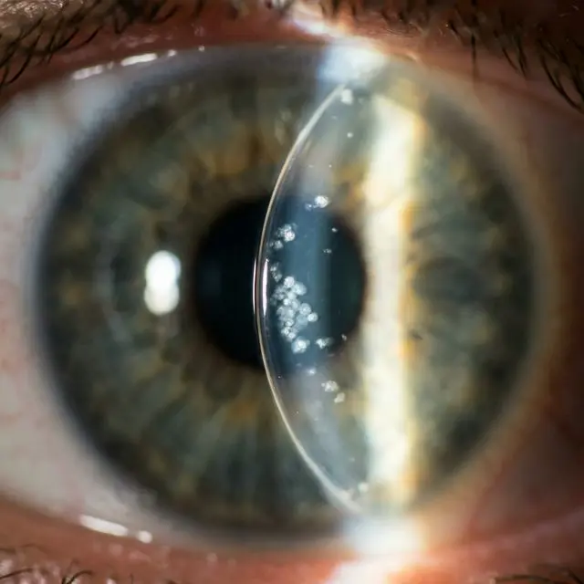
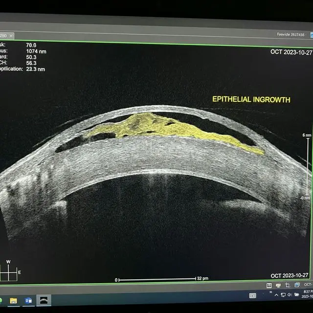

Многие пациенты, решившиеся на лазерную коррекцию зрения, слышат от врачей успокаивающую фразу: _«Если зрение со временем немного упадет (произойдет регресс) или останется небольшой минус, мы всегда сможем сделать бесплатную докоррекцию»_.

Эта процедура, которую маркетологи клиник ласково называют «рефракционной доводкой», при методах LASIK и Femto-LASIK технически называется **Flap Lift** (поднятие лоскута). Врачу не нужно заново срезать роговицу — он просто поддевает старый лоскут (флеп) специальным шпателем, приподнимает его, лазер выпаривает еще немного ткани, и лоскут укладывается обратно.

Звучит как простая и быстрая процедура. Но на самом деле **поднятие однажды уже приросшего лоскута несет в себе гораздо больше рисков, чем первичная операция**.

В этой статье мы подробно разберем, почему Flap Lift — это не просто «косметическая доводка», и с какими тяжелыми осложнениями могут столкнуться пациенты.

## Миф: «Лоскут можно безопасно поднимать годами»

Одной из главных (и пугающих) особенностей методов LASIK и Femto-LASIK является то, что [роговичный лоскут никогда не прирастает обратно на 100%](/riski-i-posledstviya/prochnost-loskuta-issledovanie-2-4-proczenta/). Он удерживается на месте лишь тонким слоем эпителия по краям (эпителиальной пробкой). Центральная часть лоскута навсегда остается слабо зафиксированной.

Именно поэтому хирург может поднять ваш лоскут и через год, и через 10 лет после первой операции. Но каждое такое вмешательство нарушает хрупкую целостность восстановленной поверхности.

## Главная опасность докоррекции: Врастание эпителия (Epithelial Ingrowth)

Самое частое и коварное осложнение после Flap Lift — это **врастание эпителиальных клеток под лоскут**.

При первичной операции вероятность этого осложнения составляет менее 1-2%. Но **при докоррекции (Flap Lift) риск врастания эпителия взлетает до 10-20%** (а по некоторым исследованиям — и выше, особенно если лоскут поднимают спустя несколько лет).

### Как это происходит?

Когда хирург инструментом разрывает эпителиальное кольцо, удерживающее лоскут, и поднимает его, поверхностные клетки роговицы (эпителий) могут случайно попасть в подлоскутное пространство (стромального ложа). После возвращения лоскута на место эти клетки оказываются в «парнике». Они начинают активно размножаться под флепом, образуя белесые пятна (жемчужины) или своеобразные «языки» в прозрачной демаркационной зоне заживления.

_Клиническая картина врастания эпителия: скопления клеток в виде "жемчужин" под роговичным лоскутом._

### Чем это грозит?

1. **Снижение зрения:** Врастающий эпителий делает роговицу мутной, пациент видит как сквозь грязное стекло.
2. **Нерегулярный астигматизм и двоение:** Бугорок клеток под лоскутом деформирует его поверхность. Появляются [жуткие гало, глэр и двоение текста](/oslozhneniya/galo-effekt-posle-lazernoj-korrekczii-zreniya/).
3. **Расплавление лоскута (Flap Melt):** Если эпителий активно разрастается, он начинает выделять ферменты, которые буквально «съедают» (расплавляют) строму лоскута. Это катастрофическое осложнение, ведущее к необратимой потере зрения и требующее срочной пересадки роговицы или ее участков.

### Лечение врастания — это хирургия отчаяния

Для более точной оценки глубины залегания и деформации роговицы применяют **ОКТ переднего отрезка глаза** (Оптическая когерентная томография). Томограф делает срез роговицы и показывает, насколько сильно вросший эпителий приподнимает верхний расслоенный слой (флэп).

_Локальная отслойка лоскута на ОКТ: вросший эпителий (желтая зона) приподнимает флэп над стромальным ложем._

Если врастание начинает мешать зрению или угрожает расплавлением, хирург вынужден... **снова делать Flap Lift!**
Врач поднимает лоскут и пытается выскоблить врастающие клетки хирургическим лезвием. Но парадокс в том, что каждое новое поднятие лоскута еще сильнее провоцирует новое врастание эпителия. Это превращается в замкнутый круг.

## Риск №2: Микрострии (Складки) лоскута

Спустя годы после первой операции лоскут «запоминает» свою форму. Когда его отрывают от ложа и укладывают обратно, он может лечь не идеально ровно.

Возникают микрострии — микроскопические складки (морщины) на лоскуте. Оптически это проявляется как **[сильное искажение зрения, двоение и размазывание источников света ночью](/pobochnye-effekty/tekst-naezzhaet-na-tekst-posle-korrekcii/)**. Лечить стрии крайне сложно; иногда врачи пытаются «разгладить» их, снова поднимая лоскут и накладывая швы, что опять же чревато врастанием эпителия.

## Риск №3: Синдром сухого глаза (ССГ)

Любое испарение ткани лазером разрушает роговичные нервы. [Первичный LASIK уже нанес удар по чувствительности ваших глаз](/oslozhneniya/suhost-glaz-posle-lazernoj-korrekcii-zreniya/). Докоррекция наносит второй удар. Врачи испаряют дополнительные микроны ткани, перерезая те нервные окончания, которые чудом успели регенерировать.

Многие пациенты, которые до докоррекции почти не жаловались на сухость, после нее получают тяжелейший, хронический ССГ с постоянными болями.

## Риск №4: Экстазия (выпячивание) роговицы

Толщина роговицы ограничена. При первой операции хирург уже изъял значительный объем стромы. При докоррекции ткань испаряется снова.
Если хирург ошибся в расчетах скрытой толщины, или в роговице уже начались дистрофические изменения, докоррекция спровоцирует **кератэктазию** — роговица под давлением газа изнутри глаза начнет выпячиваться как конус. Зрение стремительно рухнет, и единственным спасением станет сшивание роговицы (кросс-линкинг) или ее пересадка.

## Стоит ли игра свеч?

«Рефракционная доводка» продается как простой способ превратить остаточные -0.75 диоптрии в идеальные «единицы». Но риск потерять качественное зрение из-за врастания эпителия или микрострий при Flap Lift несопоставимо выше, чем при первичной операции.

Прежде чем соглашаться на докоррекцию из-за небольшого минуса или астигматизма, спросите себя: **может быть, безопаснее купить хорошие очки или контактные линзы, чем снова вскрывать свой глаз?**
