Вы сделали лазерную коррекцию. Прошли годы, а зрение не радует: двоится, расплывается в сумерках, вокруг фар — звёздные лучи, которые не исчезают ни днём, ни ночью. Вы идёте к окулисту, делаете топографию, и врач говорит: «У вас децентрированная зона абляции» или «Малая оптическая зона». Звучит как приговор. Но это не приговор. Это — исправимо.

Данная статья — адаптированный перевод и разбор научной публикации из Indian Journal of Ophthalmology (IJO, декабрь 2020, PMID 33229662, PMCID PMC7856932). Авторы — группа хирургов из Narayana Nethralaya (Бангалор, Индия) во главе с доктором Рохитом Шетти. Это одно из ключевых руководств для рефракционных хирургов по исправлению осложнений лазерной коррекции с использованием топография-контролируемой кастомной абляции (TCAT). Мы перевели, адаптировали и дополнили материал так, чтобы пациент мог понять: что пошло не так, можно ли это исправить и где искать хирурга, который действительно умеет это делать.

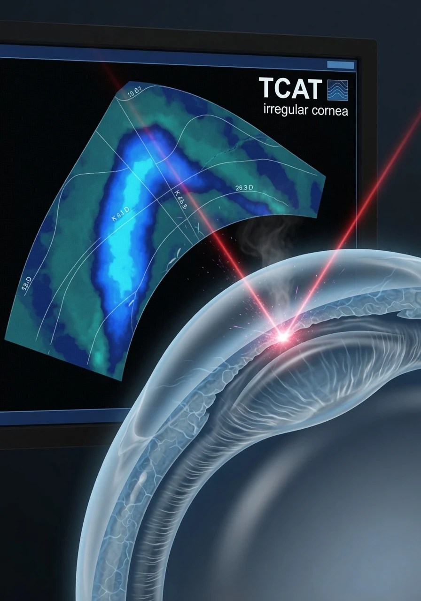

## Абляционные осложнения — главный вызов рефракционной хирургии

Рефракционная хирургия существует около 25 лет. За это время лазерные установки прошли путь от «первого поколения» — с широким лучом, без систем слежения за глазом и с примитивными номограммами — до современных фемтосекундных и эксимерных платформ с активным eye-tracking и персонализированными профилями абляции. Но у пациентов, прооперированных на старых установках (да и на новых — если хирург допустил ошибку), остались проблемы. Три главных абляционных осложнения:

- **Децентрированная зона абляции** — лазер «отработал» не по центру зрачка, а со смещением
- **Малая оптическая зона** — диаметр обработанной области меньше, чем зрачок в сумерках
- **Индуцированные аберрации высшего порядка** (HOA) — кома, трефойл, сферическая аберрация, которые не корректируются очками

До появления топография-контролируемой абляции (TCAT) пациенты с такими проблемами были обречены на жёсткие контактные линзы (RGP) либо на жизнь с искажённым зрением. TCAT изменила правила игры.

## Что такое TCAT: топография-контролируемая кастомная абляция

TCAT (Topography-guided Customized Ablation Treatment) — это метод, при котором эксимерный лазер производит абляцию роговицы, руководствуясь не субъективной рефракцией пациента («что он видит на фороптере»), а **реальной формой его роговицы**, полученной с кератотопографа. Представьте: вместо того чтобы шлифовать линзу «на глаз», вы сканируете её поверхность с микронной точностью и шлифуете по математической модели неровностей.

TCAT решает три задачи одновременно:

1. **Регуляризация** — выравнивание неправильной формы роговицы
2. **Расширение оптической зоны** — увеличение диаметра обработанной области до 6.5 мм (оптимальный стандарт)
3. **Рецентрация** — смещение зоны абляции обратно к центру зрачка

Но есть нюанс. TCAT — не кнопка «сделать красиво». Это сложный математический процесс, требующий от хирурга понимания полиномов Цернике и работы с номограммами C4/C12. Без этого — гарантированный «рефракционный сюрприз».

## Децентрированная абляция: что это и почему это катастрофа

Точная центрация зоны абляции относительно входного зрачка — краеугольный камень успешной лазерной коррекции. Абляция считается децентрированной, если её центр не совпадает с оптической осью глаза.

### Причины децентрации

- Асимметричное расширение зрачка (зрачок расширяется не «в точку», а со смещением)
- Саккадические движения глаза (микроподёргивания, которые старая система не отслеживает)
- Неправильное позиционирование головы пациента относительно лазера
- Отклонение зрительной оси от центра зрачка (угол каппа)
- Негомогенное увлажнение роговицы в процессе абляции
- Смещение вакуумного кольца относительно центра зрачка
- Отказ или неточность системы eye-tracking

### Степени децентрации и их последствия

Смещение **0.5–1.0 мм**: страдает низкоконтрастное зрение, появляются аберрации высшего порядка. Пациент замечает, что буквы на таблице видит, но «картинка не та» — нет резкости, нет контраста.

Смещение **более 1.0 мм**: катастрофическое ухудшение качества зрения. Меридиан роговицы, соединяющий центр абляции с центром зрачка, попадает в переходную зону между максимальной и минимальной оптической силой — и зрение становится объективно плохим независимо от коррекции.

### Симптомы: как пациент ощущает децентрацию

Ключевое отличие симптомов децентрированной абляции от обычного «минуса» — они **не зависят от времени суток**. Двоение (монокулярная диплопия), блики, «звёздные лучи» (starbursts) — присутствуют и днём, и ночью. Обычная рефракционная аномалия даёт похожие симптомы в сумерках (когда зрачок расширяется), но при децентрации — это постоянно.

На топограмме (Pentacam) децентрированная абляция выглядит как «выбитая» зона, смещённая относительно центра. Диагноз подтверждается кератотопографией.

### Исторический контекст

До появления активного eye-tracking избежать децентрации было практически невозможно — особенно при высокой миопии, требующей длительной абляции. Современные системы с инфракрасной регистрацией радужки (iris registration), использующие лимб роговицы как референсную точку, и увеличенные зоны абляции снизили частоту значимых (>1 мм) децентраций до минимума. Но «старые» пациенты остались. И их можно исправить.

## Малая оптическая зона: экономия ткани, за которую платит пациент

### Почему раньше делали маленькие зоны

На лазерных установках первого и второго поколения существовало правило: при миопии средней и высокой степени и толщине роговицы менее 500 микрон — уменьшать зону абляции. Уменьшение зоны всего на 0.75 мм относительно диаметра зрачка позволяло сократить глубину абляции на **20–25%** и снизить риск послеоперационной кератоэктазии.

Логика была железная: лучше пусть пациент видит с ореолами, чем ослепнет от эктазии. Но результат — миллионы людей с «эффектом ночного клуба»: днём видно нормально, а в сумерках — световые круги, ореолы, двоение.

### Механизм проблемы

Когда оптическая зона меньше зрачка в условиях низкой освещённости, лучи света, проходящие через необработанную периферию роговицы, фокусируются **не в ту же точку**, что и центральные лучи. Результат — размытые круги светорассеяния, воспринимаемые как glare и halos.

При высокой миопии (более –7 диоптрий) разница в рефракции между аблированной и интактной роговицей максимальна — и аберрации высшего порядка зашкаливают.

### Что даёт расширение зоны с TCAT

Топография-контролируемое расширение оптической зоны даёт впечатляющие результаты:

- Снижение **комы** на **53%**
- Снижение **сферических аберраций** на **44%**
- Субъективное улучшение ночного зрения у подавляющего большинства пациентов

Оптимальной считается зона **6.5 мм**. Именно этот диаметр используется авторами статьи во всех четырёх клинических случаях.

## Три платформы для TCAT: на чём работают хирурги

Авторы статьи описывают три современные рефракционные платформы:

### 1. WaveLight EX500 (Alcon) — Contoura Topography-Guided

- Платформа: эксимерный лазер 500 Гц
- Топограф: Allegro Topolyzer-Vario
- Протокол: Contoura (топография-контролируемая абляция)
- Особенность: поддержка C4/C12 номограмм, работа с Q-значением
- **Одобрен FDA** для первичной коррекции; коррекция осложнений — off-label «с осторожностью»

### 2. Schwind Amaris 1050RS — Corneal Wavefront

- Платформа: эксимерный лазер 1050 Гц
- Топограф: Sirius (CSO, Флоренция)
- Протокол: Corneal Wavefront (CW) с опцией minimize depth
- Особенность: функция ORKCAM, минимизация глубины абляции при сохранении коррекции клинически значимых HOA

### 3. Technolas Teneo 317 Model 2 (Bausch & Lomb) — Zyoptix Wavefront-Guided

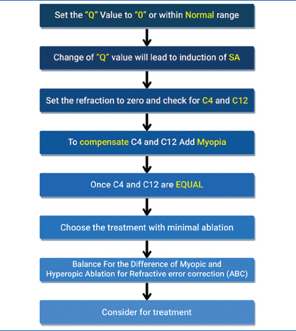

- Платформа: эксимерный лазер
- Протокол: Zyoptix wavefront-guided
- Особенность: **не позволяет** компенсировать C4/C12 напрямую. Использует PPR vs Pupil Size (Zywave) и субъективную рефракцию для планирования

## Номограммы C4 и C12 — САМОЕ ВАЖНОЕ в TCAT

Это центральный раздел статьи и то, что отличает настоящего специалиста по TCAT от «кнопкодава». Если вы ищете хирурга для исправления осложнений — спросите его, как он **уравнивает C4 и C12 перед расчётом абляции**. Если он не понимает вопроса — ищите другого.

### Что такое C4 и C12

C4 и C12 — это обозначения полиномов Цернике (Zernike polynomials) — математических функций, описывающих форму волнового фронта:

- **C4** = defocus (расфокусировка) — аберрация низшего порядка, та самая, которую меряют в диоптриях на авторефрактометре
- **C12** = spherical aberration (сферическая аберрация высшего порядка) — несимметричность фокуса центральных и периферических лучей

### Почему их нужно уравнять

Ключевой принцип: **перед расчётом абляции C4 и C12 должны быть приведены к равенству**. Если зайти в планирование TCAT с «сырыми» значениями — результат будет непредсказуем. Абляция, направленная на коррекцию аберраций высшего порядка, неизбежно меняет сферический компонент рефракции — и если это не учесть, пациент получит либо недокоррекцию (останется с минусом), либо гиперкоррекцию (уйдёт в плюс).

Это и есть «рефракционный сюрприз» — осложнение, которого можно избежать математикой.

### Как происходит уравнивание: алгоритм

1. **Шаг 1.** На странице планирования TCAT выставляется Q-значение (асферичность) = 0 и модифицированная рефракция = 0 (сфера и цилиндр обнулены)
2. **Шаг 2.** Генерируется профиль Цернике — система показывает текущие значения C4 и C12
3. **Шаг 3.** Хирург итеративно вводит сферическую коррекцию (шаг за шагом), каждый раз проверяя значения C4 и C12 во вкладке Zernike
4. **Шаг 4.** Когда C4 ≈ C12 — найдена «точка равновесия». Именно эта сферическая коррекция и будет использована как базис
5. **Шаг 5.** Проверяется для второго Q-значения (например, –0.30) — какая комбинация Q и рефракции даёт **минимальную глубину абляции** при равных C4/C12. Она и выбирается

### Конкретный пример из статьи (Клинический случай 1)

При Q = 0: C4 и C12 уравнялись при сферической коррекции **–0.50 DS**.
При Q = –0.30: уравнялись при **–0.75 DS**.
Выбрана комбинация Q = 0 + рефракция –0.50 DS, так как она дала минимальную абляцию.

Далее применяется **Ablation-Based Compensation (ABC)**: разница между центральной и максимальной абляцией (13 микрон) добавила ещё –0.75 DS миопического сдвига. Итоговая коррекция: –1.25 DS.

Без этого процесса TCAT не работает. Это именно та «магия номограмм», которую подавляющее большинство хирургов не понимает и не применяет.

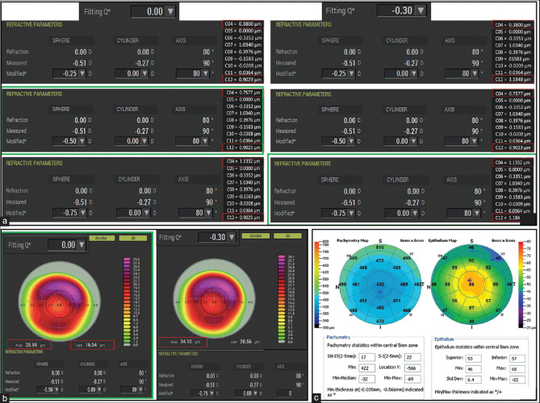

## Клинический случай 1: женщина 35 лет — PRK 10 лет назад

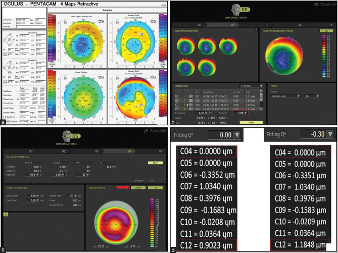

**Пациентка:** 35 лет, левый глаз (OS). Жалобы: снижение зрения, glare, halos, starbursts в течение **10 лет** после фоторефракционной кератэктомии (PRK), выполненной в другой клинике.

**Исходные данные:**
- BCVA (максимально корригированная острота): 6/9 (0.67)
- Топография (Pentacam): децентрированная абляция с малой оптической зоной («выбитая» зона)
- Пробная RGP-линза: улучшение качества зрения (классический тест — если жёсткая линза помогает, значит проблема именно в поверхности роговицы)

**Планирование TCAT (WaveLight EX500):**
- 8 сканирований на Topolyzer-Vario → отобраны 4 наилучшего качества
- Зона расширена до 6.5 мм
- Уравнивание C4/C12: Q = 0, модифицированная рефракция = –0.50 DS
- ABC-компенсация: +0.75 DS миопического сдвига
- Итоговая коррекция: –1.25 DS

**Хирургия:**
- Фототерапевтическая кератэктомия (PTK) + PRK
- Митомицин-C 0.02% — 60 секунд (профилактика хейза при повторном вмешательстве)
- Бандажная контактная линза на 2 дня

**Результат:**
- UCVA (некорригированная острота) = 6/6 (1.0)
- Рефракция = plano (0 диоптрий)
- Оптическая зона расширена, роговица регуляризирована

**Что это значит для пациента:** даже спустя 10 лет мучений с бликами и двоением — полное восстановление за одну процедуру.

## Клинический случай 2: женщина 58 лет — PRK 20 лет назад + катаракта

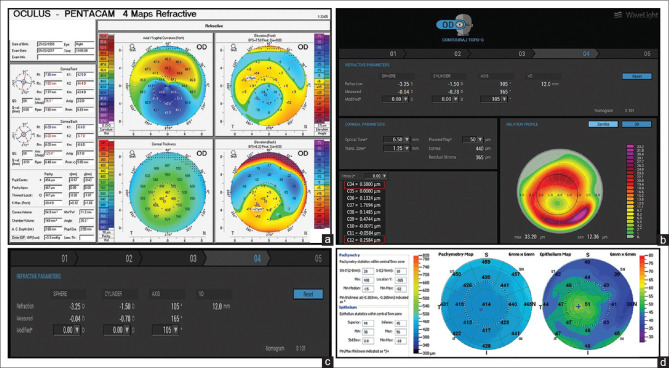

**Пациентка:** 58 лет, правый глаз (OD). Жалобы: starbursts в течение **20 лет** после PRK, снижение зрения последние 2 года.

**Исходные данные:**
- BCVA: 6/18 (0.33) с коррекцией –3.0 DS / –1.25 DC × 100°
- Ядерная катаракта 2 степени
- Топография (Pentacam): децентрированная абляция
- Толщина эпителия (Rtvue): 51 микрон

**Особенность случая:** у пациентки одновременно две проблемы — нерегулярная роговица И катаракта. Если сделать только факоэмульсификацию — расчёт силы ИОЛ на нерегулярной роговице будет ошибочным, и пациентка останется с «рефракционным сюрпризом» после замены хрусталика.

**Стратегия: TCAT → 3 месяца → факоэмульсификация с ИОЛ.**

**Планирование TCAT (WaveLight EX500):**
- Q = 0, рефракция = 0
- C4 и C12 **не показали существенной разницы** (редкий случай) — значит, сферический сдвиг от абляции минимален
- Кастомная абляция для регуляризации роговицы на зоне 6.5 мм
- Рефракционная ошибка **не корригировалась** (будет скорректирована ИОЛ)
- PTK (50 микрон) + PRK + MMC 0.02%

**Ключевое условие — стабильность топографии после TCAT:**
Изменение среднего K (mean K) ≤ 0.2 диоптрии за три последовательных визита — это критерий стабильности, после которого можно планировать факоэмульсификацию.

**Результат после двух этапов:**
- BCVA: 6/6 с +0.75 DS / –0.75 DC × 90°
- Аберрометрический профиль (i-Trace) улучшен
- ИОЛ: асферическая монофокальная +8.0 DS (рассчитана по карте EKR через калькулятор ASCRS)

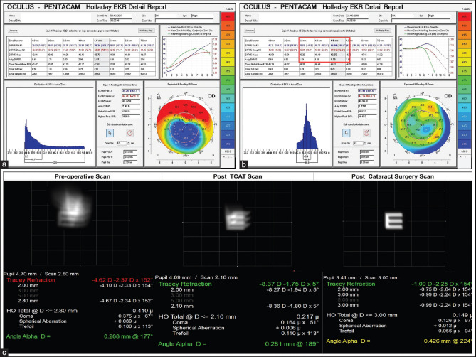

**Что это значит:** TCAT позволяет подготовить нерегулярную роговицу к точному расчёту ИОЛ — и пациент получает чёткое зрение после замены хрусталика, а не «угадайку».

## Клинический случай 3: мужчина 31 год — PRK 3 года назад, зрение 6/75

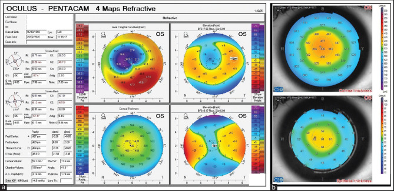

**Пациент:** 31 год, левый глаз (OS). Жалобы: снижение зрения 6 месяцев, стойкие glare и halos после PRK.

**Исходные данные:**
- BCVA: **6/75** (0.08!) — это глубокий инвалидизирующий уровень
- Исходная миопия до PRK: –3.0 DS
- Нерегулярный астигматизм: **2.2 DC** (огромная разница между меридианами)
- Топография (Pentacam): децентрированная абляция
- Катаракта: ядерная 2 степени + задняя субкапсулярная
- Толщина эпителия (MS-39): 61 микрон
- Пациенту в другой клинике предложили факоэмульсификацию с монофокальной ИОЛ — но он настаивал на эмметропии (зрение без очков)

**Платформа: Schwind Amaris 1050RS — Corneal Wavefront**

**Ключевая техника: функция Minimize Depth**

После экспорта топографии с Sirius в планировщик Schwind (ORKCAM), при целевой рефракции 0:
- Центральная абляция: **86.0 микрон**
- Максимальная абляция: **93.2 микрона**

После активации опции **minimize depth** (минимизация глубины):
- Центральная абляция: **53.73 микрона** (снижение на 37.5%)
- Максимальная абляция: **46.52 микрона** (снижение на 50%)

Функция minimise depth работает так: из списка полиномов Цернике (Zernike list) программа выбирает подмножество клинически значимых аберраций и игнорирует те, которые не влияют на качество зрения. Это позволяет сохранить ткань роговицы — критически важно, когда пациент уже перенёс одну рефракционную процедуру и запас стромы ограничен.

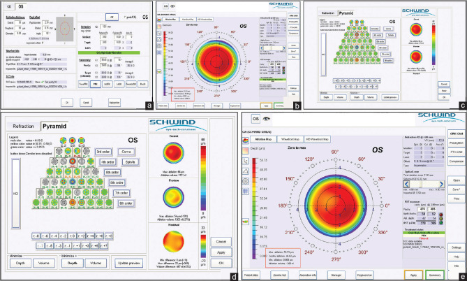

Хирургия: лазерная абляция по минимизированному профилю + MMC 0.02% (60 с) + ирригация ложа BSS.

**Результат после двух этапов (TCAT + фако + ИОЛ):**
- BCVA: 6/6 (1.0) с plano
- ИОЛ: монофокальная неторическая +28.5 D
- Роговица регуляризирована, топография центрирована

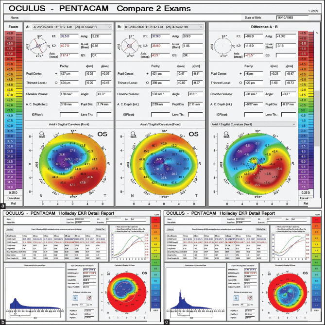

**Что это значит:** пациент с практически слепым глазом (6/75 — это зрение на грани инвалидности по зрению) вернулся к 100% зрению после двухэтапной процедуры. И это не единичное «чудо», а воспроизводимый протокол.

## Клинический случай 4: мужчина 25 лет — LASIK OU, starbursts + glare

**Пациент:** 25 лет, оба глаза (OU). Жалобы: прогрессирующие glare и starbursts, усиливающиеся к вечеру. В анамнезе — LASIK для коррекции миопии –3.0 DS OU.

**Исходные данные:**
- BCVA: 6/6P OU (субъективно — «болтается между 6/6 и 6/9»)
- Манифестная рефракция OD: +0.25 DS / –0.50 DC × 50°; OS: +0.50 DS
- Циклоплегическая рефракция OD: +0.25 DS / +0.25 DC × 45°; OS: +0.50 DS
- Топография: малая зона децентрированной абляции OU (не покрывает даже 4.5 мм зрачковой зоны)
- Topolyzer: разница между измеренным цилиндром (на топограмме) и рефракционным цилиндром (субъективно)

### Почему измеренный цилиндр ≠ рефракционный цилиндр

Это ключевой диагностический момент статьи. На топограмме цилиндр был выраженным, а при субъективной проверке на фороптере — минимальным. Причина: **аберрации роговицы компенсируются внутренней оптикой глаза (хрусталиком)**.

Расследование с использованием трёх аберрометров:

**Galilei (Ziemer):** 55–60% измеренного на Topolyzer астигматизма — это корнеальная кома. Компонент комы больше в OS.

**i-Trace (Tracey Technologies):** в правом глазу (OD) внутренние аберрации хрусталика **компенсируют** корнеальную кому — суммарные аберрации глаза сбалансированы. В левом глазу (OS) компенсация хрусталиком **минимальна** — вся корнеальная кома «бьёт» по качеству зрения.

**Osiris-T (CSO):** при покое аккомодации кома в OD = 0.53 Eq.D; при аккомодации кома = –0.15 Eq.D. **70% комы компенсируется хрусталиком при напряжении аккомодации** — то есть хрусталик правого глаза постоянно работает «на износ», компенсируя кривизну роговицы. В левом глазу изменений комы при аккомодации нет, компенсация отсутствует.

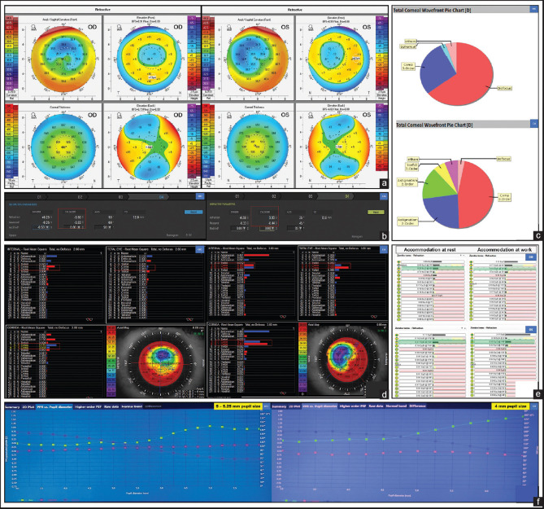

**PPR vs Pupil Size** (Zywave, B&L): качество зрения сохраняется до диаметра зрачка 5.0–5.25 мм в OD, но только до 4.0 мм в OS. Дальше — резкое ухудшение. Именно поэтому симптомы усиливаются к вечеру: в мезопических условиях зрачок расширяется за пределы «компенсированной» зоны.

### Стратегия: разные глаза — разные платформы

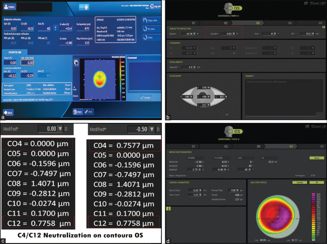

**OD (правый глаз) — Zyoptix wavefront-guided (Technolas Teneo 317):**
- Поскольку хрусталик активно компенсирует корнеальные аберрации — wavefront-контролируемая абляция, учитывающая **суммарные** аберрации глаза, предпочтительнее топография-контролируемой
- Коррекция: +0.12 DS / –0.19 DC × 65°, зона 6.5 мм
- Платформа Zyoptix не поддерживает компенсацию C4/C12 — вместо неё используются PPR vs Pupil Size и субъективная рефракция

**OS (левый глаз) — Contoura topography-guided (WaveLight EX500):**
- Поскольку хрусталик НЕ компенсирует корнеальную кому — топография-контролируемая абляция для прямой регуляризации роговицы
- Уравнивание C4/C12: при модифицированной рефракции 0 — неравны; при добавлении –0.50 DS — уравнялись
- ABC-компенсация по разнице абляции
- Итоговая коррекция: –0.75 DS / –0.40 DC × 45°, зона 6.5 мм

**Результат:**
- OU: 6/6, OD plano, OS –0.25 DS
- Топография: зона расширена, регуляризирована
- i-Trace после операции: кома и трефойл минимизированы на роговице, хрусталике и суммарно
- В OD: изменения комы при аккомодации минимальны — хрусталик «отдыхает», компенсации больше не требуется

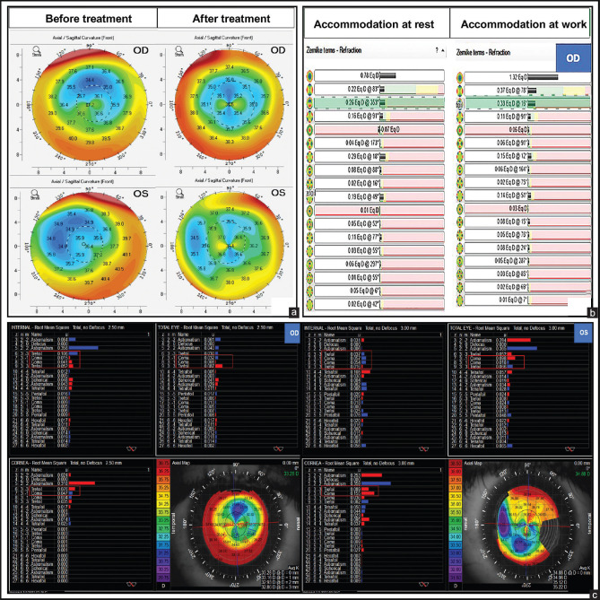

### Мораль этого случая

Никогда нельзя подходить к двум глазам одного пациента с одинаковым планом. **Разные глаза — разные аберрационные профили — разные платформы.** Именно поэтому TCAT — это не «конвейер», а штучная работа.

## Алгоритм для хирурга при нерегулярной роговице (Таблица 2)

Авторы статьи приводят пошаговую блок-схему принятия решений, которую мы адаптируем:

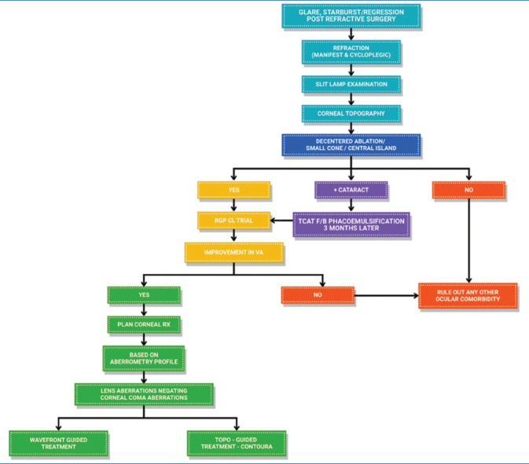

1. **Шаг 1: Pentacam** (или другой Шаймпфлюг-топограф). Получить карту кривизны передней и задней поверхности роговицы, пахиметрию. Подтвердить наличие иррегулярности.

2. **Шаг 2: Сравнение цилиндров.** Измеренный на топографе цилиндр vs субъективный рефракционный цилиндр. Если разница >0.5 DC — подозрение на компенсацию аберраций внутренней оптикой глаза.

3. **Шаг 3: Аберрометрия.** Galilei, i-Trace и/или Osiris-T — для разделения корнеальных и внутренних (лентикулярных) аберраций. Если хрусталик активно компенсирует роговицу → wavefront-guided предпочтительнее. Если нет → topography-guided.

4. **Шаг 4: Выбор платформы.**
   - WaveLight EX500: Contoura topography-guided (C4/C12 доступны)
   - Schwind Amaris 1050RS: Corneal Wavefront + minimize depth (экономия ткани)
   - Technolas Teneo 317: Zyoptix wavefront-guided (PPR vs Pupil Size вместо C4/C12)

5. **Шаг 5: Уравнивание C4/C12.** Подбор Q-значения и модифицированной рефракции, при которых C4 ≈ C12 и абляция минимальна.

6. **Шаг 6: ABC-компенсация.** Добавление сдвига, вызванного разницей центральной и периферической абляции.

7. **Шаг 7: Хирургия TCAT.** PTK + PRK (или трансэпителиальная абляция) + MMC 0.02% (при повторных вмешательствах) + бандажная линза.

8. **Шаг 8: Стабилизация.** Минимум 3 месяца. Критерий: изменение mean K ≤ 0.2 D за три последовательных визита.

9. **Шаг 9 (опционально): Факоэмульсификация с ИОЛ.** Расчёт по карте EKR через калькулятор ASCRS. Возможность имплантации торической или мультифокальной ИОЛ благодаря регуляризированной роговице.

## Почему это не делают в обычных клиниках

Пациент, ищущий исправление осложнений, должен понимать: TCAT — для «потоковой» клиники недоступен. На то есть четыре причины.

### 1. Оборудование

Для полноценного TCAT нужны:
- **Шаймпфлюг-топограф** (Pentacam HR, Sirius, Galilei) — для карт кривизны и пахиметрии
- **Плацидо-топограф** (Topolyzer-Vario, Atlas) — для экспорта сканов в планировщик лазера
- **Аберрометр** (i-Trace, Osiris-T, Zywave) — для разделения корнеальных и внутренних аберраций
- **AS-OCT** (Rtvue, MS-39) — для картирования эпителия
- **Эксимерный лазер** с поддержкой TCAT (WaveLight EX500, Schwind Amaris, Technolas Teneo)

Стоимость такого парка — сотни тысяч долларов. Обычная клиника с одним эксимерным лазером «для LASIK» не может себе этого позволить.

### 2. Время

Планирование одного глаза занимает **30–60 минут** (сканирования, экспорт, итеративный подбор C4/C12, Q-значения, ABC-компенсация). На «конвейере» из 20 пациентов в день такое невозможно. Это штучная работа.

### 3. Квалификация

Хирург должен понимать:
- Полиномы Цернике (C4, C12, кома, трефойл, сферическая аберрация)
- Q-значение (асферичность) и его влияние на профиль абляции
- Аберрометрию — разделение корнеального и лентикулярного компонентов
- Расчёт ИОЛ на регуляризированной роговице (EKR, ASCRS calculator)

Этому не учат на стандартных курсах по LASIK. Это — субспециализация.

### 4. Off-label статус

FDA одобрила WaveLight Contoura для **первичной** коррекции. Лечение осложнений — с пометкой «with precaution»: не противопоказано, но требует специального информированного согласия и углублённого консультирования пациента о возможности частичной коррекции и рефракционных сюрпризов.

## Что это значит для пациента с осложнениями

Если вы — пациент с децентрированной зоной, малой оптической зоной или индуцированным неправильным астигматизмом после неудачной лазерной коррекции, вот что вам нужно знать:

**Не всё потеряно.** TCAT — зрелая, воспроизводимая технология, описанная в рецензируемой литературе и подтверждённая клиническими результатами.

**Где искать?** Специализированные центры: Narayana Nethralaya (Бангалор, Индия) — авторы статьи; ELZA Institute (Цюрих, Швейцария) — проф. Хафез; отдельные хирурги в РФ, имеющие оборудование WaveLight EX500 с модулем Contoura или Schwind Amaris с CW.

**Как выбрать хирурга?** Задайте один вопрос: «Как вы уравниваете C4 и C12 при планировании TCAT?» Если ответ — недоумение или «это не нужно», ищите дальше.

**Риски:** рефракционный сюрприз (недокоррекция/гиперкоррекция), индукция хейза (минимизируется MMC 0.02%), необходимость повторного вмешательства. Но альтернатива — пожизненные жёсткие линзы или искажённое зрение.

**Реалистичные ожидания:** TCAT не всегда даёт 6/6. В статье у всех четырёх пациентов — 6/6, но авторы предупреждают: возможна частичная коррекция. Пациенты с нереалистичными ожиданиями («сделайте мне орлиное зрение с первой попытки») — не кандидаты.

## Психологический аспект: годы мучений и одно решение

Многие пациенты с абляционными осложнениями живут с проблемой годами — 10, 20 лет (как пациентки из случаев 1 и 2). Они смирились. Они перестали искать решение. Они уверены, что «лазерная коррекция — это навсегда, и если что-то пошло не так, то это навсегда».

Это неправда. И статья Shetty et al. — лучшее тому доказательство. Четыре пациента, четыре разных клинических сценария, четыре успешных исхода. От пациента с BCVA 6/75 (почти слепой глаз) до пациента, которому подобрали разные платформы под разные глаза. Это не чудеса, а математика и хирургическая техника.

Главное препятствие — не технология, а доступ. В РФ центров, выполняющих TCAT по полному протоколу (с уравниванием C4/C12, аберрометрией и ABC-компенсацией) — единицы. Но они есть. И они растут.

## Заключение

Статья Shetty, Lalgudi, Kaweri et al. «Customized laser vision correction for irregular cornea post-refractive surgery» (IJO, 2020) — не просто научная публикация. Это руководство к действию для рефракционных хирургов и источник надежды для пациентов с осложнениями.

**Ключевые выводы:**

- Топография-контролируемая кастомная абляция (TCAT) — зрелая технология, способная исправить децентрированные зоны, расширить оптическую зону до 6.5 мм и регуляризировать нерегулярную роговицу
- **Уравнивание C4 и C12** — центральный элемент планирования, без которого TCAT даёт рефракционные сюрпризы. Это — «секретный ингредиент», отличающий эксперта от «кнопкодава»
- Разные платформы (WaveLight Contoura, Schwind Amaris CW, Technolas Zyoptix) имеют разные сильные стороны — выбор зависит от аберрационного профиля конкретного глаза
- Функция **minimize depth** (Schwind) позволяет сократить глубину абляции на 40% при сохранении коррекции клинически значимых HOA — критически важно для глаз с тонкой роговицей
- TCAT + факоэмульсификация — мощная двухэтапная стратегия: сначала регуляризация роговицы, затем точный расчёт и имплантация ИОЛ
- Информированное согласие и детальное консультирование — обязательны: пациент должен понимать возможность частичной коррекции
- TCAT требует оборудования стоимостью в сотни тысяч долларов, часового планирования на глаз и квалификации на уровне понимания полиномов Цернике — поэтому «потоковые» клиники не предлагают эту услугу

Если ваш случай — осложнение после лазерной коррекции с нерегулярной роговицей, не опускайте руки. Найдите хирурга, который понимает C4 и C12. Задайте ему этот вопрос. И если услышите внятный ответ — вы на правильном пути.

В нашем телеграм-чате [@lasik_chat](https://t.me/lasik_chat) вы найдёте сотни людей, столкнувшихся с осложнениями лазерной коррекции. Кто-то уже прошёл TCAT и делится опытом, кто-то только ищет клинику, кто-то выбирает между дообследованием и повторной операцией. Вы не один — и это, возможно, самое важное, что нужно знать, когда зрение «поехало» после, казалось бы, окончательного решения проблемы.

---

**Источник:** Shetty R, Lalgudi VG, Kaweri L, Choudhary U, Chabra A, Gupta K, Khamar P. Customized laser vision correction for irregular cornea post-refractive surgery. *Indian J Ophthalmol.* 2020 Dec;68(12):2867-2879. DOI: [10.4103/ijo.IJO_2793_20](https://doi.org/10.4103/ijo.IJO_2793_20). PMCID: [PMC7856932](https://pmc.ncbi.nlm.nih.gov/articles/PMC7856932/). Публикация распространяется по лицензии CC BY-NC-SA 4.0.
