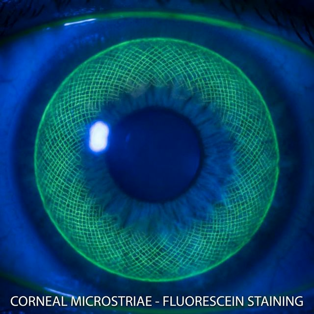
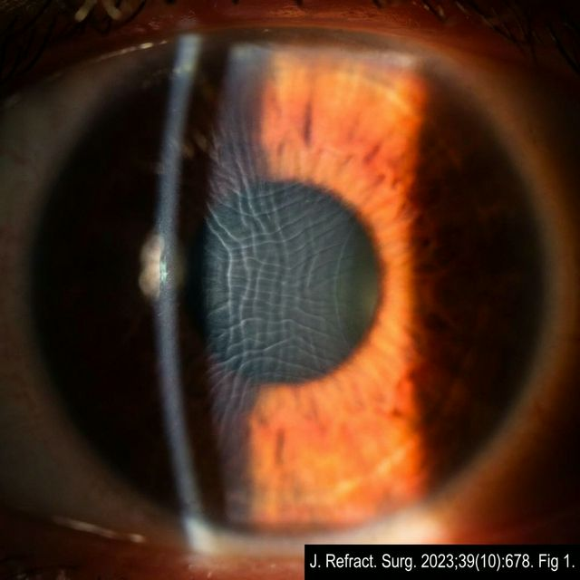
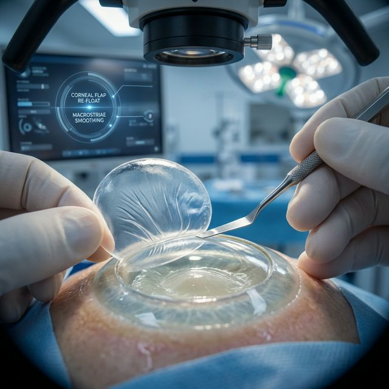

Складки роговичного лоскута (флэпа при LASIK или кэпа при SMILE) — это специфическое хирургическое осложнение, при котором роговичная ткань после лазерной коррекции зрения ложится неровно, образуя микроскопические или видимые глазом «морщины» (стрии).

Данное осложнение напрямую влияет на то, как свет преломляется глазом, вызывая оптические искажения. Частота возникновения стрий варьируется от 0.2% до 1.5% случаев, но их влияние на качество жизни пациента может быть колоссальным.

## Разница между макростриями и микростриями

Складки (стрии) принято разделять на два основных типа в зависимости от размера, причин образования и степени влияния на зрение.

### Макрострии (Macrostriae)

Это крупные, глубокие складки роговичного лоскута, которые проходят через всю его толщу. Они появляются, когда флэп (крышечка при LASIK или Femto-LASIK) физически смещается со своего ложа.

- **Как выглядят:** Выглядят как явные волны или изломы на роговице. Заметны при прямом освещении на щелевой лампе.
- **Симптомы:** Всегда вызывают резкое снижение качества зрения, сильное двоение (гостинг), светобоязнь и ощущение инородного тела.
- **Причины:** Острая механическая травма в первые сутки после операции (пациент сильно потер глаз, неудачно уткнулся лицом в подушку).

### Микрострии (Microstriae)

Это мельчайшие «морщинки» или "гофрированность" поверхности роговицы, обычно затрагивающие только Боуменову мембрану лоскута.

- **Как выглядят:** Едва различимы. Часто выглядят как паутинка или сетка из тонких линий. Выявляются с помощью флуоресцеина или при обратном (ретроиллюминационном) освещении.
- **Симптомы:** Могут протекать бессимптомно и не влиять на строчки в таблице проверки зрения. Однако если они пересекают оптическую зону (центр зрачка), пациент страдает от потери контрастности, размытости букв и выраженных [гало-эффектов](/oslozhneniya/galoing-starburst-glare-posledstviya-lasik/) ночью.
- **Причины:** Эффект "несоответствия палатки" (Tent effect). Когда лазер выжигает строму (минус диоптрии), кривизна роговицы уплощается. Лоскут (флэп/кэп), возвращаясь на место, оказывается "велик" для нового, более плоского ложа, и собирается в микроскладки, как лишняя ткань.

## Складки при LASIK vs SMILE: В чем разница?

Важно понимать, что стрии — это проблема не только устаревшего микрокератомного LASIK.

1.  **LASIK и Femto-LASIK:** Здесь формируется полноценный открытый лоскут (флэп) на ножке. Он может соскользнуть, загнуться или лечь с микроскладками при высыхании ложа.
2.  **SMILE / SMILE PRO / CLEAR:** При этих лентикулярных методах флэп не откидывается, но внутри роговицы формируется полость, из которой через микроразрез (2 мм) пинцетом удаляют линзочку (лентикулу). Крыша этой полости называется **кэп (cap)**.
    - После удаления лентикулы образуется пустота. Верхний кэп проседает (опускается) на дно полости. Поскольку кэп сохранил свою изначальную крутизну длины дуги, при провисании на более плоское дно физически образуются **микроскладки кэпа**. Это неизбежный закон геометрии.
    - Иногда при грубом извлечении лентикулы хирургом, кэп может чрезмерно растянуться и надорваться, образуя макрострии.

## Причины возникновения складок

**Ранние причины (первые 24-48 часов):**

- **Механическое смещение.** Пациент потер глаз, сильно зажмурился, моргнул до того, как хирург закончил сглаживать флэп, или сдвинул лоскут во сне. Это главная причина макрострий.
- **Ошибка хирурга.** Плохое выравнивание краев флэпа, недостаточное увлажнение ложа перед укладкой лоскута (эффект засохшей губки) или избыточная ирригация (водяная подушка под флэпом).
- **Смещение флотацией.** Избыток жидкости выталкивает лоскут.

**Поздние причины:**

- [Синдром сухого глаза (ССГ)](/oslozhneniya/sindrom-suhogo-glaza-posle-lasik/). Из-за сухости поверхности эпителий натягивается и деформирует лоскут.
- **Эпителиальное врастание.** Клетки эпителия прорастают под лоскут, приподнимают его и заставляют "морщиться".

## Как выглядит проблема: Фото стрий

Ниже представлены клинические фотографии того, как врач видит складки роговицы на оборудовании.

_Макрострии после ЛАСИК. Видны глубокие борозды._

_Микрострии: тонкая сетка в оптической зоне, часто вызывающая гало и гостинг._

_(Примечание: Микрострии кэпа после SMILE выглядят схожим образом (эффект гофрированности) при детальном осмотре в ретроиллюминации)._

_Складки кэпа после операции SMILE из-за эффекта провисания "палатки"._

## Симптомы и диагностика

Главное коварство **микрострий** заключается в том, что по таблице Сивцева ваш визус может быть 1.0 (100%), но качество зрения будет ужасным. Хирург на осмотре на следующий день может сказать: «Все отлично, острота единичка», проигнорировав оптические аберрации.

**На что жалуются пациенты:**

- "Двоение, троение букв (гостинг)". Зависит от освещения.
- Резкое падение контрастности. Текст кажется серым, а не черным.
- Крупные, искаженные "звезды" (старберсты) от фонарей авто ночью. Ореолы и лучи света могут иметь "хвосты" или искажаться в одну сторону (по направлению складки).

**Диагностика проводится несколькими способами:**

1.  **Окрашивание флуоресцеином (Negative Staining).** Краситель скапливается в "долинах" между складками, создавая четкий узор линий под синим кобальтовым фильтром.
2.  **Ретроиллюминация.** Врач направляет свет так, чтобы он отразился от радужки. На фоне красного рефлекса стрия блестит как трещина на стекле.
3.  **ОКТ (Оптическая когерентная томография) переднего отрезка.** Позволяет увидеть срез роговицы и измерить глубину складок.

## Методы лечения

Тактика лечения зависит от типа стрий и того, насколько они мешают пациенту. Считается, что макрострии необходимо устранять в первые 24–48 часов. Чем дольше складка находится "в памяти" роговицы, тем сложнее от нее избавиться.

### 1. Наблюдение

Если стрии мелкие, периферические (не пересекают центр зрачка) и пациент не жалуется на качество зрения — их не трогают. Многие микроскладки со временем становятся менее выраженными по мере заполнения пространства новым эпителием.

### 2. Поднятие и разглаживание лоскута (Flap-Lift / Re-floating)

Это основная хирургическая процедура устранения проблемы.

- Врач шпателем вскрывает край зажившего флэпа и поднимает его.
- Ложе и нижняя часть флэпа обильно промываются BSS-раствором.
- Лоскут укладывается обратно и буквально "натягивается" (растягивается, как мокрая простыня) во все стороны специальными тупферами.
- Иногда используется гипотонический раствор или дистиллированная вода на пару минут (метод «осмотического набухания»), чтобы заставить строму набухнуть и распрямить складки изнутри.
- В конце хирургического этапа на глаз может быть надета мягкая бандажная линза (МКЛ), чтобы удержать лоскут на месте в натянутом состоянии до приживления.

_Лечение макрострий: хирургическое поднятие (Flap Lift) и разглаживание роговичного лоскута._

### 3. Наложение швов (Сутурирование)

Применяется в тяжелых, застарелых случаях, когда лоскут потерял эластичность и стрии возвращаются (рецидивируют) после поднятия и разглаживания. Врач накладывает тончайшие радиальные швы через роговицу, плотно натягивая флэп. Швы снимают через 2–4 недели.

### 4. ФТК (Фототерапевтическая кератэктомия)

Если стрии не поддаются разглаживанию или эпителизировались так, что поверхность никогда не станет ровной, хирург может выполнить процедуру ФТК — деликатное "подшлифовывание" эпителия и поверхности флэпа эксимерным лазером, чтобы выровнять оптический рельеф.

## Профилактика после операции

Пациент может минимизировать риски появления макрострий, строго соблюдая [режим в первый месяц после коррекции](/oslozhneniya/ogranicheniya-i-zaprety-posle-lazernoy-korrekcii/):

- **Никогда не тереть глаза!** Даже если глаз зудит или слезится.
- Спать только в специальных прозрачных защитных очках (shields), которые выдают в клинике, минимум 5–7 ночей. Это убережет вас от случайного трения глаз во сне.
- Избегать сильного зажмуривания в первые дни.
- В точности соблюдать график закапывания увлажняющих капель, чтобы предотвратить деформацию флэпа из-за сильной сухости (ССГ).

Если в первые дни после операции вы почувствовали резкое ухудшение зрения, появление "двойного" изображения в одном глазу или сильное чувство инородного тела (как будто в глаз попала ресница, и это не проходит) — **немедленно обратитесь к своему оперирующему хирургу**. Раннее выявление смещения лоскута — залог быстрого и легкого восстановления!
