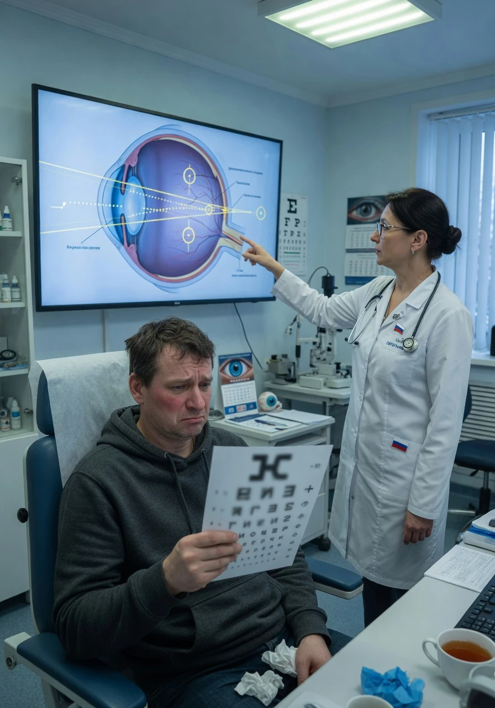

## Зрение после SMILE Pro не восстановилось: почему самая дорогая операция не дала 100% зрение

Вы заплатили 200–250 тысяч рублей за SMILE Pro на новейшем лазере VisuMax 800 от Zeiss. Вам обещали «премиальную» коррекцию с быстрым восстановлением и зрением 100% уже на следующий день. Проходит неделя, месяц, три месяца — а зрение так и не стало идеальным. В одном глазу остался минус, в другом — астигматизм, по ночам двоится, а картинка «нечёткая, как в тумане».

Хирург разводит руками: «Подождите, стабилизируется». Вы ждёте. Не стабилизируется.

Разберём **10 причин**, почему после SMILE Pro зрение может не восстановиться, — с реальными историями пациентов, статистикой FDA и конкретными рекомендациями, что делать дальше.

---

## 1. Недокоррекция (undercorrection) — самая частая причина

**Недокоррекция** — это когда лазер убрал не весь минус. Пациент приходил с −5.0, а после операции остался с −1.0 или −1.5. По таблице он видит 0.4–0.6 вместо обещанной единицы.

**Почему так происходит при SMILE Pro:**

- **Номограмма лазера не учтена.** Каждый экземпляр VisuMax 800 имеет индивидуальные особенности — так называемую номограмму. Если хирург не откалибровал настройки под свой конкретный лазер, фактическая коррекция отклоняется от расчётной на 0.5–1.5 D.
- **Индивидуальные особенности заживления.** У части пациентов эпителий роговицы утолщается в ответ на травму сильнее, чем ожидалось — это «съедает» часть рефракционного эффекта.
- **Остаточная толщина лентикулы.** При SMILE хирург извлекает лентикулу вручную. Если лентикула извлечена не полностью — в строме остаётся тонкий слой ткани, который сохраняет часть исходной рефракции.

**Как диагностировать:** авторефрактометрия показывает остаточный минус. Топография (Pentacam) — равномерная поверхность без искажений, просто «недостаточно плоская».

**Частота:** по данным FDA (PMA P150040/S035), **1.3% пациентов после SMILE не достигают остроты 20/20 из-за недокоррекции**, а при высоком исходном минусе (−6.0 и выше) — до 3–5%.

---

## 2. Гиперкоррекция (overcorrection) — ушёл в плюс

Обратная ситуация: лазер убрал **слишком много** ткани, и пациент из минуса ушёл в плюс. Вместо −4.0 получил +0.75 или даже +1.5.

**Причины гиперкоррекции при SMILE Pro:**

- **Эпителиальная гиперплазия.** Эпителий утолщается неравномерно — в центре роговицы сильнее, чем на периферии. Это создаёт эффект «избыточной плоскости» — свет фокусируется за сетчаткой.
- **Ошибка расчёта лентикулы.** Если в программу лазера заложена неправильная толщина лентикулы (человеческий фактор или сбой калибровки) — удаляется больше ткани, чем нужно.
- **Возрастной фактор.** У пациентов старше 40 лет аккомодационный резерв снижен, и даже небольшая гиперкоррекция вызывает выраженный дискомфорт вблизи.

**Симптомы:** пациент видит дальние объекты хорошо, но reading distance (40 см) — размыто. Головные боли при чтении. Ощущение, что «глаза не фокусируются».

**Что делать:** ждать 3–6 месяцев. В части случаев эпителий «дозревает» и небольшой плюс (до +0.75) компенсируется. Если гиперкоррекция сохраняется — варианты: очки для близи, ФРК-докоррекция (с высоким риском хейза), либо принятие ситуации.

---

## 3. Регресс (откат) — зрение было хорошее, а через год упало

Самая коварная ситуация: первые 3–6 месяцев зрение было 1.0, пациент доволен. Через полгода-год замечает, что вывески стали размытыми. Авторефрактометр показывает −0.75 или −1.25, которых раньше не было.

**Механизм регресса после SMILE Pro:**

- **Эпителиальная гиперплазия** — главный виновник. Роговичный эпителий утолщается, заполняя «ступеньку», созданную удалённой лентикулой. Чем больше была коррекция — тем сильнее компенсаторное утолщение эпителия.
- **Биомеханическая перестройка стромы.** Удаление лентикулы меняет натяжение коллагеновых волокон. Строма может медленно «расправляться» в течение 6–18 месяцев, возвращая часть исходной кривизны.
- **Гормональные факторы.** Беременность, ГВ, заболевания щитовидной железы, приём КОК — всё это меняет гидратацию и толщину роговицы, провоцируя регресс.

**Статистика:** По данным мета-анализов, регресс >0.5 D после SMILE наблюдается у **5–12% пациентов в течение 2 лет**. Для LASIK этот показатель — 10–18%, для ФРК — 3–8%.

**Варианты решения** — читайте в разделе «Что делать, если зрение не восстановилось» ниже.

> Подробнее о механизме регресса: [Регресс зрения после лазерной коррекции](/oslozhneniya/regress-posle-lazernoj-korrekczii-zreniya/)

---

## 4. Индуцированный астигматизм — SMILE Pro добавил то, чего не было

До операции у пациента был чистый минус без астигматизма. После SMILE Pro появляется астигматизм 0.75–1.5 D. Изображение «плывёт» под определённым углом, строчки на таблице раздваиваются.

**Причины индукции астигматизма при SMILE:**

- **Неправильная ось.** SMILE исправляет астигматизм поворотом лентикулы на заданный угол. Если ось рассчитана или выполнена с ошибкой — часть астигматизма не только не убирается, но и добавляется.
- **Неравномерное удаление лентикулы.** Ручное извлечение лентикулы через 2-мм разрез — микрохирургическая манипуляция. Если лентикула извлекается неравномерно (один край захвачен сильнее другого) — поверхность роговицы становится асимметричной, что и есть астигматизм.
- **Заживление разреза.** Рубец в месте разреза может стягивать строму, создавая локальное изменение кривизны — индуцированный астигматизм.

**Как диагностировать:** кератометрия + топография показывают неравномерную кривизну роговицы. Аберрометрия — повышенный цилиндрический компонент.

**Принципиальный момент:** индуцированный астигматизм после SMILE сложнее исправить, чем после LASIK. При LASIK можно поднять лоскут и провести коррекцию оси. При SMILE лоскута нет — повторное вмешательство требует либо ФРК (с риском хейза), либо техники Circle (с риском несостоятельности «лоскута»).

---

## 5. Нерегулярная поверхность роговицы — зрение не корригируется очками

Это одно из самых тяжёлых осложнений SMILE: лентикула извлечена неравномерно, и поверхность роговицы приобретает **нерегулярную форму**. В отличие от обычного астигматизма (который можно скорректировать цилиндром в очках), нерегулярный астигматизм **очками не корригируется**.

**Причины:**

- Фрагментация лентикулы при извлечении (часть ткани порвалась — см. п. 9).
- Неравномерный интерфейс между стромальными слоями.
- Асимметричное заживление с формированием микронеровностей.

**Симптомы:** пациент видит 0.8–1.0 по таблице, но картинка «грязная» — ореолы, тени, двоение контуров. Качество зрения субъективно плохое, несмотря на формально приемлемую остроту.

**Диагностика:** кератотопография (Pentacam) показывает нерегулярную карту кривизны. Аберрометрия — повышенные аберрации высшего порядка (HOA).

**Что делать:** единственный реальный выход — **склеральные (ночные) линзы**. Они создают новую гладкую поверхность поверх нерегулярной роговицы и восстанавливают качество зрения до 1.0. Обычные мягкие линзы неэффективны.

> Подробнее: [Склеральные линзы после лазерной коррекции](/oslozhneniya/skleralnye-linzy-posle-lazernoj-korrekczii-zreniya/)

---

## 6. Помутнение в интерфейсе (interface haze) — воспаление между слоями

**Interface haze** — помутнение в зоне контакта двух слоёв стромы (там, где была удалена лентикула). При SMILE это осложнение встречается реже, чем при ФРК, но оно возможно.

**Причины haze после SMILE Pro:**

- Воспалительная реакция на микроостатки лентикулы в интерфейсе.
- Индивидуальная склонность к фиброзу (избыточному рубцеванию).
- Активация кератоцитов в зоне интерфейса — строма мутнеет.

**Частота:** по данным исследований, клинически значимый haze после SMILE встречается у **0.5–2% пациентов**, чаще — при высоких диоптриях (−7.0 и выше).

**Симптомы:** зрение как «через грязное стекло»; снижение контрастной чувствительности; в тяжёлых случаях — потеря 2–4 строк по таблице.

**Лечение:** стероидные капли (дексаметазон) длительным курсом. В упорных случаях — повторное вмешательство (ФРК с митомицином С), но это дополнительный риск хейза уже от самой ФРК.

> Подробнее о хейзе: [Хейз после лазерной коррекции — помутнение роговицы](/oslozhneniya/heyz-posle-lazernoj-korrekcii-pomutnenie-rogovicy/)

---

## 7. Синдром сухого глаза — «невидимый» убийца остроты

SMILE Pro рекламируется как операция, которая «не перерезает нервы роговицы» (в отличие от LASIK, где формируется лоскут). Это правда лишь отчасти.

**Что происходит на самом деле:**

- При SMILE разрез составляет 2 мм — это действительно меньше, чем 20-мм окружность лоскута LASIK.
- Но **лентикула удаляется из центральной стромы**, где плотность нервных окончаний максимальна. Пересечение нервов всё равно происходит — просто не на периферии, а в центре.
- Иннервация роговицы восстанавливается **от 3 до 12 месяцев**. В этот период слёзопродукция снижена.

**Как сухость влияет на зрение:**

- Сухая роговица теряет оптическую гладкость. Слёзная плёнка — это передняя поверхность «оптической системы» глаза. Если плёнка нестабильна — острота падает на **1–3 строки**.
- Колебания зрения в течение дня: утром видно хорошо, к вечеру — размыто.
- Жжение, песок в глазах, светобоязнь.

**Важно:** многие пациенты приходят с жалобой «плохо вижу после SMILE», а на деле проблема — в сухости. После курса увлажняющих капель и восстановления слёзной плёнки острота возвращается к 1.0.

**Что делать:** интенсивное увлажнение (бесконсервантные капли каждые 1–2 часа), обтурация слёзных точек, мазь на ночь. Если через 6 месяцев улучшения нет — возможно, сухость не единственная причина.

---

## 8. Центральная токсическая кератопатия (CTK) — реакция на продукты распада

CTK — редкое, но тяжёлое осложнение. После SMILE лентикула, разрушенная лазером внутри стромы, оставляет **продукты тканевого распада** и свободные радикалы. У отдельных пациентов развивается воспалительная реакция на эти продукты.

**Симптомы CTK:**

- Помутнение в центральной зоне роговицы (видно на щелевой лампе).
- Снижение зрения на 3–5 строк, не корригируемое очками.
- Развивается в первую неделю после операции.
- Сопровождается болью, светобоязнью, слезотечением.

**Лечение:** агрессивная стероидная терапия (каждый час в первые дни). При своевременном лечении прогноз благоприятный — 80% пациентов восстанавливают зрение. При задержке лечения — стойкое помутнение.

Это осложнение почти исчезло с появлением VisuMax 800 (более точная фокусировка лазера снижает объём тканевого детрита), но помнить о нём нужно.

---

## 9. Разрыв лентикулы при извлечении — оставшаяся ткань искажает рефракцию

Слабое место SMILE — **ручной этап**. Лентикула формируется лазером, но извлекается хирургом вручную через 2-мм разрез. Если лентикула тонкая (при малой диоптрии) или если хирург допустил ошибку — она может **разорваться** при извлечении.

**Последствия:**

- Часть ткани остаётся в строме — неравномерная рефракция.
- Нерегулярный астигматизм (очки не помогают).
- При крупных фрагментах — воспаление в интерфейсе.

**Что делать:** ОКТ роговицы покажет, есть ли остатки ткани. При значимых фрагментах — хирургическое удаление (повторное вскрытие разреза с промыванием интерфейса). При мелких — наблюдение, т. к. ткань может резорбироваться за 3–6 месяцев.

**Это осложнение — полностью хирургическое.** Оно не связано с лазером VisuMax 800. Это вопрос квалификации и опыта конкретного хирурга.

---

## 10. Аберрации высшего порядка (HOA) — зрение 1.0 по таблице, но качество ужасное

**Самая недооценённая проблема SMILE Pro.** Пациент читает 10-ю строку таблицы (зрение 1.0), но ночью не может вести машину — фары расплываются в звёзды размером с кулак. Текст на тёмном фоне «двоится». Вокруг источников света — ореолы и засветы.

**Это не истерика пациента. Это аберрации высшего порядка (Higher-Order Aberrations, HOA).**

**Механизм HOA после SMILE Pro:**

- **Изменение асферичности роговицы.** Исходная роговица имеет форму вытянутого эллипсоида (prolate) — периферия более плоская, чем центр. После SMILE роговица становится более сферичной (oblate), а периферия — более крутой. Это **индуцирует сферическую аберрацию** — главную причину ореолов и засветов.
- **Индукция комы.** Даже микроскопическое смещение центра оптической зоны лентикулы относительно зрительной оси порождает кому — двоение изображения под углом.
- **Трефойл и другие аберрации.** Нерегулярное заживление и неравномерная толщина роговицы после операции создают сложные искажения волнового фронта.

**Статистика:** По данным FDA, после SMILE **у 30–40% пациентов увеличиваются HOA**, особенно кома и сферическая аберрация. Для сравнения: после LASIK (с wavefront-оптимизированной абляцией) увеличение HOA меньше — 20–30%.

**Принципиальный нюанс:** SMILE — это рефракционная, а не wavefront-оптимизированная процедура. Лазер формирует лентикулу по рефракционной формуле (диоптрии + ось), а не по индивидуальной карте волнового фронта. Поэтому SMILE не компенсирует существующие HOA и часто добавляет новые.

**Что делать:** аберрометрия (Wavefront-анализатор). Если HOA значимы — склеральные линзы. Повторная операция (топографически-ориентированная абляция поверх SMILE) возможна, но риск хейза очень высок.

---

## Реальные истории из чата пациентов

*Имена изменены, истории собраны из телеграм-чата [@lasik_chat](https://t.me/lasik_chat).*

### История 1: Недокоррекция — Александр, 29 лет, SMILE Pro −4.25 D

> «Сделал SMILE Pro в марте 2025 года в одной из топовых клиник Москвы. Заплатил 240 тысяч. На следующий день правый глаз — 1.0, левый — 0.4. Хирург сказал: «Ждите, стабилизируется». Прошло 4 месяца — левый глаз так и остался −1.25. Хирург признала недокоррекцию, предложила докоррекцию LASIK через полгода. Но когда я пришёл на ОКТ — остаточная толщина роговицы оказалась 312 мкм. Хирург сказала: «Делать докоррекцию рискованно, остаточный слой будет меньше 280 мкм». В итоге — ношу очки с −1.25 на один глаз. Чувствую, что заплатил четверть миллиона за неполный результат. В рекламе клиника обещала «100% зрение», а в договоре — мелким шрифтом: «целевой рефракционный результат ±0.5 D»».

**Комментарий:** Недокоррекция −1.25 — клинически значимая. Пациенту нужна была либо докоррекция (но запас ткани не позволил), либо склеральные линзы. Очки с разными диоптриями на глазах создают анизометропию — дополнительный дискомфорт.

### История 2: Индуцированный астигматизм — Анна, 34 года, SMILE Pro −3.5 D

> «До SMILE Pro у меня был простой минус без астигматизма. После операции прошёл месяц — зрение 0.6–0.7, строчки на таблице раздваиваются. Авторефрактометр показал астигматизм 1.5 D на правом глазу. Хирург сказал: «Так бывает, это особенность заживления». Прошло 8 месяцев — астигматизм так и остался. Ночью вождение невозможно — фары раздваиваются в вертикальные столбы. Очки с цилиндром +1.5 D помогают, но они неудобные (искажают пространство). Делать докоррекцию мне отказались в трёх клиниках: «Тонкая роговица, нет стандартного протокола для докоррекции SMILE»».

**Комментарий:** Индуцированный астигматизм 1.5 D — значительное осложнение. Астигматизм не уйдёт сам через 8 месяцев — он стабилизировался. Склеральные линзы могли бы дать зрение 1.0 без искажений, но пациентка о них не знала.

### История 3: Плохое качество при 1.0 — Михаил, 31 год, SMILE Pro −5.0 D

> «Сделал SMILE Pro полгода назад. По таблице — оба глаза 1.0. Хирург доволен, клиника довольна, статистика отличная. Но я НЕ вижу нормально. Ночью фары — огромные звёзды с лучами во все стороны. Текст на телефоне на тёмном фоне читать невозможно — буквы размываются в ореол. В сумерках мир выглядит как через запотевшее стекло. Пошёл в другую клинику на аберрометрию — сферическая аберрация в 3 раза выше нормы, кома +0.35 мкм. Врач сказала: «Это HOA, они после SMILE почти всегда увеличиваются. Ваш случай — не уникальный, но выраженный». Предложили склеральные линзы. Я пока думаю — это ещё 100 тысяч сверху к уже потраченным 230»».

**Комментарий:** Классический случай HOA. Пациент — «успешный результат» для статистики клиники (зрение 1.0), но несчастный человек в реальной жизни. Единственный выход — склеральные линзы.

### История 4: Регресс через 8 месяцев — Елена, 27 лет, SMILE Pro −4.0 D

> «Сделала SMILE Pro в июне 2025. Первые полгода — эйфория, зрение 1.0 на оба глаза. Ноябрь — замечаю, что вывески на улице плывут. Январь 2026 — правый глаз −0.75, левый −0.5. Февраль — правый уже −1.0. Хирург сказала: «Регресс. Бывает у 10% пациентов. Ничего не сделаешь — ткань роговицы перестроилась. Докоррекцию делать не советую — риск хейза перевешивает пользу». Я в шоке. Мне 27 лет, я заплатила 220 тысяч — и через 8 месяцев зрение снова падает. Теперь ношу очки −1.0. Обидно до слёз»».

**Комментарий:** Регресс на 1.0 D через 8 месяцев — клинически значимый. Скорее всего, причина в комбинации эпителиальной гиперплазии и биомеханической перестройки. ФРК-докоррекция возможна, но риск хейза действительно выше стандартного из-за травмированной стромы SMILE. Пациентке стоило рассмотреть склеральные линзы как бесконтактную альтернативу.

---

## Статистика FDA по SMILE: сколько процентов пациентов не достигают 20/20

По данным FDA, представленным в заявке PMA P150040/S035 (утверждение SMILE в США), результаты 12-месячного наблюдения таковы:

- **UCVA 20/20 или лучше** — достигают **88–92% пациентов** (в зависимости от исходного минуса). То есть **8–12% пациентов НЕ видят 20/20 без очков после SMILE**.
- **UCVA 20/40 или лучше** — достигают 99% пациентов. Это значит, что около 1% имеет зрение хуже 20/40 после операции.
- **Индуцированные HOA:**
  - Сферическая аберрация увеличивается у 35–42% пациентов.
  - Кома увеличивается у 28–35%.
- **Потеря 2 и более строк** (Best Spectacle-Corrected Visual Acuity) — 0.6–1.2% пациентов.
- **Сухость глаз** через 6 месяцев — 15–20% (меньше, чем после LASIK — 30–40%, но всё равно значимо).
- **Недокоррекция >0.5 D** через 12 месяцев — 3–5%.

**Важное уточнение:** FDA-статистика собиралась в контролируемых условиях с участием лучших хирургов. Реальная частота осложнений в коммерческих клиниках **может быть выше** — особенно по недокоррекции и индуцированному астигматизму.

---

## SMILE Pro vs LASIK: сравнение частоты недокоррекции

| Параметр | SMILE Pro | LASIK |
|---|---|---|
| Частота недокоррекции >0.5 D | 3–5% | 2–4% |
| Частота недокоррекции >1.0 D | 1–2% | 1–2% |
| Частота индуцированного астигматизма >0.5 D | 4–7% | 3–5% |
| Докоррекция возможна? | Нет стандартного протокола (Circle/ФРК с риском) | Да (поднятие лоскута, стандартная процедура) |
| Риск регресса через 2 года | 5–12% | 10–18% |
| Увеличение HOA | 30–40% | 20–30% |
| Сухость через 6 мес | 15–20% | 30–40% |

**Вывод из таблицы:** SMILE Pro выигрывает у LASIK по сухости и регрессу, но **проигрывает по HOA и возможностям докоррекции**. По частоте недокоррекции разница незначительна.

Главное маркетинговое преимущество SMILE Pro (меньше сухости и нет лоскута) — реальное. Но **оптическое качество (HOA)** и **ремонтопригодность (докоррекция)** — два параметра, где SMILE принципиально хуже.

---

## Что делать, если зрение после SMILE Pro не восстановилось

### Шаг 1: Дождитесь стабилизации — 3–6 месяцев

Первые 3 месяца после SMILE Pro — период активного заживления. Отёк стромы, нестабильность слёзной плёнки, перестройка эпителия — всё это временно влияет на зрение. **Не паникуйте раньше времени**. Однако если через 3 месяца значимых улучшений нет — пора действовать.

### Шаг 2: Полный диагностический набор

Не ограничивайтесь авторефрактометром в той же клинике. Сделайте **независимую диагностику** в другом учреждении:

- **Топография роговицы (Pentacam)** — карта кривизны, регулярность поверхности.
- **Аберрометрия (Wavefront-анализатор)** — оценка HOA (кома, сферическая аберрация, трефойл).
- **ОКТ роговицы (AS-OCT)** — остаточная толщина стромы, состояние интерфейса, наличие фрагментов лентикулы.
- **Кератометрия** — точный астигматизм (ось и сила).

### Шаг 3: Варианты решения — от простого к сложному

**Очки.** Для недокоррекции до 1.5 D — самый безопасный вариант. Очки не травмируют роговицу и дают предсказуемое зрение. Минус: зачем тогда операция?

**Мягкие контактные линзы.** Возможны после полного заживления (3–6 месяцев). Но подходят только при регулярном астигматизме. При нерегулярной поверхности — бесполезны.

**Склеральные линзы.** **Оптимальный вариант при нерегулярной поверхности, HOA и остаточном астигматизме.** Линза создаёт новую гладкую оптическую поверхность поверх деформированной роговицы. Недостатки: цена (80–150 тыс. руб.), ежедневный уход.

**Докоррекция поверх SMILE (ФРК).** Возможна, но:
- Высокий риск хейза (воспалённая строма после SMILE).
- Болезненное восстановление (3–5 дней).
- Требуется достаточный запас ткани (остаточная строма ≥300 мкм).

**Техника Circle — превращение SMILE в LASIK.** Фемтолазер делает круговой разрез поверх SMILE, создавая подобие лоскута. Риски:
- «Лоскут» может порваться при поднятии.
- Интерфейсный хейз.
- Эктазия роговицы при недостатке ткани.

Circle — единичные случаи в мире. Не рекомендована к широкому применению.

**Факичные линзы ICL.** Имплантация линзы внутрь глаза, не затрагивающая роговицу. Подходит для пациентов с тонкой роговицей после SMILE. Минус: высокая цена (300–500 тыс. руб.), это внутриглазная операция со своими рисками.

### Шаг 4: Почему SMILE нельзя «переделать» как LASIK

При LASIK сформирован лоскут — «крышка», которую можно поднять, провести коррекцию и уложить обратно. Десятки тысяч таких докоррекций выполнены по всему миру. Это стандартная процедура.

При SMILE **лоскута нет**. Роговица — монолит с 2-мм разрезом сбоку. Чтобы получить доступ к строме для повторной абляции, нужно либо резать заново (Circle), либо шлифовать поверхность (ФРК). Оба варианта — нестандартные, с повышенным риском.

**Именно поэтому выбор методики — это выбор запасного хода на случай неидеального результата. LASIK даёт этот запасной ход. SMILE — нет.**

> Подробнее: [Почему после SMILE не делают докоррекцию](/oslozhneniya/pochemu-smile-ne-delayut-dokorrekciyu/)

---

## Заключение: SMILE Pro — не панацея, а маркетинговое преимущество

SMILE Pro на VisuMax 800 — технически совершенная операция. Малый разрез, быстрое восстановление, меньше сухости. За это пациент платит премиальную цену — 200–250 тысяч рублей.

Но рекламные обещания «идеального зрения» сталкиваются с реальностью:

- **8–12% пациентов не достигают 20/20 без очков.**
- **У 30–40% увеличиваются аберрации высшего порядка.**
- **У 15–20% сохраняется клинически значимая сухость через 6 месяцев.**
- **При неудовлетворительном результате докоррекция либо невозможна, либо рискованна.**

Частота оптически значимых проблем у SMILE Pro — **та же, что у LASIK**. SMILE Pro выигрывает по скорости восстановления и сухости, но проигрывает по качеству зрения (HOA) и возможности докоррекции.

**Перед операцией спросите хирурга:**

1. «Какая статистика недокоррекции в вашей клинике, а не в рекламном буклете Zeiss?»
2. «Что вы будете делать, если у меня останется минус 1.0? Какой протокол докоррекции?»
3. «Сделайте мне аберрометрию ДО операции и скажите, насколько увеличатся HOA».

Если хирург на третий вопрос скажет «у SMILE не увеличиваются HOA» — **второе мнение обязательно**.

Обсудить свой случай, почитать реальные истории пациентов можно в нашем телеграм-чате: [@lasik_chat](https://t.me/lasik_chat). Там нет рекламной цензуры — только честный обмен опытом.
