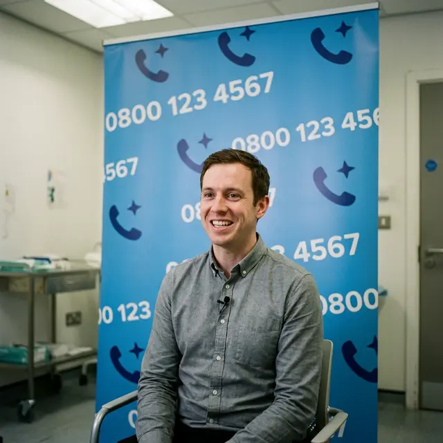

Интернет пестрит объявлениями: **«Федеральная программа восстановления зрения»**, **«Региональное восстановление через агрегатор»**. Звучит солидно, но за этим часто стоят обычные посредники и конвейерные клиники.

В этой статье мы разберем, как устроена экономика таких «программ» и почему дешевизна — это всегда риск.

## Ложные вывески и телефонный прессинг

Агрегаторы ЛКЗ — это прежде всего отделы продаж.

- **Спам-атаки:** Оставили заявку? Вас будут «дожимать» звонками по несколько раз в день, создавая ажиотаж.
- **Психологическое давление:** Менеджеры обучены манипулировать страхами, обещая нереальные скидки по «секретным программам».

## Фабрика радости: Скидки за «Wow-эффект»

Почему в рекламе агрегаторов все так счастливы? Эти эмоции покупаются.

1.  **Бартер на отзывы:** Пациенту предлагают скидку, если он запишет видео-благодарность прямо на выходе из операционной.
2.  **Эффект вау:** Сразу после лазера пациент испытывает временную эйфорию. Этот момент клиники используют, чтобы зафиксировать «радость» на камеру. О проблемах, которые начнутся позже, в ролике не скажут.
3.  **Цензура правды:** На сайтах программ вы никогда не найдете историй об осложнениях. Неудачные случаи просто зачищаются маркетинговым отделом.

## Экономика демпинга: На чем они экономят?

- **Диагностика за 15 минут:** Вместо глубокого 3D-анализа роговицы вам сделают поверхностный тест. Риск пропустить патологию огромен.
- **Хирурги на вахте:** Часто врачи оперируют по 60 человек за смену. Ошибки от усталости — обычное дело для лоукостеров.

## Юридическая ловушка

Многие агрегаторы работают через цепочки ООО. Как только у одного юрлица накапливается критическая масса жалоб — оно подает на банкротство. На его месте появляется новое. Вы остаетесь один на один со своими проблемами.

## Где расставлены сети?

Бизнес-модель лоукост-клиник требует огромного количества пациентов ежедневно. Поэтому агрегаторы чаще всего «обрабатывают» жителей городов-миллионников и крупных промышленных узлов:

**Москва, Санкт-Петербург, Казань, Самара, Оренбург, Новосибирск, Воронеж, Омск, Барнаул, Пенза, Красноярск, Ижевск, Ростов-на-Дону, Уфа, Челябинск, Волгоград.**

## Вердикт

Лазерная коррекция — это не товар с распродажи. Если клиника прячется за агрессивным маркетингом и торгует скидками за отзывы — бегите оттуда. Ваше зрение дороже любых сэкономленных денег.
