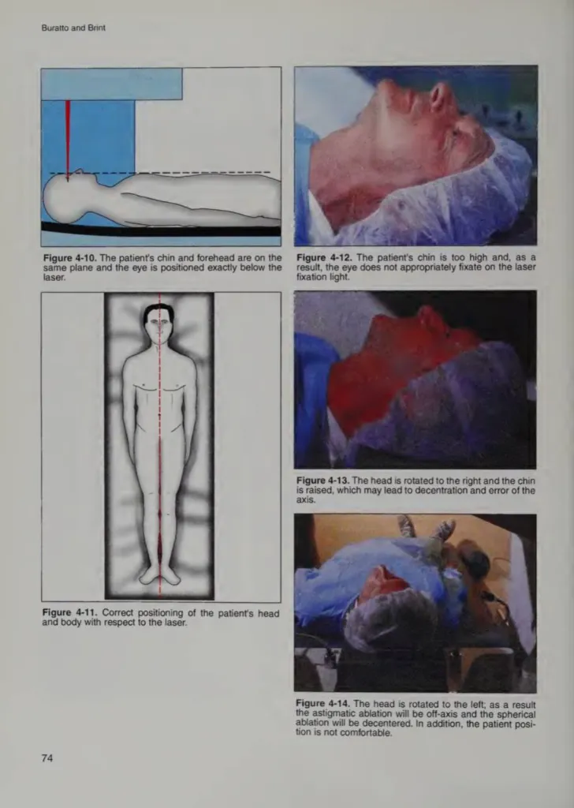

Лазерная коррекция зрения — это не просто "быстрая и безопасная процедура", как любят говорить в рекламе клиник. Это **ювелирная работа**, где даже малейшее движение может привести к катастрофическим последствиям.

## Что вам не расскажут перед операцией

Перед операцией вам скажут просто: **"Смотрите в зелёную точку"**. Всё.

Никто не предупредит, что:

- Один неловкий наклон головы — и лазер попадёт не туда
- Одно случайное движение — и исправить это уже **нельзя**
- Неправильная фиксация головы может испортить всю операцию

## Миф об "умном" лазере

Клиники любят говорить, что современные лазеры оснащены **eye tracking** (системой слежения за глазом). Это правда. Но есть нюанс, о котором молчат:

> **Лазер отслеживает движения ГЛАЗА, но НЕ отслеживает движения ГОЛОВЫ.**

Если вам неправильно зафиксируют голову или вы случайно дернетесь, лазер может не успеть скорректировать луч. Результат — **децентрация абляции**.

## Критическое значение позиционирования

_Источник: Buratto and Brint, учебник по лазерной хирургии глаза_

На изображении из учебника по лазерной хирургии показано, насколько важно правильное положение головы и тела пациента:

### Правильное положение (Figure 4-10, 4-11):

- Подбородок и лоб на одной плоскости
- Глаз расположен точно под лазером
- Тело выровнено по центральной оси

### Неправильное положение (Figure 4-12, 4-13, 4-14):

- **Подбородок слишком высоко** → глаз не фиксируется на лазерной точке
- **Голова повернута вправо** → децентрация и ошибка оси
- **Голова повернута влево** → астигматическая абляция смещена, сферическая абляция децентрирована, пациенту некомфортно

## Что может случиться при движении?

### 🔴 Лазер прожжёт не ту зону

Операция идёт по заранее рассчитанной карте глаза (топографии роговицы). Но если вы пошевелитесь, эта карта станет бесполезной.

Лазер испарит ткань роговицы **не там, где надо**. Это называется **децентрация абляции**.

**Последствия:**

- Индуцированный астигматизм высокого порядка
- Двоение изображения (ghosting)
- Невозможность получить чёткое зрение даже в очках

### 🔴 Проблемы с ночным зрением

Если лазер неправильно изменит форму роговицы из-за смещения, ваш глаз больше не будет нормально работать в темноте.

**Симптомы:**

- Огромные блики и ореолы вокруг источников света
- Звёздочки (starbursts) от фар встречных машин
- Двоение
- Неясность зрения в сумерках

[Подробнее о проблемах ночного зрения →](/nochnoe-zrenie-posle-lazernoj-korrekczii/)

### 🔴 Непоправимое ухудшение зрения

Есть люди, которые после ЛКЗ **теряли зрение настолько, что даже очки не могли помочь**.

Они не слепые, но их зрение:

- Нечёткое
- Искажённое
- Размытое
- С постоянными артефактами

**Почему?** Потому что лазер сместился на доли миллиметра из-за неправильного положения головы или её движения во время процедуры.

## Технические детали децентрации

В отличие от многих медицинских процедур, абляция роговичной ткани **необратима**. Ткань испарена и не регенерирует.

Исправление децентрации возможно только частично и требует дополнительной абляции, что:

- Истончает роговицу ещё больше
- Повышает риск [эктазии](/ektaziya-rogovicy-posle-lazernoj-korrekczii-zreniya)
- Не всегда даёт удовлетворительный результат

## Сравнение методов по уязвимости к движению

| Метод        | Уязвимость к движению | Система слежения               |
| :----------- | :-------------------- | :----------------------------- |
| **LASIK**    | Высокая               | Eye tracking (только глаз)     |
| **SMILE**    | Средняя               | Контактная линза стабилизирует |
| **ФРК**      | Высокая               | Eye tracking (только глаз)     |
| **TransPRK** | Высокая               | Eye tracking (только глаз)     |

## Почему об этом молчат?

Потому что тогда **денег станет меньше**.

Клиникам невыгодно рассказывать о таких рисках. Они продвигают лазерную коррекцию как "безопасную и надёжную", но не говорят, что **одна секунда — и можно остаться с испорченным зрением на всю жизнь**.

## Вопросы, которые стоит задать себе

- Вы уверены, что вам зафиксируют голову в корректном положении?
- Сможете неподвижно пролежать под лазером 6-10 минут?
- Уверены, что лазер отследит каждую ошибку?
- Что будет, если вы случайно чихнёте или вздрогнете?

**А если нет?**

## Реальные случаи

Из базы данных FDA MAUDE и форумов пострадавших:

> "Во время операции я почувствовал, что голова соскальзывает. Попытался сказать врачу, но он сказал 'не двигайся'. Теперь у меня двоение в правом глазу, которое не проходит уже 3 года."

> "Хирург сказал, что всё прошло отлично. Но когда я открыл глаза, всё было смазано. Оказалось, что абляция смещена на 1.5 мм от центра. Мне сказали, что 'так бывает' и отказались делать докоррекцию."

[Читать больше историй →](/otzyvy/)

## Вывод

Движение во время лазерной коррекции — это не просто "небольшая помеха". Это **прямой путь к осложнениям**, которые могут остаться с вами на всю жизнь.

Если вы всё же решились на операцию:

1. Убедитесь, что клиника использует современный eye tracker
2. Спросите, как фиксируют голову и тело
3. Узнайте, что будет, если вы случайно пошевелитесь
4. Требуйте письменного объяснения рисков децентрации

Но лучший способ избежать этих рисков — **не делать операцию вообще**.

## См. также

- [Врачебные ошибки при лазерной коррекции](/vrachebnye-oshibki-pri-lazernoy-korrekcii/)
- [10 причин не делать LASIK](/desyat-prichin-ne-delat-lasik/)
- [Почему офтальмологи не делают себе лазерную коррекцию](/pochemu-oftalmologi-ne-delayut-lazernuyu-korrekciyu-sebe/)
