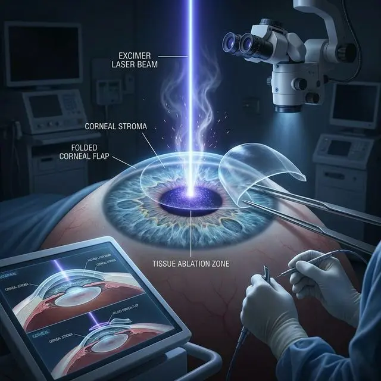

Ежедневно тысячи людей вбивают в поисковик вопросы: «**лазерная коррекция зрения что это такое простыми словами**» и «**что такое лазерная коррекция зрения плюсы и минусы**». Реклама клиник обещает быстрое и безболезненное избавление от очков, называя процедуру чуть ли не косметической услугой наравне с походом к стоматологу.

Но прежде чем лечь под лазер, каждому человеку необходимо снять розовые очки коммерции и понять, что в действительности делают с вашими глазами. В этой статье мы подробно и без медицинских терминов разберем, **что такое лазерная коррекция зрения**, как физически протекает операция и какие необратимые последствия она за собой влечет.

## Лазерная коррекция зрения: что это такое?

Если отвечать на вопрос «**лазерная коррекция зрения что это**» максимально коротко: это хирургическая операция, при которой луч лазера навсегда срезает (испаряет) часть живой ткани роговицы.

**Роговица** — это передняя выпуклая прозрачная оболочка глаза, через которую свет попадает внутрь оптической системы. При близорукости (миопии) глазное яблоко обычно слишком вытянуто в длину, из-за чего фокус изображения формируется перед сетчаткой, а не прямо на ней. Изображение вдали кажется размытым.

Чтобы свет фокусировался правильно, лазер делает из вашей собственной уникальной роговицы «линзу». Он выжигает клетки в центре роговицы, делая ее поверхность более плоской. То есть, хирург не «лечит» близорукость (размер глаза остается вытянутым, а все риски отслойки сетчатки сохраняются), он лишь делает вам неснимаемую «очковую линзу» прямо из тканей вашего же глаза, уменьшая при этом его прочность.

## Как проходит лазерная коррекция зрения?

Напуганы? Давайте посмотрим механику процесса. Чтобы добраться до плотных внутренних слоев роговицы (стромы), которые нужно испарить, хирург должен преодолеть передний, самый защищенный и пронизанный нервами слой. В зависимости от того, как хирург проходит этот слой, выделяют разные технологии.

Вот **как проходит лазерная коррекция зрения** при самом популярном методе — [LASIK и Femto-LASIK](/riski-i-posledstviya/lasik-ili-femtolasik-v-chem-raznica/):

1. **Подготовка и анестезия.** В глаз капают мощный обезболивающий препарат. Вы в сознании и лежите на операционном столе.
2. **Фиксация глаза.** Чтобы вы не моргнули, устанавливается специальный пружинный расширитель для век (блефаростат). При некоторых методах на глаз также надевают вакуумное кольцо с сильным давлением до потери зрения — это нужно для жесткой фиксации.
3. **Разрез (выкраивание лоскута).** При ЛАСИК специальным лезвием микрокератома, а при Фемто-Ласик — фемтосекундным лазером, на поверхности роговицы вырезается полукруглая «крышечка» (лоскут или флэп). При этом навсегда перерезаются миллионы нервных волокон оптического аппарата.
4. **Работа лазера.** Хирург пинцетом отгибает лоскут в сторону. Затем эксимерный лазер за несколько секунд с характерным звуком треска и запахом паленого белка испаряет необходимый объем стромы роговицы под отогнутой «крышечкой».

_Испарение (абляция) стромы ультрафиолетовым лазером под отогнутым лоскутом — необратимый процесс "выжигания" очковой линзы прямо на глазу._

5. **Закрытие.** Лоскут укладывается обратно на место. Глаз промывают раствором, чтобы избежать попадания мусора под лоскут (хотя такое случается нередко).

Если вы интересуетесь, **лазерная коррекция зрения как происходит** при методе [SMILE](/otzyvy/smile-ili-smile-pro/), то вместо создания большой «крышечки» лазер вырезает кусочек ткани (лентикулу) внутри роговицы, который хирург затем физически "выдирает" пинцетом через узкий сквозной прокол.

## Лазерная коррекция зрения: плюсы и минусы до и после

Маркетологи всегда красиво расписывают «жизнь до и после». Но если вы ищете честный ответ на запрос «**лазерная коррекция зрения что это такое плюсы и минусы до и после**», вам необходимо знать всю правду.

### Плюсы (Что обещает клиника):

- **Отказ от очков и линз.** В большинстве случаев после операции люди действительно начинают видеть вдаль без очков.
- **Быстрота процедуры.** Само воздействие лазера занимает секунды, а пребывание в клинике — несколько часов.

### Минусы и необратимые последствия (О чем молчат врачи):

Любая лазерная коррекция — это ампутация части роговицы. Она влечет за собой целый шлейф осложнений, от которых страдает огромный процент прооперированных:

1. **Хронический синдром сухого глаза (ССГ) и нейропатические боли.** Перерезание корнеальных нервов во время создания лоскута или прокола при SMILE приводит к тому, что роговица теряет чувствительность. Орган перестает получать сигнал «обнови слезу». Наступает тяжелейший сухой глаз. Люди вынуждены годами капать увлажняющие капли каждые полчаса, чувствуя в глазах резь, песок и битое стекло. Зачастую это перерастает в хроническую неизлечимую глазную боль на всю жизнь.
2. **Гало (ореолы) и светобоязнь.** Измененная лазером роговица искажает прохождение света. В ночное время (когда зрачок расширяется) источники света — фары авто, фонари, светофоры — превращаются в гигантские лучистые ореолы («гало» и «старберсты»). Из-за этого многие пациенты навсегда лишаются возможности безопасно водить автомобиль ночью.
3. **Хрупкость роговицы.** Разрезанный лоскут при ЛАСИКе никогда не прирастает обратно со 100% прочностью. Приросшими оказываются только края. Лоскут держится как мокрая бумажка на стекле и может оторваться даже через 15 лет от случайного тычка пальцем в глаз или удара воздушной подушки автомобиля, приведя к мгновенной слепоте.
4. **[Регресс зрения](/riski-i-posledstviya/pochemu-posle-lkz-padaet-zrenie-regress/).** Глаза — это не пластик. Организм попытается компенсировать исчезнувшую ткань, восстанавливая толщину, что приведет к возврату «минуса». Вам все равно придется надеть очки через 1-5 лет. А в 45 лет неизбежно нагрянет возрастная дальнозоркость (пресбиопия), и понадобятся очки для чтения.
5. **Угроза кератоэктазии.** Самое опасное осложнение — истонченная лазером роговица не выдерживает давления изнутри, растягивается и выпячивается. Это требует сложнейших операций, вплоть до пересадки донорской роговицы для спасения глаза от слепоты.

### Стоит ли делать операцию?

Изучая, **что такое лазерная коррекция зрения**, вы должны сделать фундаментальный вывод: эта операция **не лечит**. Это лишь косметическая процедура, вырезающая очковую линзу прямо на вашем глазу и навсегда травмирующая орган.

Все риски, боль и возможная инвалидизация при лазерной коррекции совершенно неоправданны, так как сегодня существуют абсолютно безопасные, безболезненные и, что самое главное, _полностью обратимые_ методы компенсировать миопию — красивые оправы для очков и современные дышащие контактные линзы. Выбор всегда за вами, но помните: новые глаза вам никто не пересадит!
