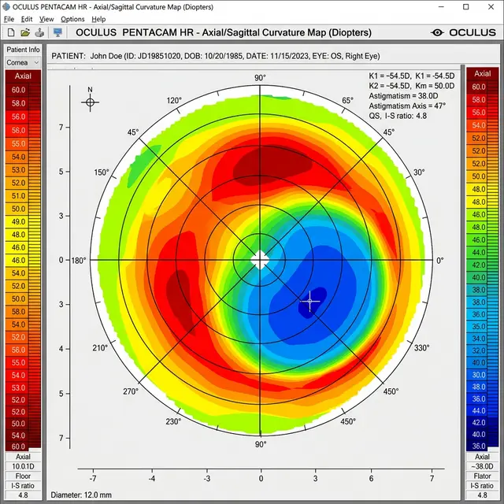
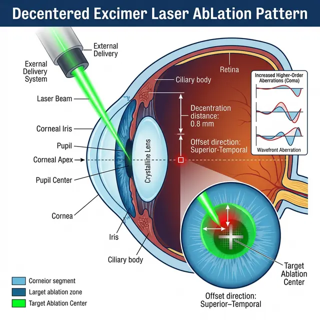
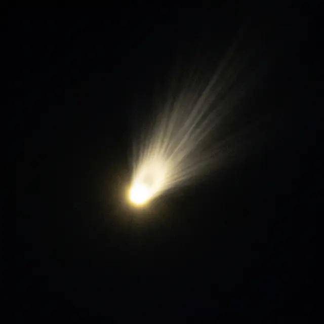
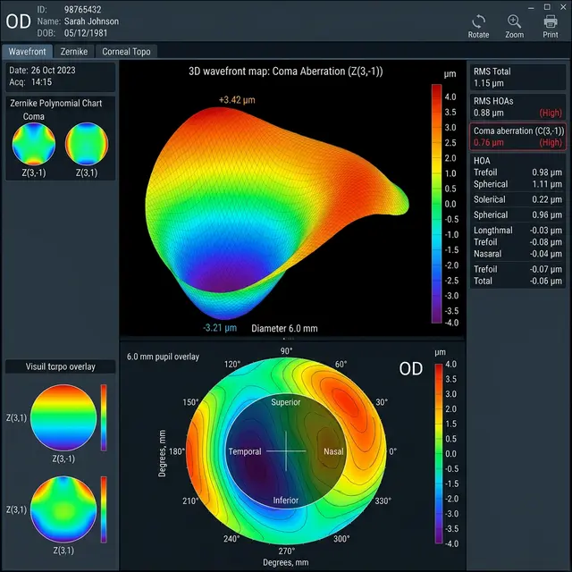
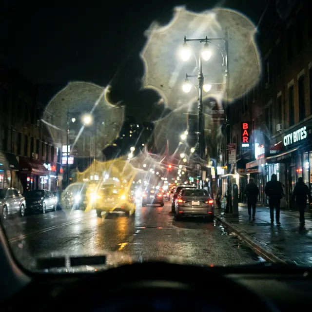
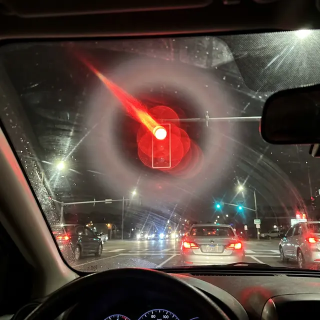

Представьте, что вы надели очки, у которых линза смещена в сторону от зрачка. Вы видите мир искаженным, двоящимся и размытым. Именно это происходит при **децентрации оптической зоны** после лазерной коррекции зрения.

<figure style="text-align: center;">
  
  <figcaption>Типичная картина децентрации на топограмме: зона воздействия лазера (синее пятно) смещена относительно центра.</figcaption>
</figure>

Это одно из самых коварных осложнений, которое превращает жизнь пациента в бесконечный поиск «правильного» угла взгляда.

## Что это такое?

При операции хирург должен центрировать лазерный луч точно по центру вашего зрачка (вернее, по зрительной оси). Децентрация — это ситуация, когда лазер «промахнулся» и испарил ткань роговицы со смещением. В итоге центр вашей новой «линзы» не совпадает с центром зрачка.

## Почему это происходит?

Существует три основные причины:

1.  **Движение глаза (Eye Movement):** Несмотря на наличие систем слежения (Eye Trackers), резкое движение глаза пациента в момент работы лазера может привести к микросмещению.
2.  **Ошибка хирурга:** Неправильная ручная установка центрации перед началом работы лазера.
3.  **Технический сбой:** Ошибка в калибровке системы трекинга лазера.

<figure style="text-align: center;">
  
  <figcaption>Схематичное изображение ошибки: лазерный луч воздействует на роговицу в стороне от зрительной оси.</figcaption>
</figure>

## Симптомы: «Адская дискотека» в глазах

Если у вас децентрация, вы столкнетесь со следующими проблемами:

- **Монокулярное двоение:** Даже с одним закрытым глазом картинка будет двоиться или иметь «тень» (ghosting).
- **Выраженные гало и старберсты:** Вокруг ламп и фар возникают огромные лучи и ореолы, так как свет преломляется через край зоны коррекции.
- **Потеря контрастности:** Мир кажется тусклым, «грязным», особенно в сумерках.
- **Быстрая утомляемость:** Мозг сходит с ума, пытаясь совместить две разные картинки.

## Аберрация «Кома»: эффект кометы

Децентрация вызывает специфический вид искажений, который в оптике называют **аберрацией комы**.

<figure style="text-align: center;">
  
  <figcaption>Как выглядит точечный источник света (звезда или фонарь) для пациента с децентрацией: свет превращается в «комету» с хвостом.</figcaption>
</figure>

Вместо четкой точки свет размазывается в асимметричное пятно, напоминающее комету с ярким ядром и тусклым длинным хвостом. Это происходит потому, что световые лучи, проходящие через разные края децентрированной роговицы, не сходятся в одной точке на сетчатке.

<figure style="text-align: center;">
  
  <figcaption>3D-карта волнового фронта (wavefront): хорошо виден характерный асимметричный изгиб, который дает эффект комы.</figcaption>
</figure>

Подобные искажения невозможно исправить обычными очками, так как они не могут скомпенсировать сложную, «кривую» форму вашей новой роговицы. Единственный выход в такой ситуации — жесткие склеральные линзы, которые создают новую, идеально ровную поверхность поверх поврежденной.

<figure style="text-align: center;">
  
  <figcaption>Пример того, как видит мир человек с децентрацией оптической зоны ночью: сильное двоение и «тени» от всех источников света.</figcaption>
</figure>

<figure style="text-align: center;">
  
  <figcaption>Красный сигнал светофора при децентрации: свет превращается в «ракету» или «комету», а вокруг видны множественные фантомные копии сигнала.</figcaption>
</figure>

## Почему это трудно исправить?

Децентрация — это не просто «недокоррекция», когда можно просто «добавить» диоптрий. Это **архитектурный брак**.
Чтобы исправить децентрацию, нужно:

- Либо сточить еще больше ткани роговицы вокруг, чтобы «выровнять» центр. Но роговица не бесконечна, её толщины может просто не хватить.
- Либо использовать сложнейшую докоррекцию «по топографии» (Topography-guided), которую делают далеко не в каждой клинике.

Часто попытка исправить децентрацию приводит к еще большему ухудшению зрения, появлению нерегулярного астигматизма и кератоконусу.

## Вердикт

Децентрация — это технический брак операции. Если после Ласика у вас стойкое двоение, которое не проходит через 3 месяца — требуйте **кератотопограмму**. Обычный авторефрактометр в клинике может показывать «0.0», но топограмма четко покажет смещенное «пятно» коррекции. Не позволяйте врачам списывать это на «нейроадаптацию».
