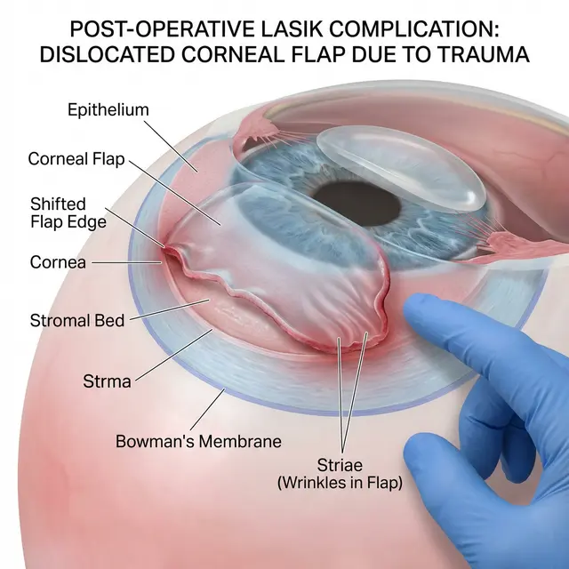

Фемто-Лазик (Femto-LASIK) часто рекламируют как самую «быструю» операцию: сделал утром, а вечером пошел в спортзал. Но если ваш спорт подразумевает хоть малейший риск удара в лицо, эта операция может стать главной ошибкой в вашей карьере.

Разберемся, почему **Фемто-Лазик и спорт** — это опасное сочетание, и какие существуют строгие противопоказания.

## Почему флэп — это «слабое звено»?

В отличие от старого Ласика, где лоскут резали стальным ножом, в Фемто-Ласике его формирует лазер. Это точнее, но биологическая суть не меняется: **лоскут никогда не прирастает обратно**. Он держится только за счет вакуума и тонкого слоя эпителия по краям.

Для спортсмена это означает, что в его глазу всегда есть «крышка», которую можно сорвать.

## Виды спорта под запретом (Противопоказания)

Если вы занимаетесь следующими видами спорта, Фемто-Лазик вам **категорически не рекомендуется**:

1.  **Единоборства (Бокс, ММА, каратэ):** Любой пропущенный джеб или касание перчаткой может привести к «сморщиванию» (стриям) лоскута. Это требует немедленной операции, а зрение может не восстановиться до 100%.
2.  **Игровые виды (Футбол, Баскетбол, Регби):** Локоть соперника, попавший в глаз, или удар мячом на вылете — классические причины госпитализации пациентов после Фемто-Ласика.
3.  **Экстремальные виды (Мотокросс, Прыжки в воду):** Сильные вибрации или удар об воду при падении создают избыточное давление, которое может «приподнять» край еще не зажившего лоскута.

## Сроки ограничений

Клинические рекомендации обычно говорят о 1 месяце без спорта. Но статистика осложнений показывает, что смещение лоскута случается и через **5-10 лет** после операции при сильном механическом воздействии.

Прочность соединения тканей в зоне разреза после Фемто-Ласика восстанавливается лишь на **2-5%** от исходной.

## Есть ли безопасная альтернатива?

Для тех, кто не готов отказываться от активного спорта, существует метод **ФРК (PRK)** или его современные вариации (Trans-PRK).

- **Плюс:** Нет никакого лоскута. Роговица остается единым целым. Это выбор спецназа, летчиков и профессиональных бойцов.
- **Минус:** Реабилитация длится 2-3 недели (вместо 2 дней), и это больно.

## Резюме

Если вы планируете продолжать заниматься спортом, где возможен физический контакт — **Фемто-Лазик вам противопоказан**. Не слушайте менеджеров в клиниках, которые торопят вас на операционный стол. Помните: один случайный удар на тренировке может обнулить все результаты коррекции и оставить вас с рубцом на всю жизнь.
