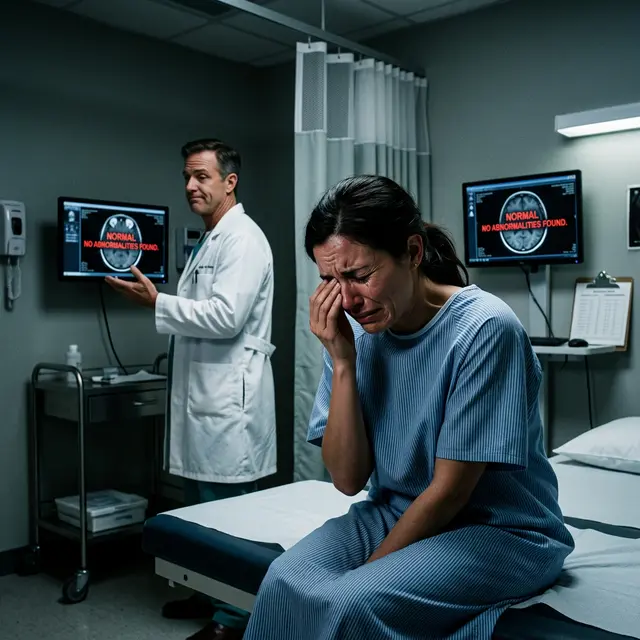

Вы проснулись после операции и поняли, что мир двоится, глаза режет каленым железом, а ночью вы видите «звездные взрывы» вместо фонарей. Вы идете к врачу, ожидая помощи, но слышите: _«Ваши анализы идеальны. Глаз здоров. Возможно, вам стоит обратиться к психотерапевту»_.

Это и есть **газлайтинг в офтальмологии**. Психологическая манипуляция, цель которой — заставить вас усомниться в собственной адекватности, чтобы защитить репутацию клиники.

## Почему врачи это делают?

Лазерная коррекция зрения — это коммерческий продукт. Отрицательный отзыв или судебный иск портят конверсию. Врачу гораздо проще объявить пациента «сложным» или «мнительным», чем признать:

1.  **Нервные окончания повреждены** (нейропатическая боль), и на обычных аппаратах этого не видно.
2.  **Случилась ошибка лазера**, которую невозможно исправить.
3.  **Вы попали в те самые 5%**, о которых «забыли» упомянуть в рекламе.

## Любимые тактики газлайтинга

- **«Это нейроадаптация»**: Стандартный ответ на любые искажения в первые полгода. Мозг якобы должен «привыкнуть» к двоящейся картинке. Спойлер: к физическому браку на роговице мозг не привыкает, он просто учится игнорировать часть сигнала, теряя в качестве жизни.
- **«Тесты показывают 1.0»**: Вы можете видеть нижнюю строчку таблицы через силу и слезы, но это не значит, что ваше зрение качественное. Глэр, гало и потеря контрастности не измеряются стандартными таблицами.
- **«У вас просто депрессия»**: Часто после операции у пациентов действительно начинается депрессия. Но врачи путают причину и следствие: человек впадает в депрессию _из-за_ испорченного зрения, а не видит плохо из-за депрессии.

## Как защитить себя?

1.  **Требуйте объективных данных**: Если у вас болят глаза, требуйте **конфокальную микроскопию** (она видит поврежденные нервы) или **кератотопограмму** (она видит неровности поверхности). Обычный осмотр щелевой лампой здесь бесполезен.
2.  **Фиксируйте жалобы письменно**: Не позволяйте врачу просто «поговорить с вами». Каждая жалоба должна быть занесена в медицинскую карту.
3.  **Ищите «второе мнение»**: Идите в клинику, которая не занимается лазерной коррекцией. Врачи там более объективны и не связаны круговой порукой.

## Итог

Если вы чувствуете, что с глазами что-то не так — **вам не кажется**. Боль реальна. Искажения реальны. Газлайтинг — это всего лишь юридический щит клиники. Знание этой тактики — ваш первый шаг к тому, чтобы начать бороться за свое здоровье, а не за «идеальные отчеты» хирурга.
