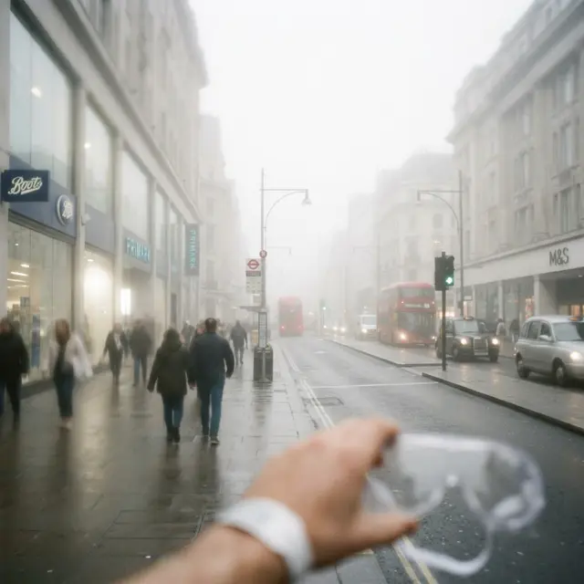

Эффект «тумана» или «белой пелены» — самая частая жалоба пациентов в первые дни после операции. Вы открываете глаза, ожидая HD-четкость, но видите мир так, будто находитесь в плохо проветренной бане.

Разберемся, **как долго видишь как за туманом после лазерной коррекции зрения** и когда этот симптом перестает быть нормой.

## Почему возникает туман?

Основная причина — **отек роговицы**. Лазерное воздействие — это контролируемый ожог и травма тканей. Организм реагирует на это накоплением жидкости в межклеточном пространстве роговицы, что временно снижает её прозрачность.

## Сроки: когда туман должен рассеяться?

Продолжительность эффекта напрямую зависит от метода операции:

### 1. После LASIK / Femto-LASIK

- **Первые 4-6 часов:** Максимальный туман и слезотечение.
- **Через 24 часа:** У 80% пациентов туман исчезает или становится минимальным.
- **1 неделя:** Остаточный туман может возникать к вечеру при зрительной нагрузке.

### 2. После ФРК (PRK)

Здесь ситуация сложнее. Поскольку эпителий удаляется полностью, отек и воспалительная реакция выражены сильнее.

- **Первые 3-4 дня:** Пока не заживет защитная линза, туман будет очень плотным.
- **От 2 недель до месяца:** Зрение может «плавать», а туман — то появляться, то исчезать.

## Когда туман — это плохой знак?

Если через месяц после операции вы все еще «в тумане», это может быть признаком осложнений:

1.  **Хейз (Haze):** Это специфическое помутнение роговицы после ФРК, связанное с неправильным заживлением коллагена. Роговица становится матовой, как некачественное стекло. Требует длительного лечения стероидами.
2.  **ДЛК (Синдром песков Сахары):** Неинфекционное воспаление под лоскутом при LASIK. Туман сопровождается ощущением инородного тела и светобоязнью.
3.  **Гипертензия:** Повышение внутриглазного давления как реакция на гормональные капли (Дексаметазон). Отек роговицы при этом не проходит, а нарастает.

## Как ускорить восстановление?

- **Соблюдайте режим капель:** Капли снимают отек и воспаление. Пропуск одного дня может вернуть «туман» на неделю.
- **Дайте глазам отдых:** Чтение и мониторы заставляют вас реже моргать, что усиливает сухость и отек.
- **Солнцезащитные очки:** УФ-излучение провоцирует воспаление неокрепшей роговицы.

## Вердикт

В норме туман после LASIK проходит за **1-3 дня**. Если пелена перед глазами сохраняется дольше недели или зрение начало ухудшаться после периода четкости — не ждите «нейроадаптации», срочно бегите к врачу на контроль внутриглазного давления.
