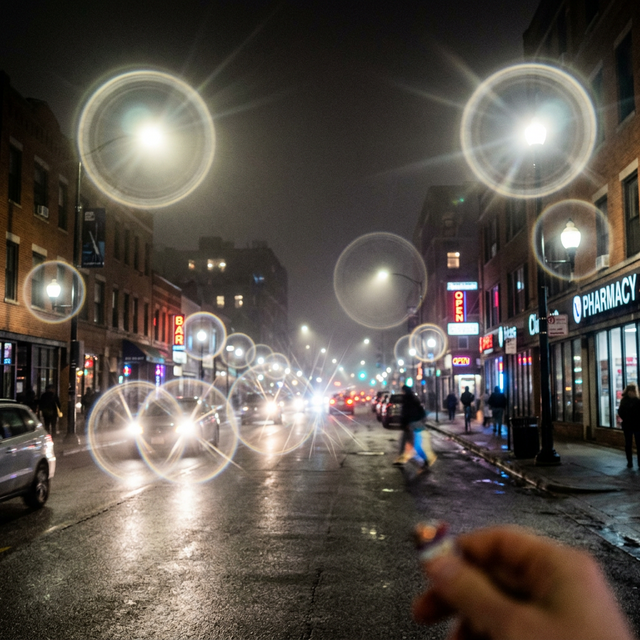
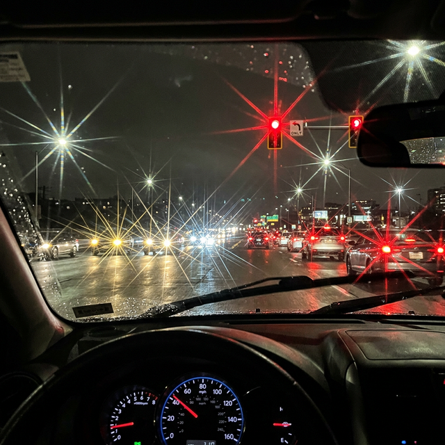
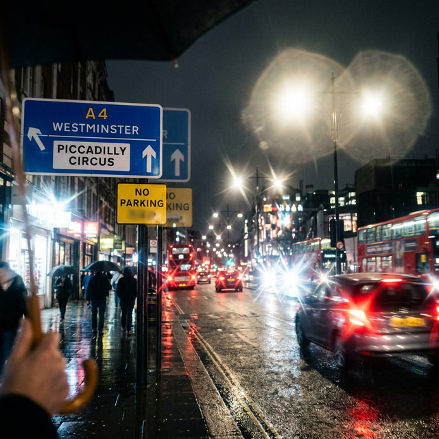
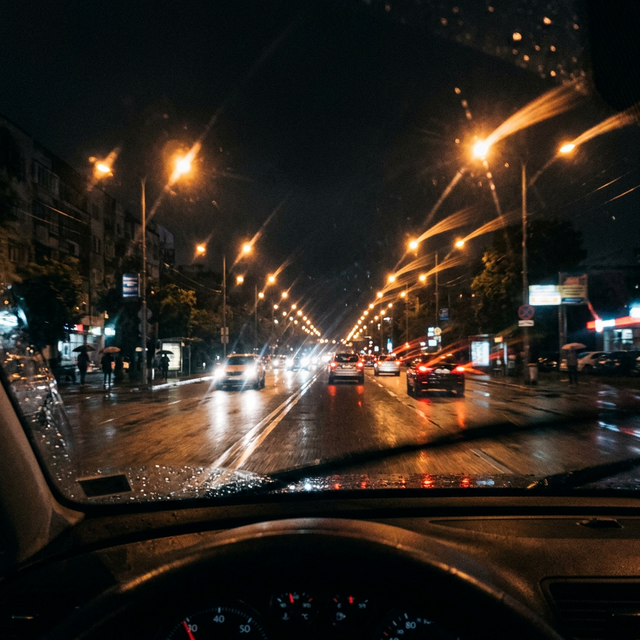

Обещания клиник о «100% зрении» часто не включают в себя описание того, что вы будете видеть ночью. Для многих пациентов после лазерной коррекции зрения (ЛКЗ) ночной город превращается в калейдоскоп светящихся артефактов.

В этой статье мы покажем, как на самом деле выглядят уличные фонари и фары машин глазами человека с постоперационными аберрациями.

## 1. Эффект Гало (Halo)

Гало — это светящиеся кольца или ореолы вокруг каждого источника света. Они возникают, когда свет проходит через края прооперированной зоны роговицы при расширенном зрачке.

_Типичный пример эффекта Гало: мягкие светящиеся круги вокруг ламп и фар._

---

## 2. Старберст (Starburst)

Старберст проявляется в виде длинных, острых лучей, исходящих из центра источника света. Это делает вождение ночью крайне утомительным, так как лучи от фар встречных машин могут перекрывать обзор.

_Эффект Старберст: ослепляющие лучи, превращающие фонари в «колючие звезды»._

---

## 3. Глэр (Glare) и Размытие (Ghosting)

Глэр — это общее ослепление и рассеивание света, из-за которого теряется контрастность. Размытие (ghosting) добавляет к основному объекту его слабую «тень» или копию, сдвинутую в сторону.

_Глэр превращает яркие точки в слепящие пятна, а надписи на знаках начинают двоиться._

---

## 4. Эффект Комы (Coma)

Кома — это аберрация, при которой точка света превращается в «комету» с хвостом. Это происходит из-за асимметрии роговицы или небольшой децентрации лазерного воздействия.

_Эффект Комы: светящиеся точки «стекают» в одну сторону, создавая визуальный шум._

## Почему это происходит?

Все эти эффекты — результат появления **аберраций высшего порядка**. Лазер меняет кривизну роговицы, но он не может сделать её поверхность такой же идеальной, как природная линза.

**Причины:**

1.  **Широкий зрачок:** Ночью зрачок расширяется больше, чем зона воздействия лазера.
2.  **Децентрация:** Лазер прижег роговицу чуть в стороне от оптической оси.
3.  **Индивидуальный ответ тканей:** Роговица зажила неравномерно, создав микроскопические неровности.

## Можно ли это исправить?

К сожалению, обычные очки или мягкие линзы эти эффекты не убирают. Помочь могут только специальные **склеральные линзы**, которые создают новую ровную поверхность для глаза, или (в редких случаях) сложная топографически-ориентированная переоперация.

Если вы только планируете ЛКЗ, обязательно спросите врача о размере вашей **оптической зоны** и сравните его с размером вашего зрачка в темноте.
