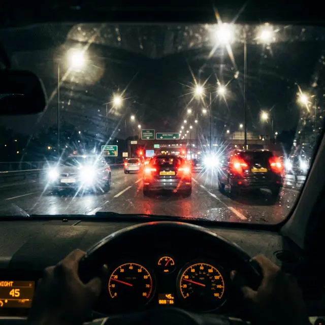

Многие пациенты, мечтающие о лазерной коррекции зрения, представляют результат как «кристально чистую картинку» 24/7. Однако для значительного процента оперированных реальность наступает после захода солнца. Вопрос «**как видят фонари после ЛКЗ**» — один из самых болезненных в сообществах пострадавших от коррекции.

То, что в клиниках называют «временным дискомфортом», на деле может оказаться пожизненным искажением визуального восприятия.

## Три всадника ночной слепоты

После ЛКЗ (LASIK, Femto-LASIK, ФРК или SMILE) светящиеся объекты в темноте часто перестают быть точками и превращаются в оптические артефакты:

1.  **Гало (Halo):** Вокруг каждого фонаря или фары появляется светящееся кольцо или облако. Это происходит из-за того, что свет проходит через край зоны, где лазер изменил роговицу.
2.  **Глэр (Glare):** Ослепляющий эффект, когда свет «разливается» по полю зрения, снижая контрастность. Представьте, что вы смотрите через грязное лобовое стекло, которое невозможно протереть.
3.  **Старбёрст (Starburst):** От источников света расходятся длинные, острые «лучи» или «иглы». Фонари превращаются в гигантские светящиеся ежи.

## Почему это происходит?

Главная причина — несоответствие диаметра **оптической зоны абляции** (зоны, которую обработал лазер) и диаметра вашего **зрачка в темноте**.

Если ваш зрачок в условиях низкой освещенности расширяется до 7-8 мм, а лазер обработал только центральные 6 мм (стандарт для многих эконом-клиник), лучи света на периферии проходят через «неправильную» кривизну или край лоскута. В этот момент и рождается оптический хаос.

## «Черный список» для водителей

Для тех, кто часто ездит за рулем ночью, подобные спецэффекты становятся прямой угрозой безопасности:

- Фары встречных машин ослепляют сильнее обычного.
- Дорожные знаки и разметка «плывут» в ореолах света.
- Теряется способность оценивать дистанцию до объектов.

## Можно ли это исправить?

Врачи часто обещают, что «мозг адаптируется» (нейроадаптация). В переводе на человеческий — вы просто привыкнете страдать.

**Реальные пути решения (не всегда успешные):**

- **Бримонидин или капли с пилокарпином:** Временно сужают зрачок, чтобы свет не попадал на край зоны коррекции. Но это лишь временная мера с побочками.
- **Склеральные линзы:** Сложные и дорогие линзы, которые создают новую оптическую поверхность поверх поврежденной роговицы.
- **Топо-графическая докоррекция:** Повторная операция по сглаживанию неровностей, которая несет риск еще большего истончения роговицы (эктазии).

## Вердикт

То, **как вы будете видеть фонари после ЛКЗ**, зависит от анатомии вашего зрачка и качества оборудования. Если у вас широкие зрачки, риск получить «ночные огни» вместо зрения стремится к 100%. Обязательно требуйте замера зрачка в темноте (пупиллометрии) перед операцией, хотя многие клиники «забывают» это сделать, чтобы не терять клиента.
