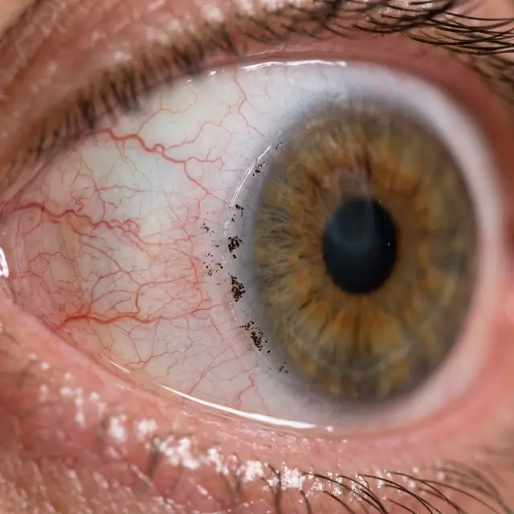

Женщины часто пренебрегают запретом на макияж после операции, считая его «перестраховкой врачей». На самом деле, попадание косметики под свежесформированный лоскут — это одна из самых неприятных и трудноизлечимых проблем.

<figure style="text-align: center;">
  
  <figcaption>Микроскопические частицы туши или теней, застрявшие под краем лоскута. Они вызывают хроническое воспаление и могут стать причиной врастания эпителия.</figcaption>
</figure>

### Как это происходит?

Роговичный лоскут (флэп) не приклеен герметично. Первые несколько дней он держится «на честном слове».

- Если вы красите ресницы или веки, микрочастицы туши, подводок или теней могут легко затечь под приоткрытый край лоскута.
- Еще хуже — **волосинка или ресничка**, попавшая под флэп.

### Чем опасна волосинка под флэпом?

Если под лоскут попала ворсинка (с одежды хирурга, из воздуха или ваша собственная ресница), она превращается в очаг хронической инфекции и раздражения.

1.  **ДЛК (Пески Сахары):** Организм реагирует на чужеродный белок мощным воспалением.
2.  **Неправильный астигматизм:** Даже одна тонкая волосинка создает бугорок на поверхности роговицы, искажая все проходящие лучи.
3.  **Вторичное инфицирование:** Инородное тело — отличный плацдарм для бактерий.

### Что делать, если инородное тело уже там?

Сами вы ничего не сделаете. Промывать глаз каплями бесполезно — частица находится **внутри** тканей.

- Хирургу придется снова поднимать лоскут (флэп).
- Промывать интерфейс специальным стерильным раствором.
- Укладывать лоскут обратно.

Это означает еще один круг заживления, риск занесения инфекции и еще больший психологический стресс.

### Как предотвратить?

- **Никакой косметики минимум 2 недели.** Это закон.
- **Осторожно умывайтесь:** Чтобы ресницы случайно не попали в глаз при контакте с водой.
- **Носите защитные очки:** Они уберегут от попадания пыли и ворсинок из воздуха в первые 2–3 дня.

Если вы чувствуете, что в глазу что-то «мешает», а капли не помогают — **не ждите**. Идите на осмотр. Инородное тело под лоскутом само не рассосется.
