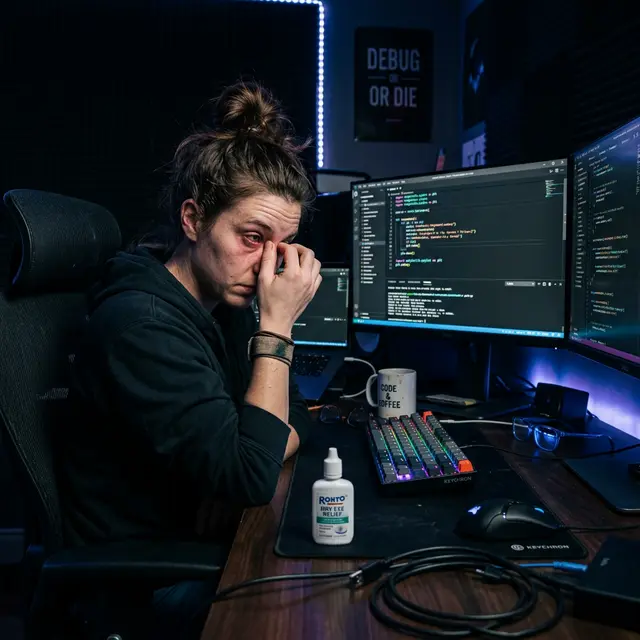

Для айтишника зрение — это основной инструмент производства. Поэтому вопрос «**есть ли смысл делать лазерную коррекцию зрения, если идешь на программиста**» звучит в кабинетах офтальмологов и IT-хабах постоянно.

Проблема в том, что клиники обещают свободу от очков, но «забывают» рассказать о специфических рисках для тех, кто проводит у монитора по 10-14 часов в сутки.

## Главный враг — Синдром Сухого Глава (ССГ)

Любой программист знает, что при глубоком погружении в код человек перестает моргать. Концентрация внимания снижает частоту мигательных движений в 3-5 раз.

- **До операции:** Ваша роговица справляется с этим.
- **После операции:** Нервные окончания роговицы перерезаны лазером. Обратная связь нарушена. Глаз не подает сигнал о сухости, и слеза не вырабатывается вовремя.

Для программиста это означает **хроническую боль и жжение**. Спустя 2-3 часа работы картинка начинает «плыть» не из-за плохого зрения, а из-за того, что поверхность роговицы превращается в пересохшую пустыню.

## Регресс: вернется ли минус?

Существует миф, что если много смотреть в монитор после ЛКЗ, «зрение снова упадет». На самом деле, лазер меняет форму роговицы навсегда. Но!

1.  **Спазм аккомодации:** Постоянная нагрузка вблизи вызывает перенапряжение мышц глаза. Вы видите хуже, и кажется, что минус вернулся.
2.  **Нестабильность тканей:** При высоких степенях миопии роговица может постепенно «выравниваться» назад (регресс), и нагрузка на близком расстоянии способствует этому процессу.

## Специфика работы в IT

В условиях офисной работы к факторам риска добавляется сухой воздух и повсеместная работа кондиционеров — это идеальные условия для того, чтобы ваш ССГ после операции стал невыносимым.

Нередко программисты жалуются, что в крупных потоковых клиниках врачи не всегда вникают в специфику профессии и назначают стандартный протокол, который для специалиста может закончиться пожизненной зависимостью от капель.

## Так есть ли смысл?

**Смысл есть только в том случае, если вы готовы:**

- Каждые 20 минут делать перерыв и капать увлажняющие капли без консервантов (минимум год).
- Работать со специальным увлажнителем воздуха под столом.
- Примириться с тем, что идеальная четкость может смениться «грязным» зрением в конце рабочего дня.

## Вывод

Если ваш минус не мешает вам жить в очках или линзах — **программисту лучше не трогать роговицу**. Галстук можно снять, а лоскут в глазу останется с вами навсегда, превращая каждый рабочий спринт в борьбу с болью и песком в глазах.
