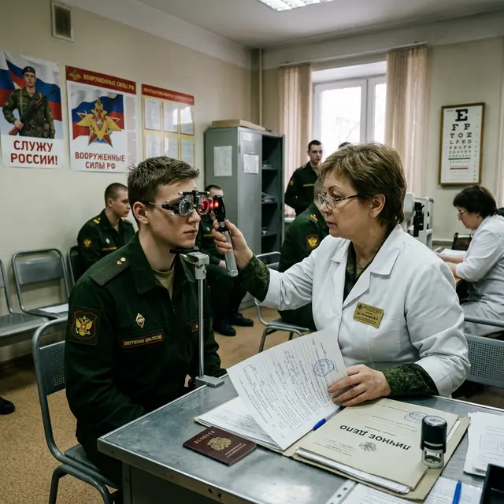

Среди призывников бытует два противоположных мифа: одни думают, что после операции на глаза в армию точно не возьмут («глаза же резаные»), другие — что операция поможет пройти медкомиссию и попасть в элитные войска.

Разберемся в юридических тонкостях: **если сделать лазерную коррекцию зрения, заберут ли в армию** и на какую отсрочку можно рассчитывать.

## Базовое правило военкомата

Согласно «Расписанию болезней», освидетельствование призывников, перенесших лазерную коррекцию, проводится по **статье 36**.

Главный нюанс: категорию годности выставляют не по самому факту операции, а по **результату** (остроте зрения) и состоянию глазного дна после неё.

## Станет ли призывник «годным»?

Если у вас была близорукость выше -6.0 диоптрий (категория «В» — ограниченно годен), и вы сделали операцию, после которой зрение стало единица — **вы автоматически становитесь годным к службе (категория «А» или «Б»)**.

Для военкомата неважно, была у вас операция или нет — они смотрят на текущие показатели рефракции. Таким образом, лазерная коррекция часто «закрывает» путь к получению военного билета по зрению.

## Дают ли отсрочку после операции?

Да. Любое хирургическое вмешательство дает право на временную негодность:

- После лазерной коррекции (LASIK, ФРК и др.) обычно предоставляется **отсрочка на 6 месяцев** (категория «Г»). Это время дается на реабилитацию и проверку стабильности результата.
- По истечении отсрочки вас вызовут на повторное освидетельствование. Если зрение стабильно и осложнений нет — вы пойдете служить с «новыми» глазами.

## Скрытые риски службы после ЛКЗ

Армия — это не лучшие условия для «хрупких» глаз после лазера:

1.  **Травмоопасность:** Как мы писали в статье про **[отрыв флэпа](/riski-i-posledstviya/mozhet-li-flep-otorvatsya/)**, лоскут после LASIK никогда не прирастает полностью. Прямой удар в глаз в ходе учений или драки может привести к потере лоскута и слепоте. В полевых условиях спасти такой глаз невозможно.
2.  **Гигиена:** Пыль, грязь, отсутствие возможности вовремя закапать увлажняющие капли в наряде или на полигоне — прямой путь к хроническому воспалению и потере прозрачности роговицы.
3.  **Нагрузки:** Тяжелые физические нагрузки в первые полгода после операции могут способствовать повышению ВГД и проблемам с сетчаткой, которая при близорукости часто истончена.

## Хитрость с ФРК

Некоторые пытаются сделать ФРК специально перед призывом, так как после этого метода на роговице не остается лоскута (флэпа), и она технически более прочная. Однако период реабилитации и «тумана» после ФРК гораздо дольше, что может усложнить жизнь новобранцу в первые месяцы.

## Вердикт

Если ваша цель — **избежать службы**, делать лазерную коррекцию — плохая идея. Она превратит вас из «ограниченно годного» в обычного солдата. Если же вы мечтаете служить в спецназе или ВДВ, помните, что LASIK — это «ахиллесова пята» вашего организма. Один случайный удар в лицо может закончить вашу военную карьеру инвалидностью по зрению.
