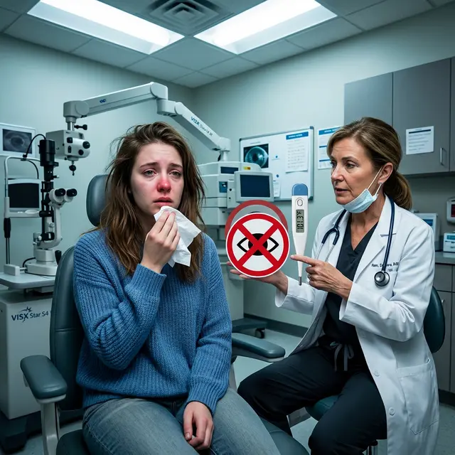

Часто пациенты, которые месяцами готовились к операции, боятся её переносить: «Уже взяла отпуск», «Билеты куплены», «Насморк — это ерунда». Они пытаются скрыть легкое недомогание от хирурга. Но **лазерная коррекция зрения с признаками ОРВИ** — это игра в русскую рулетку, где на кону ваше зрение навсегда.

## Почему ОРВИ — абсолютное противопоказание?

Любая вирусная инфекция — это не просто сопли. Это генерализованный процесс, затрагивающий весь организм, включая слизистые оболочки глаз.

### 1. Риск инфицирования интерфейса

Во время операции роговица вскрывается (в LASIK формируется лоскут). Если в организме «гуляет» вирус, риск того, что он попадет в стерильное пространство между слоями роговицы, возрастает в десятки раз. Результат — гнойный кератит, который лечится крайне тяжело и часто оставляет помутнения (бельма).

### 2. Реактивация герпеса

Многие люди являются носителями вируса герпеса. Любая простуда ослабляет иммунитет, и хирургическая травма (лазер) может спровоцировать герпетический кератит. Это одно из самых страшных осложнений, ведущее к потере роговицы.

### 3. Непредсказуемое заживление

Иммунная система во время болезни находится в состоянии «войны». Она может ответить на лазерное воздействие избыточным воспалением.

- **Хейз (Haze):** Помутнение роговицы после ФРК, которое при ОРВИ возникает гораздо чаще.
- **Отек:** Заживление будет идти дольше, с сильными болями и медленным восстановлением остроты зрения.

### 4. Невозможность лежать неподвижно

Кашель, чихание или заложенность носа могут проявиться прямо под лазером. Даже одно «апчхи» во время формирования лоскута или работы лазера может привести к **[дислокации флэпа](/riski-i-posledstviya/mozhet-li-flep-otorvatsya/)** или децентрации абляции.

## Что делать, если вы заболели?

1.  **Не скрывайте симптомы:** Опытный хирург все равно заметит покраснение глаз или отек слизистых, но ваше сокрытие факта болезни подорвет доверие врача.
2.  **Отложите операцию:** Стандартное требование — минимум **1-2 недели полного здоровья** после исчезновения всех симптомов (включая остаточный кашель).
3.  **Сдайте анализы:** Если болезнь была тяжелой, лучше сдать общий анализ крови, чтобы убедиться, что уровень лейкоцитов пришел в норму.

## Проверка «на входе» в клинику

В хороших клиниках врач обязательно:

- Спросит о самочувствии.
- Осмотрит лимфоузлы и горло.
- Измерит температуру.
  Если у вас 37.1°C и заложен нос — вас развернут домой. И это лучший исход, чем получить осложнение на всю жизнь.

## Вердикт

Если вы решили **сделать лазерную коррекцию с признаками ОРВИ**, вы сознательно идете на риск необратимых изменений в роговице. Лазерная коррекция — это эстетическая, плановая операция. Она не горит. Подождите 10 дней, выздоровейте окончательно и только тогда ложитесь под лазер.
