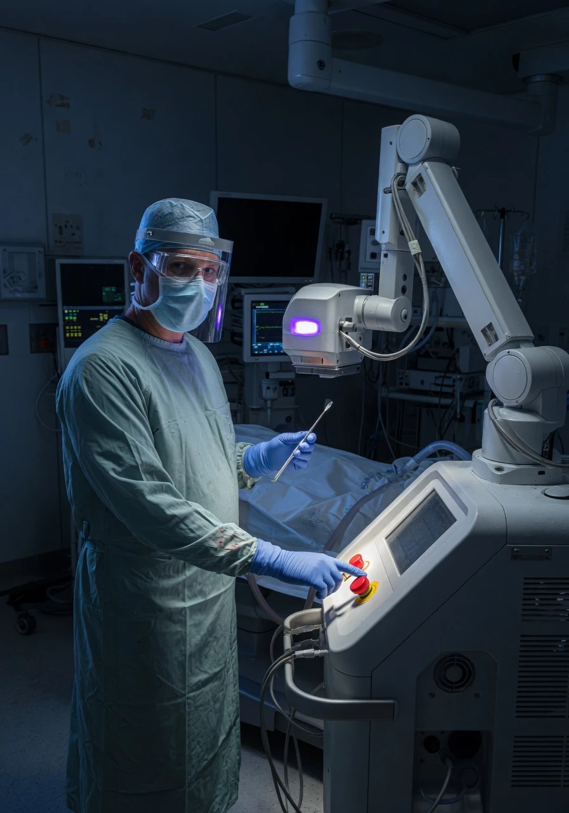

## Пациент думает, что хирург — гений микрохирургии. Реальность: 15-минутный алгоритм

Когда вы заходите в операционную, в голове рисуется образ: хирург-виртуоз, годами оттачивавший мастерство, склоняется над микроскопом и ювелирными движениями перестраивает вашу роговицу. Именно так клиники и преподносят лазерную коррекцию зрения — как **высокотехнологичную микрохирургию**, доступную лишь избранным специалистам с многолетним опытом.

Реальность куда прозаичнее. **90% ЛКЗ-операций сводятся к механическому повторению одного и того же алгоритма**, который осваивается за две недели. Хирургу не нужно ни рассчитывать параметры, ни принимать клинические решения, ни анализировать топограмму роговицы. Всё, что от него требуется — не дрогнуть рукой при поднятии флэпа и вовремя нажать кнопку.

Давайте разберём по шагам, что на самом деле происходит в операционной — и поймём, почему большинство «рефракционных хирургов» ближе к операторам станков с ЧПУ, чем к врачам в привычном понимании.

---

## Что реально делает хирург во время LASIK: 6 шагов

Разложим стандартную процедуру LASIK — самую массовую лазерную операцию в мире — на элементарные действия.

### Шаг 1. Формирует лоскут (флэп)

Хирург использует **микрокератом** (механический лезвийный инструмент) или **фемтосекундный лазер**. В обоих случаях процесс на **80% автоматизирован**:

- Фемтосекундный лазер: хирург стыкует интерфейс с глазом пациента, нажимает педаль — лазер сам формирует лоскут по заданной программе. Параметры (диаметр, толщина, угол, форма края) загружены заранее.
- Микрокератом: хирург устанавливает головку, выбирает кольцо по размеру глаза, нажимает педаль — лезвие проходит по направляющей.

И в том, и в другом случае хирург **не принимает решений о глубине, диаметре или форме** флэпа в реальном времени. Всё запрограммировано до операции — и зачастую даже не самим хирургом, а оптометристом или медсестрой.

### Шаг 2. Откидывает лоскут

Хирург шпателем или пинцетом поднимает сформированный лоскут и отводит его в сторону, обнажая строму роговицы. Движение отработано до автоматизма. Время: 5-10 секунд.

### Шаг 3. Вводит параметры в лазер

Вот здесь кроется ключевой момент. Хирург вбивает в эксимерный лазер **готовые цифры**, которые ему передал оптометрист:

- **Рефракция**: сфера, цилиндр, ось (например, -3.75 / -1.25 × 175°)
- **Оптическая зона**: диаметр (стандартно 6.0–6.5 мм)
- **Переходная зона**: ширина (обычно 1.0–1.5 мм)

Эти цифры берутся из авторефрактометра и визометрии — обследования, которое проводит **не хирург**, а оптометрист или медсестра. Хирург просто вводит их в интерфейс лазера. Если параметры подобраны правильно — операция даст хороший результат. Если нет — виноват будет не лазер, а тот, кто эти цифры ввёл. Или **не скорректировал**.

### Шаг 4. Нажимает кнопку

Самое медийное действие. Хирург нажимает ножную педаль, активируя эксимерный лазер. Дальше — 15-40 секунд автоматической абляции. Лазер работает по программе, отслеживая движения глаза системой eye-tracking.

Хирург в это время **смотрит в микроскоп и следит**, чтобы пациент не отвёл взгляд. Всё. Он не управляет лазером вручную — программа задана заранее.

### Шаг 5. Укладывает лоскут обратно

Лоскут аккуратно возвращается на место. Хирург разглаживает его канюлей, убирая пузырьки воздуха и складки. Время: 20-30 секунд. Адгезия происходит за счёт капиллярных сил — швы не накладываются.

### Шаг 6. Всё. Операция закончена.

Общее время: **8-12 минут на один глаз**. Пациент встаёт и идёт домой. Хирург принимает следующего.

Повторите это 30-40 раз за день — и получите стандартный рабочий день «рефракционного хирурга» в потоковой клинике.

---

## Что хирург НЕ делает (и часто не умеет)

Теперь самое важное: список того, что квалифицированный хирург **должен** делать, но подавляющее большинство — **не делает** и зачастую **не имеет компетенций**.

### Не рассчитывает номограммы

Номограмма — это **корректировочная таблица**, которая переводит измеренную рефракцию пациента в параметры, вводимые в лазер. Без номограммы лазер работает как весы без тарирования: вы ставите гирю в 1 кг, а показывает 800 г или 1,2 кг.

**80% хирургов используют заводские настройки номограмм и никогда их не корректируют.** Подробнее о номограммах — в следующем разделе.

### Не анализирует топограмму роговицы

Топография роговицы (Pentacam, SCHWIND, Orbscan) — это **единственный способ увидеть реальную форму передней и задней поверхности роговицы**. Без неё нельзя:

- Исключить субклинический кератоконус (форма роговицы)
- Оценить неравномерность толщины по зонам
- Правильно центрировать оптическую зону относительно зрительной оси

В большинстве клиник топограмму анализирует **оптометрист**, а хирург видит лишь заключение «годен/не годен» и готовые цифры рефракции. Хирург даже не смотрит на карту пахиметрии, чтобы оценить, где будет максимальная глубина абляции.

### Не учитывает Kappa-угол

**Угол каппа** — это разница между геометрической осью глаза и зрительной осью. Если хирург центрирует оптическую зону строго по центру зрачка, а зрительная ось смещена — пациент получит **децентрированную абляцию** и, как следствие, двоение, ореолы, снижение контрастной чувствительности.

Учёт Kappa-угла — базовая вещь, которую преподают на первом же семинаре. Но в потоке из 40 пациентов в день ни у кого нет времени смещать центр абляции индивидуально. Поэтому центрируют **на центр зрачка для всех**.

### Не корректирует параметры под жизнь пациента

Оптимальная оптическая зона разная для:

- **25-летнего водителя-дальнобойщика**, которому нужно идеальное ночное зрение (требуется зона 7.0+ мм, чтобы перекрыть ночной зрачок)
- **45-летнего бухгалтера**, который 8 часов в день смотрит в монитор (важнее сохранить аккомодационный резерв и не спровоцировать пресбиопию)
- **Пилота или снайпера**, для которого качество контрастной чувствительности критичнее остроты зрения по таблице

**Потоковый хирург ставит одну и ту же оптическую зону 6.5 мм всем.** Индивидуализация занимает время и требует понимания физиологии зрительного восприятия — а этому не учат на двухнедельных курсах.

### Не знает статистику осложнений своего лазера

Спросите хирурга: «Сколько пациентов с вашего лазера получили децентрацию больше 0.5 мм за последний год? Какой процент ваших операций даёт послеоперационный астигматизм более 0.75 D?»

В лучшем случае вам назовут общие цифры из рекламного буклета производителя лазера. Свою личную статистику знают единицы — потому что её **просто не ведут**.

---

## Что такое номограммы и почему это — самое важное

Теперь к главному техническому моменту, который отделяет квалифицированного хирурга от оператора кнопки.

### Как работает эксимерный лазер без номограммы

Эксимерный лазер испаряет ткань роговицы импульсами ультрафиолетового излучения (193 нм). Лазер запрограммирован так: «Чтобы убрать -3.0 диоптрии, нужно испарить X микрон ткани в зоне диаметром Y».

Но реальная эффективность абляции зависит от:

- **Состояния оптики лазера** (загрязнение зеркал, износ линз)
- **Газовой смеси** (ArF — аргон-фтор — со временем деградирует)
- **Влажности и температуры** в операционной
- **Индивидуальных особенностей роговицы** пациента (гидратация, плотность стромы)

В итоге лазер «думает», что испаряет -3.0 D, а на выходе получается **-2.0 D** (недокоррекция) или **-4.0 D** (гиперкоррекция).

### Номограмма — это «переводчик» между измеренной рефракцией и программой лазера

Каждый эксимерный лазер — Alcon EX500, Schwind Amaris, Zeiss MEL 90, VISX Star S4 — имеет **собственную номограмму**: таблицу поправочных коэффициентов, которые говорят лазеру: «Если пациент хочет -3.0 D, введи -3.4 D, потому что конкретно мой лазер сейчас недожигает 0.4 D».

Номограмма выглядит примерно так:

```
Сфера    | Ввод в лазер (Alcon EX500) | Ввод в лазер (Schwind Amaris)
---------|----------------------------|------------------------------
-1.00    | -1.15                      | -1.10
-2.00    | -2.30                      | -2.20
-3.00    | -3.55                      | -3.40
-4.00    | -4.90                      | -4.70
-5.00    | -6.20                      | -6.00
```

Без номограммы хирург вводит ровно -3.00, и пациент получает -2.45 (недокоррекция на 0.55 D). С номограммой хирург вводит -3.55 — и пациент получает ровно -3.00.

### Почему номограммы нужно обновлять каждые 3-6 месяцев

Лазер — не статичный прибор. Его физические характеристики меняются со временем:

- **Замена газовой смеси** сдвигает калибровку на 5-10%
- **Износ зеркал** меняет профиль луча и распределение энергии
- **Сезонные колебания** влажности в операционной влияют на скорость абляции

Каждые 3-6 месяцев хирург должен **собрать статистику исходов последних 50-100 операций**, сопоставить запланированную коррекцию с реально полученной — и скорректировать номограмму.

**80% хирургов используют заводскую номограмму, зашитую производителем лазера, и никогда к ней не прикасаются.** Заводская номограмма — это усреднённые значения для «идеального лазера в идеальных условиях». Ни один реальный лазер этим условиям не соответствует.

Более того, многие потоковые хирурги **вообще не знают**, как выглядит меню настройки номограмм на их лазере.

---

## Автоматизация vs квалификация: иллюзия, которую продают вам клиники

Производители эксимерных лазеров построили маркетинг на месседже: **«Наш лазер настолько умён, что делает всё сам. Хирург не нужен»**.

И это почти правда — в том, что касается автоматизации движений. Современные лазеры оснащены:

- **Eye-tracking** — отслеживает движения глаза с частотой 1000+ Гц и смещает луч вслед за глазом
- **Cyclotorsion compensation** — компенсирует вращение глаза, когда пациент переходит из положения сидя в положение лёжа
- **Auto-centration** — автоматически центрирует абляцию по зрачку

Всё это создаёт иллюзию: «Даже если хирург ошибётся — лазер поправит».

### Что автоматика НЕ делает (и не может сделать)

Автоматика компенсирует **движения**. Но она не компенсирует **неправильные решения**:

| Автоматика делает | Автоматика НЕ делает |
|---|---|
| Следит за смещением глаза | Выбирает диаметр оптической зоны |
| Компенсирует циклоторсию | Учитывает Kappa-угол для центровки |
| Останавливает абляцию при потере трекинга | Корректирует номограмму под состояние лазера |
| Контролирует частоту и энергию импульсов | Анализирует топограмму и пахиметрию |
| Выдаёт отчёт об операции | Принимает решение «оперировать или нет» |

Ключевое: если хирург ввёл **неправильную оптическую зону** (6.0 мм вместо 7.0 мм) — никакой eye-tracking это не исправит. Пациент получит гало и блики по ночам на всю оставшуюся жизнь, потому что ночной зрачок шире зоны абляции.

**Лазер делает ровно то, что ему сказали. Он не проверяет, правильно ли это.**

---

## Как на самом деле учат ЛКЗ-хирургов

Пожалуй, это самый шокирующий раздел. Маркетинг клиник рисует образ хирурга, который годами учился делать именно лазерную коррекцию. В реальности:

### Сертификация за 2 недели

Типичный путь «рефракционного хирурга»:

1. **Базовое медицинское образование**: 6 лет мединститута + 2 года ординатуры по офтальмологии. Это даёт фундамент — хирург понимает анатомию глаза и умеет диагностировать заболевания.
2. **Курс в учебном центре производителя лазера**: 2 недели теории и практики. Изучают интерфейс конкретного лазера, алгоритм действий на симуляторе, выполняют 5-10 операций на свиных глазах.
3. **5-10 операций под наблюдением**: опытный хирург стоит рядом и корректирует действия новичка на живых пациентах.
4. **Сертификат**: производитель лазера выдаёт бумагу, что данный специалист «прошёл обучение и допущен к работе на оборудовании модели X».

Всё. **Через 2 недели и 10 операций человек становится «сертифицированным рефракционным хирургом»**.

### Сравните с другой глазной хирургией

- **Хирургия катаракты (факоэмульсификация)**: 1.5-2 года обучения, 200+ операций под наблюдением, прежде чем хирург оперирует самостоятельно
- **Пересадка роговицы (кератопластика)**: 3-5 лет дополнительной подготовки
- **Витреоретинальная хирургия**: 2-3 года специализации после ординатуры

А лазерная коррекция? 2 недели. И добро пожаловать в операционную.

### Потоковая фабрика: 30-50 операций в день

В крупных сетевых клиниках хирург делает **30-50 операций в день**. Одна операция на один глаз — 8-12 минут. Перерыв между пациентами — 3-5 минут, за которые нужно заполнить документацию и принять следующего.

При такой загрузке:

- **Нет времени** на анализ топограммы каждого пациента
- **Нет времени** на пересчёт номограммы под конкретный случай
- **Нет времени** на индивидуальный подбор оптической зоны
- **Нет времени** даже на то, чтобы заметить аномалию на топограмме, если оптометрист её пропустил

Хирург превращается в конвейерного рабочего: заходит пациент → флэп → кнопка → флэп обратно → следующий.

---

## Реальные последствия неквалифицированных решений

Посмотрим, чем оборачивается подход «поднял флэп — нажал кнопку» для пациентов.

### Децентрация оптической зоны — врачебная ошибка №1

Децентрация происходит, когда зона абляции смещена относительно зрительной оси. Это **прямое следствие** того, что хирург:

- Не учёл Kappa-угол
- Доверился автоцентровке лазера вместо ручного позиционирования
- Не проверил положение зоны по топограмме

Последствия: **двоение, ореолы, снижение остроты зрения, которые не корректируются очками**. Рефракционная хирургия сверху — единственный способ исправить, и он сложнее первичной операции.

### Избыточная или недостаточная коррекция

Пациент хотел -3.0 D, а получил -1.5 D или -4.5 D. Причина — **неправильная номограмма**. Хирург использовал заводские настройки, не учитывая, что его лазер недожигает или пережигает.

Результат: пациент либо снова в очках (недокоррекция), либо в очках с обратным знаком (гиперкоррекция). Повторная операция возможна не всегда — зависит от остаточной толщины роговицы.

### Слишком малая оптическая зона — приговор для ночного зрения

Если у пациента **ночной зрачок 7.5 мм**, а хирург поставил оптическую зону **6.0 мм** (потому что «всем так делаем»), то каждый вечер после заката пациент видит:

- Гало вокруг источников света
- Лучи от фар встречных машин
- Снижение контрастности до уровня «небезопасно за рулём»

Исправить это практически невозможно — потребуется топографическая реоперация (TransPRK поверх LASIK), которая несёт дополнительные риски.

### Неучтённый остаточный астигматизм

Авторефрактометр показывает астигматизм -0.75 D. Хирург вводит эти данные в лазер. Но авторефрактометр измеряет **общий астигматизм глаза** (роговичный + хрусталиковый), а лазер испаряет только роговицу.

Если хирург не разделил астигматизм на роговичный и хрусталиковый (не проанализировал топограмму), пациент после операции получит **остаточный астигматизм** — потому что лазер скорректировал роговичную часть, а хрусталиковая осталась.

---

## Как отличить квалифицированного хирурга от «кнопкодава»

Пять вопросов, которые нужно задать хирургу на консультации. Если на любой из них вы получите уклончивый ответ или растерянный взгляд — разворачивайтесь и идите в другую клинику.

### 1. Спросите про номограммы на его конкретном лазере

**Вопрос**: «Какая номограмма используется на вашем эксимерном лазере? Это заводские настройки или вы их корректировали?»

**Реакция квалифицированного хирурга**: назовёт модель лазера, скажет, когда в последний раз корректировал номограмму, возможно даже покажет график зависимости введённых параметров от фактических исходов.

**Реакция кнопкодава**: глаза округлятся. Он либо спросит «А что это?», либо скажет «У нас всё автоматически, лазер сам всё считает». **Уходите немедленно.**

### 2. Спросите, сколько раз он корректировал номограмму за последний год

**Вопрос**: «Сколько раз за последние 12 месяцев вы вносили изменения в номограмму лазера?»

**Нормальный ответ**: «1-2 раза на основе анализа исходов последних 50-100 операций».

**Тревожный ответ**: «А зачем? Производитель поставляет настроенный лазер».

### 3. Попросите его личную статистику осложнений

**Вопрос**: «Покажите вашу личную статистику осложнений за последний год, а не общую статистику клиники. Сколько процентов ваших пациентов получили остаточную рефракцию больше ±0.5 D? Сколько децентраций больше 0.5 мм?»

**Квалифицированный хирург**: назовёт конкретные цифры. Возможно, попросит подписать NDA — но цифры у него есть.

**Кнопкодав**: «У нас процент осложнений околонулевой». Это невозможно — даже у лучших хирургов мира на лучших лазерах есть процент недокоррекций и реопераций в районе 1-3%. «Околонулевой» означает, что статистика либо не ведётся, либо вам врут.

### 4. Спросите, какие параметры он меняет под ваш возраст и профессию

**Вопрос**: «Мне 32 года, я работаю водителем. Какую оптическую зону вы планируете поставить и почему? Будете ли вы учитывать мой ночной зрачок?»

**Квалифицированный хирург**: спросит про ваши зрачки (уже измерены или измерит), расскажет про компромисс между оптической зоной и сохранением ткани роговицы, обсудит вариант с асферическим профилем абляции.

**Кнопкодав**: «Оптическую зону мы всем ставим 6.5 мм, это стандарт». Спросите: «А какой у меня ночной зрачок?» Если хирург не может ответить сразу (не глядя в карту обследования) — он не анализировал ваши риски.

### 5. Узнайте, делает ли он топографию с SCHWIND или Pentacam

**Вопрос**: «Вы лично анализируете топограмму с SCHWIND/Pentacam или на неё смотрит только оптометрист? Покажите мне мою карту пахиметрии и объясните, где будет максимальная глубина абляции».

**Квалифицированный хирург**: откроет топограмму, покажет зоны, объяснит, почему ваша роговица подходит или не подходит под операцию.

**Кнопкодав**: «Я смотрю заключение оптометриста, там всё нормально». Это означает, что хирург доверяет ваше зрение человеку, который несёт за него ровно ноль юридической ответственности.

---

## Почему индустрия так устроена

ЛКЗ-хирургия — это бизнес с оборотом в миллиарды долларов. Производителям лазеров выгодно продавать оборудование с посылом «вам не нужен суперквалифицированный хирург». Клиникам выгодно нанимать хирургов, которые делают 40 операций в день, а не 5 с индивидуальным подходом.

Сам хирург в этой системе — **винтик**. Он не принимает решений, которые влияют на бизнес-модель. Если он начнёт тратить по 30 минут на каждого пациента — клиника потеряет 75% выручки. Если начнёт отсеивать пациентов с факторами риска — потеряет ещё 20%.

В результате мы имеем систему, где **квалификация хирурга не нужна бизнесу**. Нужна пропускная способность. А пациент покупает иллюзию.

---

## Заключение

Лазерная коррекция зрения — не «просто нажать кнопку». Это сложная процедура, где качество результата зависит от десятков параметров, которые должен анализировать квалифицированный хирург.

Но реальность индустрии такова, что **большинство ЛКЗ-хирургов — это операторы кнопки**, обученные за две недели и выполняющие 40 одинаковых операций в день. Они не рассчитывают номограммы, не смотрят топограммы, не учитывают угол каппа, не подбирают оптическую зону под образ жизни пациента.

**Рынок переполнен «кнопкодавами».** Найти хирурга, который действительно понимает, что он делает, а не механически повторяет заученный алгоритм — сложно. Но возможно.

Задавайте вопросы. Если хирург не может объяснить, как и почему он выбрал именно эти параметры для вашего глаза — значит, он их и не выбирал. Кто-то сделал это за него. И этот кто-то не понесёт ответственности за ваше зрение.

---

> Обсуждаем реальный опыт лазерной коррекции, разбираем ошибки хирургов и делимся историями пациентов в нашем Telegram-чате: [@lasik_chat](https://t.me/lasik_chat).

## См. также

- [Почему глазные врачи не делают лазерную коррекцию себе и родственникам](/riski-i-posledstviya/pochemu-vrachi-ne-delayut-sebe-i-rodstvennikam-lkz/)
- [Почему сами врачи в очках](/riski-i-posledstviya/pochemu-vrachi-ne-delayut-lazernuyu-korrekciyu-zreniya-sebe/)
- [«Мне предлагали сделать бесплатно, но я отказался»](/riski-i-posledstviya/oftalmologam-predlagayut-lkz-besplatno-no-oni-ne-delayut/)
- [Эктазия роговицы после ЛКЗ](/oslozhneniya/ektaziya-rogovicy-posle-lazernoj-korrekczii-zreniya/)
- [Противопоказания к лазерной коррекции зрения](/protivopokazaniya-k-lazernoj-korrekcii-zreniya/)
