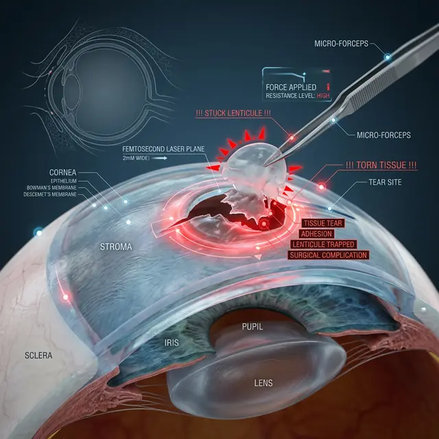

Технологию **ReLex SMILE** сегодня агрессивно продвигают как «золотой стандарт» — без разрезов, без боли, для спортсменов и космонавтов. Но за красивым маркетингом скрывается хирургическая реальность, которую редко озвучивают в рекламных брошюрах.

Главный парадокс: отсутствие лоскута (флэпа), которое преподносится как главное преимущество, делает эту операцию в разы сложнее и опаснее в случае ошибки хирурга.

## Коварная лентикула

В отличие от LASIK, где лазер просто испаряет ткань, в SMILE лазер вырезает внутри роговицы диск из ткани — **лентикулу**. Затем хирург через крошечный разрез (2-4 мм) должен «нащупать» её инструментами и вытащить.

**Вот здесь начинаются проблемы:**

1.  **Трудности разделения:** Ткань роговицы не всегда легко расслаивается. Хирург может случайно потянуть не за тот слой или оставить края лентикулы внутри.
2.  **Застрявшие фрагменты:** Если даже микроскопический кусочек лентикулы останется в роговице — это гарантированные искажения, туман и воспаление. Извлечь этот остаток через тот же разрез практически невозможно.
3.  **Разрыв надреза:** Пока хирург пытается поймать край ткани, он может порвать входной канал, что приведет к неправильному заживлению и астигматизму.

## «Слепая» хирургия

При LASIK хирург видит всю зону воздействия. При SMILE манипуляции происходят в закрытом пространстве внутри роговицы. Хирург работает почти вслепую, полагаясь на тактильные ощущения. Любое микродвижение глаза пациента в момент формирования лентикулы (сакция — потеря вакуума) делает операцию невозможной или критически опасной.

## Регресс и докоррекция

Если после SMILE у вас остался минус (а это бывает нередко), сделать полноценную докоррекцию методом SMILE невозможно. Вам придется делать либо болезненную ФРК поверх, либо классический LASIK. То есть, вы платите в два раза больше за «безлоскутную» технологию, чтобы в итоге всё равно получить лоскут или содранный эпителий при переделке.

## Инфекционный «карман»

Отсутствие лоскута означает создание замкнутого пространства внутри роговицы. Если туда попадет инфекция, промыть этот «карман» крайне сложно. В LASIK лоскут можно просто поднять и санировать поверхность, в SMILE воспаление может «законсервироваться» внутри ткани.

## Вывод

SMILE — это не «улучшенный» LASIK. Это принципиально другая процедура с **высочайшими требованиями к мастерству хирурга**. Она менее предсказуема в сложных случаях и гораздо труднее поддается исправлению.

Перед тем как пойти на SMILE, задайте врачу один вопрос: _«Сколько операций по извлечению застрявших фрагментов лентикулы вы провели лично?»_. Если ответ будет «у нас такого не бывает» — бегите из этой клиники.
