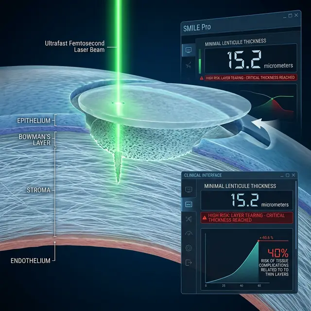

Технология SMILE Pro преподносится как вершина лазерной хирургии: быстро, безболезненно, без лоскута. Но за рекламными лозунгами «подходит для тонкой роговицы» скрываются жесткие физико-технические ограничения, о которых пациенты узнают слишком поздно.

<figure style="text-align: center;">
  
  <figcaption>Микроскопическая визуализация: формирование лентикулы внутри роговицы. Толщина краев — критический параметр для успешного завершения операции.</figcaption>
</figure>

### Главный миф: «Лазер срезает минимум»

В отличие от LASIK, где лазер «испаряет» ткань (абляция), в технологии SMILE (и SMILE Pro) лазер вырезает внутри роговицы кусочек ткани — **лентикулу**, которую хирург затем удаляет через микроразрез.

Чтобы хирург мог физически зацепить и вытащить лентикулу пинцетом, она не может быть бесконечно тонкой. Существует понятие **минимальной толщины края лентикулы**.

### Цифры, которые скрывают

Обычно лазер настраивают так, чтобы край лентикулы имел толщину не менее **10–15 микрон**.
Если у вас небольшой «минус» (например, -1.0), лазеру нужно убрать очень мало ткани в центре. Чтобы лентикула не порвалась при извлечении, аппарату приходится искусственно увеличивать её толщину, вырезая **лишнюю** ткань.

> **Парадокс:** При слабой близорукости SMILE Pro может убрать БОЛЬШЕ ткани, чем современный LASIK, просто чтобы лентикула была достаточно прочной для извлечения.

### Проблема «потерянных фрагментов»

Если толщина ткани слишком мала, возникает риск **разрыва лентикулы** (Torn Lenticule). Если в слоях роговицы останется даже микроскопический кусочек не удаленной ткани, это приведет к:

- Неправильному астигматизму.
- Хроническому воспалению.
- Невозможности получить четкую картинку даже в очках.

### Толщина остаточной роговицы

Клиники часто говорят, что SMILE Pro сохраняет биомеханику глаза. Однако критический параметр — **RSB (Residual Stromal Bed)** или остаточная толщина стромы под местом вмешательства — остается прежним. Если после операции у вас остается менее 250-300 микрон нетронутой ткани, риск развития **кератэктазии** (выпячивания роговицы) огромен, независимо от того, был лоскут или нет.

### Вывод

SMILE Pro — это не «щадящая» процедура, если ваша роговица изначально тонкая.

1.  Если хирург говорит, что лентикула будет «очень тонкой» — это риск её разрыва.
2.  Если хирург увеличивает толщину для безопасности — вы теряете драгоценные микроны, которые могли бы спасти вас от эктазии в будущем.

Перед операцией всегда спрашивайте: **«Какую толщину лентикулы закладывает программа и сколько микрон останется в самом тонком месте после удаления?»**
