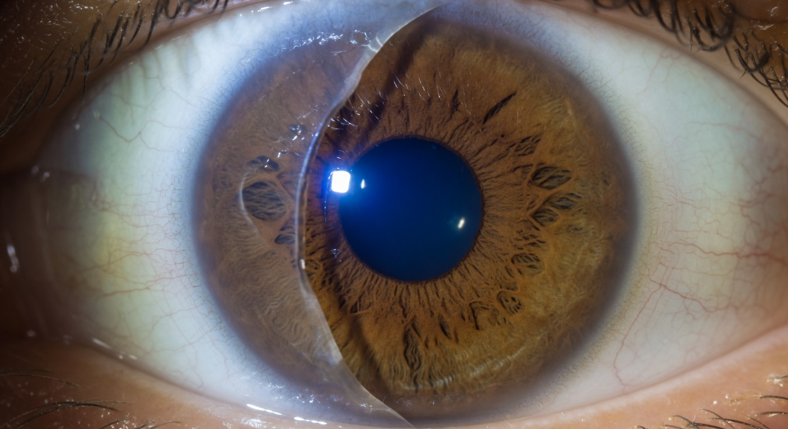

Пациенты, сделавшие LASIK 10 лет назад, часто считают, что опасность позади. «Десять лет прошло — лоскут прирос намертво, можно жить спокойно». Но так ли это? Разберём, что говорит наука о прочности роговичного лоскута спустя десятилетие, и может ли он сместиться.

## Что говорит наука: прочность лоскута через 10 лет

Ключевое исследование: **Schmack et al. (2005)** — лабораторные испытания прочности соединения лоскута со стромой на разрыв. Результаты:

| Срок после LASIK | Прочность относительно интактной роговицы |
|---|---|
| 2 месяца | 1-3% |
| 6 месяцев | 5-12% |
| 1 год | 10-15% |
| 5 лет | 15-20% |
| **10 лет** | **20-28%** |

Вывод однозначен: **даже через 10 лет прочность лоскута не превышает 25-30% от нормальной роговицы**. Это означает, что при достаточном механическом усилии лоскут может быть смещён в любой момент после операции.

## Почему прочность не восстанавливается полностью

Роговица — не кожа. В коже при разрезе формируется коллагеновый рубец, который по прочности приближается к исходной ткани (до 70-80%). В роговице этот механизм отсутствует:

- **Микрокератом или фемтосекундный лазер** делает горизонтальный разрез через коллагеновые пластины
- **Поверхностное натяжение** капиллярного слоя жидкости — основной механизм фиксации лоскута
- **Эпителиальная пробка** по краю лоскута — не несёт механической нагрузки
- **Незначительная стромальная адгезия** — слабые молекулярные связи, а не рубцевание
- **Биомеханика роговицы нарушена навсегда** — коллагеновые волокна не восстанавливают структурную непрерывность

Именно поэтому в литературе описаны случаи дислокации лоскута через 8, 10, 17 и даже 23 года после LASIK.

## Реальные случаи дислокации спустя 10+ лет

### Случай 1: Кошка ударила лапой — 10 лет после LASIK

Мужчина, 42 года. LASIK OU в 2010 году (-4.5). В 2020 году домашняя кошка ночью прыгнула на лицо и ударила лапой по правому глазу. Боль, слезотечение, резкое снижение зрения. Диагноз: дислокация лоскута на 70% с массивными складками. Репозиция через 5 часов + бандажная линза. Исход: зрение восстановилось до 0.8 (было 1.0). Остаточные микроскладки.

### Случай 2: Удар мячом — 12 лет после Femto-LASIK

Женщина, 35 лет. Femto-LASIK в 2009 году. В 2021 году во время игры в волейбол получила удар мячом в левый глаз. Обратилась через 36 часов (!) — думала, просто синяк. Диагноз: частичная дислокация лоскута с формирующимися рубцами. Репозиция + ПТК. Исход: зрение 0.6, необратимые стрии, постоянные блики.

### Случай 3: Сильное трение глаза — 10 лет после LASIK

Женщина, 48 лет. LASIK в 2008 году (-3.0). В 2018 году после аллергической реакции сильно тёрла правый глаз. Утром проснулась с «туманом» и двоением. Диагноз: смещение лоскута с микроскладками. Репозиция через 8 часов. Исход: зрение восстановилось полностью (1.0). Врач отметил: «Повезло, что обратилась быстро и усилие было не максимальным».

### Случай 4: ДТП — 17 лет после LASIK

Мужчина, 52 года. LASIK в 2000 году. В 2017 году — автомобильная авария, удар лицом о руль. Полный отрыв лоскута правого глаза. Экстренная хирургия: лоскут сохранён, репонирован, швы. Исход: зрение 0.4, неправильный астигматизм. Рекомендована пересадка роговицы.

## Статистика: насколько это редкое явление

По данным литературы, частота дислокации лоскута:

- **В первые 24 часа после операции:** 1-2% (в основном при использовании микрокератома старого поколения)
- **Первая неделя:** 0.5-1%
- **Первый год:** около 0.1-0.3%
- **1-5 лет:** единичные случаи (несколько десятков в мировой литературе)
- **5-10 лет:** крайне редкие случаи (менее 50 описанных в литературе за всю историю LASIK)
- **10+ лет:** казуистика — менее 10 описанных случаев

Но есть нюанс: **это только ЗАФИКСИРОВАННЫЕ случаи**. Многие пациенты с лёгкой дислокацией не обращаются к врачу — списывают на сухость, усталость, «что-то попало». Реальная частота может быть выше.

## Факторы, повышающие риск поздней дислокации

1. **Тонкая роговица** — изначально малая толщина снижает прочность
2. **Большой диаметр лоскута** (более 9 мм) — чем больше площадь, тем слабее фиксация
3. **Тонкий лоскут** (менее 100 мкм) — тонкий лоскут менее стабилен, чем толстый (130-160 мкм)
4. **Микрокератом (не фемтосекундный)** — лоскут, сформированный микрокератомом, менее предсказуем по толщине и имеет более широкий край
5. **Травмы глаза в анамнезе** — даже не связанные с LASIK
6. **Контактные виды спорта** — постоянная микротравматизация
7. **Привычка тереть глаза** — самый частый механизм
8. **Эпителиальная дистрофия базальной мембраны (EBMD)** — нарушение адгезии эпителия к строме

## Симптомы поздней дислокации

Симптомы те же, что и при ранней, но пациенты часто их игнорируют — «ну не может же лоскут сместиться через 10 лет, это что-то другое». В этом главная опасность.

- Внезапное ухудшение зрения (туман, размытость)
- Двоение (монокулярная диплопия)
- Боль при моргании
- Ощущение инородного тела
- Слезотечение
- Светобоязнь
- Ощущение «складки» или «ряби» перед глазом

## Алгоритм: что делать при подозрении на дислокацию спустя годы

1. **НЕ тереть глаз** — это усугубит смещение
2. **Закрыть глаз, наложить лёгкую повязку**
3. **Немедленно ехать к офтальмологу** — желательно в клинику с опытом исправления осложнений
4. **Сообщить врачу точную дату LASIK** — это важно для оценки анатомии роговицы
5. **Потребовать щелевую лампу + топографию**

Время — по-прежнему критично. Даже спустя 10 лет правило «24 часа до репозиции» работает: до 24 часов — шанс полного восстановления >70%, после 48 часов — начинается фиброз.

## Профилактика поздней дислокации

- **Никогда не тереть глаза костяшками пальцев** — используйте увлажняющие капли при зуде
- **Защитные очки** при занятиях спортом (баскетбол, волейбол, единоборства)
- **Ремень безопасности** в автомобиле — банально, но эффективно
- **Контролировать детей и домашних животных** — объяснять правила безопасности с вашим лицом
- **Осторожность в бане, сауне** — сочетание тепла и механического воздействия (веник!) опасно
- **Никакого массажа лица у косметолога** — даже через 20 лет после операции
- **Регулярные осмотры офтальмолога** — топография раз в 2-3 года для контроля состояния роговицы

## Заключение

Ответ на главный вопрос: **ДА, лоскут может сместиться через 10 лет после LASIK.** Вероятность крайне низкая (казуистические случаи), но она не равна нулю. Прочность роговицы восстанавливается до 20-28% от нормы — это достаточно для обычной жизни, но недостаточно для серьёзной травмы.

Десять лет без очков — это прекрасный результат. Но иллюзия, что лоскут «прирос намертво», опасна. Биомеханика роговицы нарушена навсегда. Помните об этом, когда трёте глаз, идёте на волейбол или разрешаете ребёнку играть с вашим лицом.

Если после травмы или сильного трения появился любой из симптомов — не думайте «это не может быть дислокация, прошло 10 лет». Может. Едьте к врачу.

Обсудить свой случай и получить поддержку от людей, столкнувшихся с осложнениями лазерной коррекции, можно в нашем телеграм-чате: [@lasik_chat](https://t.me/lasik_chat).
