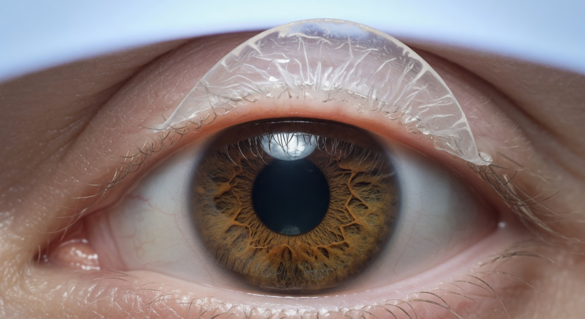

Вы сделали LASIK или Femto-LASIK год назад. Зрение отличное, глаза не беспокоят. Однажды утром вы просыпаетесь, трёте глаз от души — и вдруг чувствуете боль, картинка «плывёт», появился туман. Паника: *«Неужели лоскут сдвинулся?! Мне же говорили — через полгода он полностью прирастёт!»*

Этот страх испытывают тысячи пациентов. Давайте разберём, что говорит наука о прочности прирастания лоскута и может ли он сместиться или воспалиться через год после операции.

## Что говорят в клинике и что говорит наука

Стандартный ответ хирурга на консультации: *«Через 3-6 месяцев лоскут полностью прирастает. Можете жить обычной жизнью, тереть глаза не опасно».*

Правда сложнее. Исследования показывают, что **прочность соединения лоскута с роговицей через год после LASIK составляет не более 5-10% от прочности интактной роговицы**. Через 8-10 лет этот показатель достигает всего лишь 15-25%. Полного восстановления биомеханики не происходит никогда.

## Почему лоскут НЕ прирастает полностью

Роговица состоит из коллагеновых пластин, упакованных в строго упорядоченную структуру. Когда микрокератом или фемтосекундный лазер формирует лоскут, он навсегда разрушает эту структуру:

- **Коллаген не восстанавливается** — в отличие от кожи, где рана заполняется коллагеновым рубцом, роговица не способна восстанавливать разрушенные коллагеновые связи
- **Эпителий закрывает край** — по периметру лоскута нарастает тонкая эпителиальная «пробка», но она не несёт механической нагрузки
- **Стромальная адгезия слаба** — лоскут удерживается за счёт отрицательного давления (как присоска) и слабых молекулярных связей, а не за счёт рубцевания

Это означает, что при достаточном механическом усилии **лоскут может быть смещён в любой момент после операции** — через месяц, год, пять лет, десять.

## Через какое время трение становится безопасным?

Вопрос не имеет однозначного ответа, потому что прочность фиксации лоскута индивидуальна. Но можно выделить периоды риска:

### Первые 24 часа — максимальный риск
Лоскут удерживается ТОЛЬКО за счёт поверхностного натяжения капиллярного слоя жидкости. Даже лёгкое касание века может его сместить.

### 1 неделя — 1 месяц — очень высокий риск
Начинается эпителизация края лоскута. Механической прочности практически нет. Классический механизм дислокации — пациент трёт глаз спросонья.

### 1–3 месяца — высокий риск
Эпителиальная пробка сформирована, но строма под лоскутом ещё не стабилизировалась. Микросдвиги всё ещё возможны.

### 3–6 месяцев — умеренный риск
Клиники обычно говорят, что к этому сроку «всё зажило». Но исследования Schmack et al. (2005) и других показали, что при испытаниях на разрыв прочность соединения лоскута со стромой через 6 месяцев составляет 5-12% от нормы.

### 6–12 месяцев — риск сохраняется
Именно к этому сроку пациенты теряют бдительность. И именно в этом периоде фиксируется значительная часть поздних дислокаций. Причина проста: пациент считает, что «уже можно», и трёт глаз без ограничений.

### После года — риск есть, но ниже
Случаи дислокации через 1-5 лет документированы в литературе. Механизмы: удар, сильное трение, контакт с напором воды. **Важно:** чтобы сместить лоскут через год, требуется большее усилие, чем через месяц. Но «большее» — не значит «огромное».

## Реальные случаи дислокации через год и позже

Из чата пациентов:

> *«1 год и 3 месяца после Femto-LASIK. В бане хлестнул себя веником по лицу (дурацкая привычка). Боль, слёзы, туман. В клинике сказали — дислокация лоскута. Репозиция через 4 часа — зрение восстановилось до 0.8. Сказали спасибо, что не тёр глаз дополнительно».*

> *«1 год 8 месяцев. Сильно потёр глаз после контактных линз (носила однодневные для бассейна, врач разрешил). Ощущение песка не проходило, утром проснулась — картинка раздвоилась. Дислокация на 0.7 мм с микроскладками. Репозиция + бандажная линза на 3 дня. Функции восстановлены на 90%. Врач сказал: „Вам повезло“».*

> *«2 года после LASIK. Ребёнок случайно ударил меня в глаз игрушкой. Я не придал значения — подумал, просто синяк. Через 4 дня заметил, что правым глазом двоится. Оказалось — сдвиг лоскута со складками. Сделали репозицию, но рубцовые изменения уже начались — зрение 0.6 вместо 1.0».*

Из этих историй следует три вывода:
- Смещение через год и более — реальность, а не страшилка
- Время обращения критично (часы, не дни)
- Даже после репозиции возможны необратимые изменения

## Воспаление после трения: отдельная опасность

Даже если лоскут не сдвинулся, сильное трение глаза может вызвать воспаление по трём механизмам:

### 1. Диффузный ламеллярный кератит (DLK, «песок Сахары»)

Механическое раздражение стромального интерфейса (пространства между лоскутом и ложем) запускает воспалительную реакцию. Лейкоциты мигрируют под лоскут — под щелевой лампой это выглядит как белая зернистость. Без лечения DLK прогрессирует до стадии некроза и расплавления стромы. Лечение: стероидные капли, в тяжёлых случаях — подъём лоскута и промывание интерфейса.

### 2. Эпителиальное врастание

Трение создаёт микрощель по краю лоскута, куда прорастает поверхностный эпителий. Эпителий под лоскутом разрастается, вызывая помутнение и неровности. Лечение — хирургическая чистка интерфейса.

### 3. Усугубление синдрома сухого глаза

Трение механически повреждает и без того неполноценную слёзную плёнку и нервные окончания роговицы. Результат — усиление сухости, воспаление глазной поверхности, светобоязнь.

## Что делать, если сильно потёрли глаз и появились симптомы

### Признаки, требующие немедленного (!) обращения к врачу:

- Внезапное ухудшение зрения (туман, размытость, двоение)
- Боль, усиливающаяся при моргании
- Ощущение инородного тела, которое не проходит после увлажняющих капель
- Покраснение одного глаза, не спадающее через 30 минут
- Светобоязнь
- Субъективное ощущение «складки» или «пузыря» на глазу

### Алгоритм действий:

1. **НЕ тереть глаз повторно!** — это усугубит дислокацию
2. **Не капать ничего без назначения** — некоторые капли могут усилить отёк
3. **Закрыть глаз** и наложить лёгкую стерильную повязку без давления
4. **Немедленно ехать в клинику** — в идеале, где делали операцию (у них есть карта роговицы «до» для сравнения)
5. **Зафиксировать время** — хирургу важно знать, сколько часов прошло с момента травмы/трения

Время критично: дислокация до 24 часов — репозиция с вероятностью полного восстановления >80%. 24-48 часов — шанс 50-60%. Более 48 часов — риск необратимых рубцовых изменений.

## Как защититься: практические советы

1. **Никогда не тереть глаза кулаком или костяшкой** — это в разы опаснее кончика пальца
2. **Увлажняющие капли (без консервантов) — всегда с собой.** Если глаз чешется — закапайте, а не трите
3. **Спать в защитных очках** первые 3-6 месяцев после операции (многие хирурги рекомендуют это пожизненно при выраженном трении глаз во сне)
4. **Объяснять детям** правила безопасности с вашим лицом
5. **В бане, сауне, при занятиях контактным спортом** — помнить о риске и носить защитные очки
6. **Никаких массажей лица и области вокруг глаз у косметолога** — даже через годы после операции

## Заключение

Ответ на главный вопрос: **да, лоскут может сместиться через год после LASIK, если приложить достаточное усилие**. Вероятность ниже, чем в первый месяц, но она не нулевая и никогда не станет нулевой. Прочность роговицы не восстанавливается полностью.

Трение глаз — самый частый механизм дислокации по данным анализа форумов и чатов пациентов (около 40% всех случаев). При этом большинство пациентов трёт глаза рефлекторно и не осознаёт опасности до того момента, пока не почувствует боль или ухудшение зрения.

Если вы потёрли глаз и что-то «не так» — не ждите. Не надейтесь, что «само пройдёт». Не гуглите «пройдёт ли». Едьте в клинику. Четыре часа промедления могут стоить строчки на таблице Сивцева.

Обсудить свой случай, узнать опыт других пациентов и получить поддержку можно в нашем телеграм-чате: [@lasik_chat](https://t.me/lasik_chat). Там сотни людей, прошедших через то же самое — и многие из них спасли зрение именно потому, что вовремя обратились к врачу.
