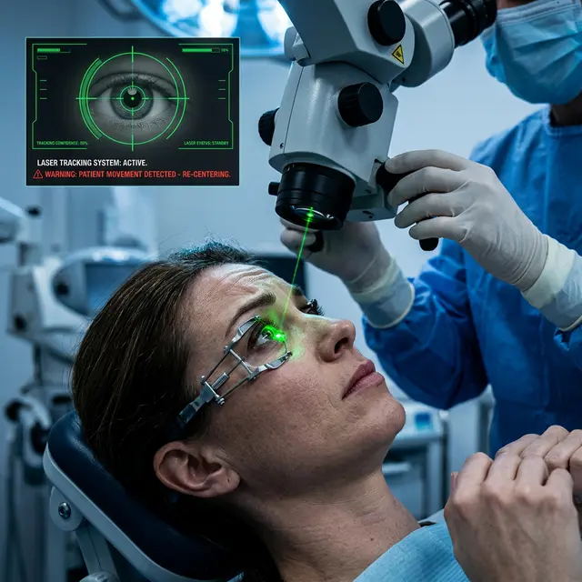

Один из самых частых страхов перед кабинетом лазерного хирурга: «А что, если я моргну, чихну или случайно отведу взгляд, и лазер прожжет мне глаз насквозь?». Клиники обычно успокаивают пациентов, говоря о «совершенных системах защиты», но реальность несколько сложнее.

## Что удерживает глаз на месте?

Во время операции ваши веки фиксируются специальным инструментом — **векорасширителем**. Вы физически не сможете моргнуть, даже если захотите. Это самая простая часть защиты.

А вот само глазное яблоко остается подвижным. В методе LASIK/Femto-LASIK глаз пациента фиксируется вакуумным кольцом только в момент формирования лоскута. Во время самой работы лазера (испарения ткани) глаз свободен.

## Как работает Eye-Tracking?

Современные эксимерные лазеры оснащены системами активного слежения (динамический айтрекинг).

- **Частота:** Лазер «фотографирует» ваш зрачок от 500 до 1000 раз в секунду.
- **Реакция:** Если глаз совершает микроскопические движения, лазер мгновенно корректирует направление луча.
- **Автостоп:** Если вы совершите резкое и сильное движение (например, кашлянете), лазер мгновенно отключится.

## В чем тогда риск?

Несмотря на «умную» электронику, человеческий фактор остается решающим.

1.  **Движение головы:** Eye-Tracking отлично следит за движением глазного яблока, но он гораздо хуже справляется с наклоном или смещением всей головы пациента. Если вы измените положение головы, лазер может «заблудиться».
2.  **Децентрация абляции:** Если система слежения не успеет отработать или сработает с ошибкой, зона воздействия лазера сместится относительно оптического центра. Результат — двоение, ореолы и невозможность четко сфокусироваться.
3.  **Потеря вакуума:** В методах SMILE или при работе фемтолазера резкое движение может привести к «потере вакуума». Операцию придется прервать, а глаз — оставить в покое на несколько месяцев до повторной попытки (если она вообще будет возможна).

## Как вести себя пациенту?

Ваша главная задача — смотреть на светящуюся метку (обычно зеленую или красную). Важно не просто «смотреть на нее», а **пытаться ее рассмотреть**, не обращая внимания на посторонние шумы, запахи паленой ткани и манипуляции врача.

## Вердикт

Двигать глазом **крайне не рекомендуется**. Хотя современные лазеры имеют многоуровневую защиту, ваша неподвижность — это 50% успеха операции. Любое «дергание» повышает риск оптических аберраций, которые потом практически невозможно исправить полностью.
