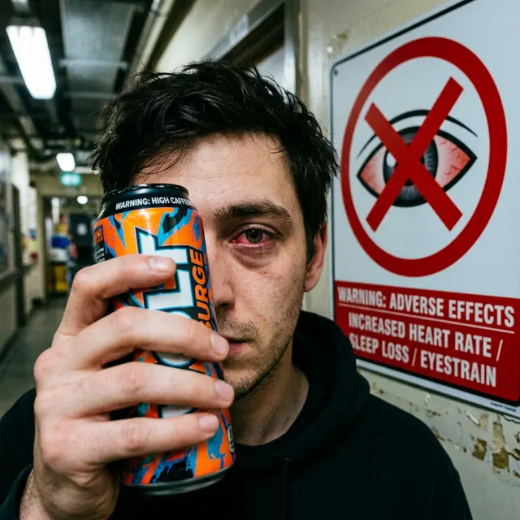

После лазерной коррекции зрения пациенты получают длинный список ограничений: не тереть глаза, не краситься, не заниматься спортом. Но часто врачи забывают упомянуть о напитках, которые мы привыкли употреблять для бодрости. Вопрос «**можно ли пить энергетики после лазерной коррекции глаза**» — это не просто каприз, а вопрос безопасности вашего лоскута и комфорта заживления.

## Почему энергетик хуже обычного кофе?

В одной банке энергетика содержится не только ударная доза кофеина, но и его синергисты: таурин, гуарана, женьшень и огромное количество сахара. Эта «гремучая смесь» бьет по организму гораздо сильнее, чем чашка эспрессо.

### 1. Синдром «пустыни» в глазу

Кофеин — мощный диуретик (мочегонное). Он выводит воду из организма, что моментально сказывается на слезной пленке.

- После ЛКЗ глаз и так страдает от [синдрома сухого глаза](/oslozhneniya/suhost-glaz-posle-lazernoj-korrekcii-zreniya/).
- Энергетик делает слезу вязкой и нестабильной.
- Результат: резкая боль, ощущение «стекла» в глазу и микротравмы роговицы при каждом моргании.

### 2. Скачки внутриглазного давления (ВГД)

Комбинация кофеина и таурина вызывает резкий подъем артериального и, как следствие, внутриглазного давления.

- Для свежеоперированного глаза, где роговица истончена и восстанавливается, любой скачок давления — это риск микро-отека тканей.
- В редких случаях это может повлиять на стабильность прилегания лоскута (флэпа).

### 3. Нервный тик и риск смещения

Передозировка стимуляторами часто вызывает **миокимию** — подергивание века.

- Если глаз начинает бесконтрольно дергаться (тик), веко постоянно механически воздействует на лоскут.
- В первые 3-5 дней, пока флэп держится «на честном слове», такие вибрации крайне нежелательны.

## Когда можно возвращаться к привычке?

**Золотое правило реабилитации:**

- **Первые 3-5 дней:** Категорический запрет на любые энергетики и крепкий кофе. Ваша задача — максимальное увлажнение организма чистой водой.
- **С 7-го дня:** Можно начать вводить слабый кофе, но энергетики лучше отложить до конца второй недели, когда край лоскута будет надежно «запечатан» эпителием.
- **С 14-го дня:** Относительно безопасно, но при условии, что вы компенсируете каждую банку энергетика литром чистой воды для борьбы с сухостью.

## Вердикт

Пить энергетики сразу после лазерной коррекции глаза **нельзя**. Это провоцирует критическую сухость роговицы и нежелательные скачки давления. Хотите, чтобы зрение стабилизировалось быстрее? Забудьте о стимуляторах минимум на неделю.
