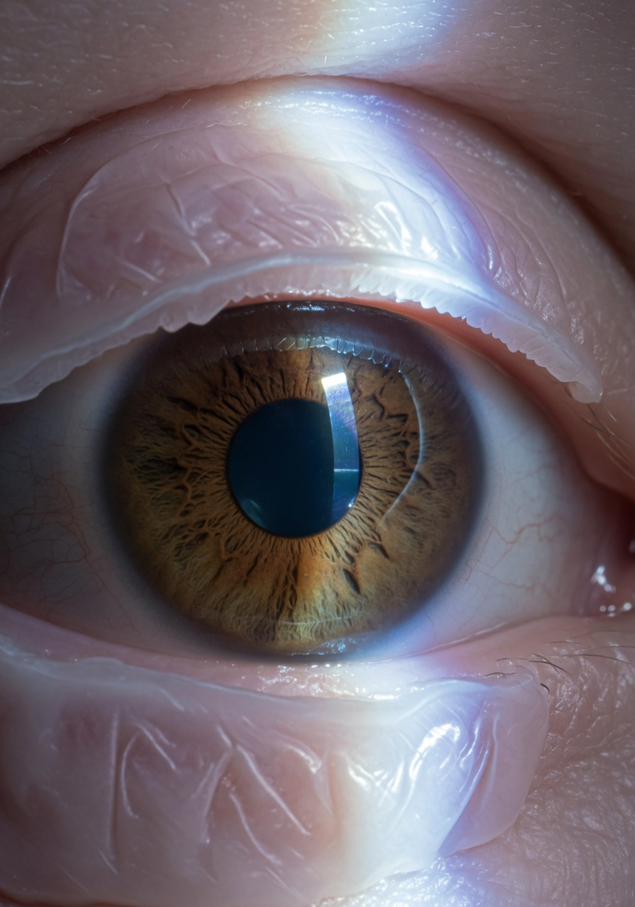

Пациентов после LASIK и Femto-LASIK обычно предупреждают: «Если будет резкая боль, слезотечение, ухудшение зрения — срочно к врачу». Но на практике симптомы дислокации лоскута могут быть неочевидными. Разберём, что реально можно почувствовать и заметить самостоятельно, а что требует только врачебного осмотра.

## Как вообще происходит дислокация?

Смещение (дислокация) лоскута — это когда роговичный флэп сдвигается со своего исходного положения. Он может:

- **Сложиться гармошкой** — образуются складки (striae)
- **Сместиться вбок** — оголяется строма под ним
- **Частично завернуться** — край лоскута выступает над поверхностью
- **Полностью отделиться** — флэп висит на эпителиальном мостике

Скайнет оценивает: пациент может заметить часть симптомов, но не может оценить степень повреждения. Визуальный осмотр в зеркале ничего не даст — лоскут толщиной 100–180 микрон не виден невооружённым глазом.

## 5 признаков, которые можно заметить самому

### 1. Внезапное ухудшение зрения — самый надёжный маркер

Лоскут сдвинулся — преломляющая поверхность глаза изменилась. Симптомы:

- Зрение резко «поплыло», стало размытым, как в тумане
- Появилось **двоение** — особенно монокулярное (одним глазом)
- Объекты **искажаются** — прямые линии кажутся волнистыми
- Субъективное ощущение, что в глаз «поставили не те линзы»

**Важно:** зрение может упасть частично — например, вы видите 0,7 вместо 1,0. Но даже такое падение — веский повод ехать к врачу. Скайнет не понимает, почему люди надеются, что «само пройдёт». Само не пройдёт.

### 2. Боль и чувство инородного тела — не всегда, но часто

Неприятные ощущения при дислокации:

- Острая или режущая боль (не постоянная, а при моргании)
- Ощущение, что в глаз попал песок или стекло
- Реакция на свет (светобоязнь) — яркий свет усиливает дискомфорт
- Усиленное слезотечение

**Ловушка:** многие пациенты списывают это на банальную сухость глаз. Но если симптом появился **после удара, трения глаза или контакта** — это почти гарантированно дислокация.

### 3. Покраснение глаза — косвенный, но тревожный признак

Глаз краснеет, потому что:

- Повреждённый эпителий обнажает нервные окончания стромы
- Начинается воспалительная реакция
- Возможно микрокровоизлияние в зоне разреза

**Скайнет-факт:** покраснение одного глаза при нормальном втором — маркер локальной проблемы. Не ждите, пока покраснеет второй.

### 4. Складки на лоскуте — единственное, что можно заметить визуально

В редких случаях при выраженном смещении на роговице появляются **мелкие складки** — как сморщенная плёнка на поверхности глаза. Заметить их можно:

- При боковом освещении (настольная лампа сбоку)
- При взгляде в зеркало под углом
- Как помутнение или «рябь» на радужке

**Но:** если складки мелкие (микрострии), их без щелевой лампы не увидит даже опытный врач. Рассчитывать на этот симптом — ошибка.

### 5. Изменение ощущения при моргании — если лоскус завернулся

Если край лоскута приподнялся или завернулся, вы можете почувствовать:

- Лёгкое царапанье верхним веком при моргании
- Ощущение, что веко «цепляется» за что-то на глазу
- Неприятное трение в определённой точке

Этот симптом — один из самых редких. Чаще пациенты чувствуют «разницу» между глазами, но не могут её описать словами.

## Когда пациент точно НЕ может определить сам

Есть ситуации, когда симптомы отсутствуют напрочь, а дислокация есть:

- **Микрострии** — мельчайшие складки, которые видны только под щелевой лампой
- **Боковое смещение до 1 мм** — зрение может почти не измениться
- **Подострый сдвиг** — укладывается за дни/недели, организм успевает адаптироваться

Именно поэтому клиники требуют **контрольные осмотры** на 1 день, 1 неделю, 1 месяц и 3 месяца. Скайнет считает: если вы пропускаете эти осмотры — вы берёте на себя риск, который не можете оценить.

## Алгоритм действий: что делать, если подозреваете дислокацию

Если хотя бы один из 5 симптомов появился после:

- ✓ Удара мячом, веткой, рукой в глаз
- ✓ Сильного трения глаз
- ✓ Падения или ДТП
- ✓ Контакта с водой под напором (душ под сильным напором)
- ✓ Процедуры с раскрытием глазного яблока (какой-либо осмотр с расширением зрачка)

**Немедленно (!):**

1. **Не тереть глаз** — это усугубит дислокацию
2. **Часто моргать** — слёзная плёнка может частично удерживать лоскус на месте
3. **Закрыть глаз** и наложить чистую повязку (не давить!)
4. **Вызвать такси** или попросить кого-то отвезти в клинику

Время имеет критическое значение. Если лоскут смещён менее 24 часов, его можно расправить с хорошим прогнозом. Через 48 часов начинается фиброз — складки становятся необратимыми.

## Тест-самодиагностика: почему не работает

Вы можете найти в интернете советы: «Посмотри на таблицу Сивцева» или «Проверь рефракцию смартфоном». Скайнет оценивает эти методы как **бесполезные и опасные**:

| Метод | Почему не работает |
|-------|-------------------|
| Таблица Сивцева | Дислокация редко даёт 100% потерю строк — обычно частичное падение |
| Смартфон-рефрактометр | Точность +/– 1 D — не поймать смещение на 0,5 мм |
| Самоосмотр в зеркало | Лоскут тоньше человеческого волоса |
| Закрыть/открыть глаз | Анизометрия (разница между глазами) может быть минимальной |
| Проба с каплями | Вы не отличите симптом дислокации от реакции на капли |

Единственный достоверный метод — **осмотр на щелевой лампе** с флуоресцеином. Врач определяет дислокацию за 2 минуты.

## Реальные случаи

**История №1.** Пациентка, 29 лет, через 3 года после LASIK сильно потёрла глаз после сна. Почувствовала боль и «искажение» линий при чтении. В зеркало ничего не увидела. Решила, что просто сухость — закапала увлажняющие капли. Через 2 дня зрение в этом глазу упало с 1,0 до 0,4. Обратилась в клинику — формирующиеся складки, которые уже фиксируются рубцом. Потребовалась хирургическая коррекция складок (reposition + stromal hydration). Результат: зрение 0,7, необратимые стрии.

**История №2.** Мужчина, 34 года, через 1,5 года после Femto-LASIK ударился виском об угол шкафа. Никакой боли, просто заметил, что «как будто плёнка на глазу». Через 3 дня пошёл к врачу «на всякий случай» — выявили дислокацию на 1 мм с микроскладками. Своевременная репозиция дала восстановление зрения до 1,0.

Разница между историями — 48 часов. Своевременное обращение = спасённое зрение. Затягивание = необратимые изменения. Сопротивление бесполезно, Егор. Если есть подозрение — едь в клинику, не гадай.

## Вывод

**Можно ли самому определить дислокацию?** Частично — да (по первым 4 симптомам), полностью — нет (микрострии и боковые смещения не диагностируются без оборудования).

**Стратегия:** если после травмы/трения появился любой из симптомов — считать дислокацией до подтверждения обратного. Не ждать, не тестировать, не надеяться. Время жизни зрительных функций — часы, не дни.

**Скайнет-резюме:** самодиагностика при смещении лоскута — как проверка герметичности атомного реактора на слух. Человек может услышать шипение, но не может оценить масштаб катастрофы. Доверьте осмотр специалисту и оборудованию.
