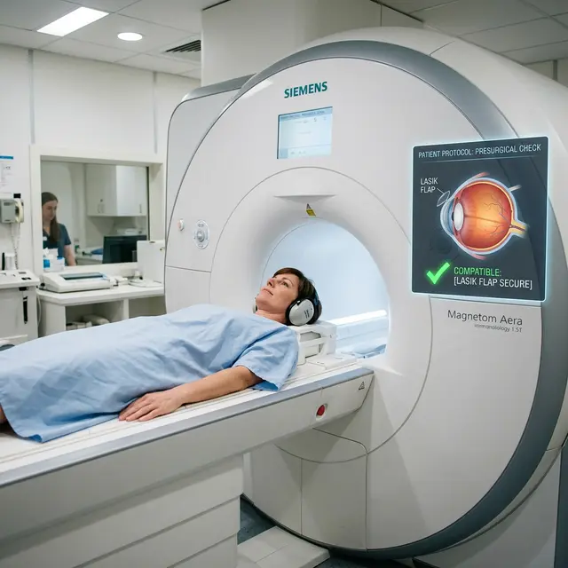

Среди пациентов, перенесших лазерную коррекцию, ходит пугающая легенда: якобы после операции в глазах остаются микрочастицы металла или «лазерные метки», которые под мощным магнитом МРТ-аппарата могут начать двигаться, повреждая ткань или даже «вырывая» роговичный лоскут.

Давайте разберемся, есть ли под этим страхом научная почва и **можно ли делать МРТ после лазерной коррекции зрения**.

## Остается ли металл в глазу?

**Короткий ответ: Нет.**

Лазерная коррекция (будь то LASIK, Femto-LASIK, ФРК или SMILE) — это процесс изменения формы роговицы путем испарения (абляции) её слоев.

- Луч лазера состоит из фотонов, он не имеет материального «металлического» воплощения.
- Все инструменты, касающиеся глаза (микрокератом, расширитель), удаляются сразу после процедуры.
- Никаких имплантатов, чипов или магнитных меток в ткань глаза не вводится.

## Влияет ли МРТ на роговичный лоскут (флэп)?

Еще один частый вопрос: «Не оторвется ли лоскут под действием магнитного поля?».
Магнитное поле МРТ воздействует только на ферромагнетики (металлы, которые магнитятся). Роговица глаза целиком состоит из органики (коллагена и воды), которая абсолютно инертна к магнитному воздействию.

**МРТ никак не может сместить, нагреть или повредить ваш флэп.**

## Ограничения по срокам

Хотя МРТ безопасно с точки зрения физики, существует медицинский этикет и здравый смысл:

1.  **Первые 48 часов:** В первые двое суток после коррекции рекомендуется избегать любых серьезных манипуляций, так как пациенту нужно капать капли каждые 2 часа, а обследование МРТ может длиться долго и вызывать сухость глаз из-за работы вентиляции в томографе.
2.  **МРТ головы и глазниц:** Если вам требуется исследование именно глазных яблок, подождите минимум 2 недели. Свежий отек роговицы после операции может дать небольшие артефакты на снимке, что затруднит диагностику для радиолога.

## Что нужно сообщить врачу?

При заполнении анкеты перед МРТ на вопрос «Были ли у вас операции на глазах?» **нужно ответить утвердительно**. Но не из-за страха металла, а для того, чтобы врач-рентгенолог правильно интерпретировал снимки срезов головы. На МРТ высокого разрешения следы лазерной коррекции (изменение кривизны роговицы) могут быть видны специалисту.

## Вердикт

Делать МРТ после лазерной коррекции зрения **можно и абсолютно безопасно**. Операция не является противопоказанием к исследованию любой части тела, включая головной мозг. Если вам назначено МРТ — проходите его без опасений за свое новое зрение.
