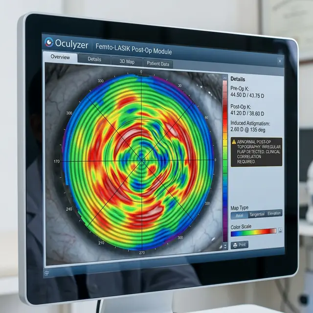

Фемто-Ласик считается эталоном точности, так как лоскут формирует лазер, а не лезвие. Но и здесь случаются сбои. «Неровный лоскут» — это приговор для идеального зрения.

<figure style="text-align: center;">
  
  <figcaption>На топографической карте видны зоны «рваного» края и неравномерной толщины лоскута. Это создает неустранимые оптические искажения.</figcaption>
</figure>

### Как лазер может ошибиться?

Проблема чаще всего не в самом лазере, а в интерфейсе «глаз-прибор»:

1.  **Срыв вакуума:** Самая частая причина. Если глаз дернулся или вакуумная присоска отошла, лазер успевает «настрелять» пузырьки газа неравномерно.
2.  **Газовые включения (OBL):** Пузырьки газа могут скопиться под лоскутом слишком плотно, мешая лазеру дорезать слой до конца. Результат — микроскопические «ступеньки» на поверхности среза.
3.  **Непрозрачный слой:** Если роговица пациента имеет старые микрошрамы или помутнения, лазер может не пройти сквозь них, оставив «мостики» неразрезанной ткани.

### Последствия для пациента:

- **Индуцированный астигматизм:** Свет преломляется криво, потому что поверхность, на которую положили лоскут обратно, — бугристая.
- **Двоение и тени:** Мозг получает два изображения из-за разной толщины лоскута в разных зонах.
- **Невозможность докоррекции:** Чтобы исправить ошибку, нужно ждать 3–6 месяцев, пока ткань полностью заживет, но даже тогда риск повторной ошибки на «битой» роговице выше.

### Что делает хирург?

Если во время операции лазер сформировал лоскут не до конца или неровно, **хороший хирург остановит операцию**. Нельзя поднимать дефектный лоскут и продолжать лазерную шлифовку.

- Операция прерывается.
- Лоскут оставляют прирастать «как есть».
- Повторную попытку делают через несколько месяцев, часто уже другим методом (например, PRK).

**Совет:** Если вы чувствуете, что в день операции что-то пошло не так, а врач говорит «всё нормально, просто капните капли», требуйте показать вашу топографию роговицы. Неровный лоскут виден на картах сразу.
