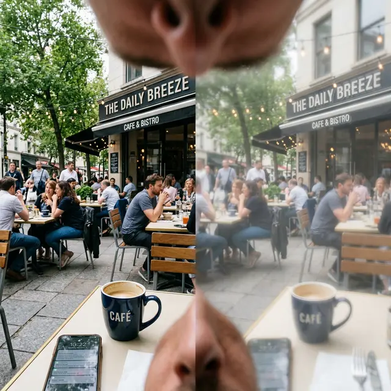

Ситуация, когда после операции один глаз видит «как орел», а второй — «как в тумане», встречается пугающе часто. Врачи обычно успокаивают: «Глаза заживают по-разному, подождите месяц». Но иногда ожидание не помогает.

<figure style="text-align: center;">
  
  <figcaption>Типичный дискомфорт: один глаз дает четкую картинку, а второй искажает изображение, вызывая головные боли и нарушение бинокулярного зрения.</figcaption>
</figure>

Давайте разберем реальные причины, почему один глаз может видеть хуже.

### 1. Неравномерный «Синдром сухого глаза»

Это самая частая причина временной разницы. Лазер перерезает нервы роговицы, из-за чего глаз перестает вырабатывать слезу в нужном объеме. Если на одном глазу нервы повреждены сильнее или он хуже смачивается, зрение на нем будет «плавать» и казаться мутным, как через грязное стекло.

### 2. Регресс и недокоррекция

Человеческий глаз — это живая ткань, а не кусок пластика. Иногда роговица одного глаза начинает слишком активно восстанавливаться, «наращивая» обратно убранные лазером диоптрии. В итоге один глаз остается в нуле, а второй уходит в небольшой «минус» (регресс). Также возможна ошибка в расчетах или работе лазера (недокоррекция).

### 3. Децентрация и астигматизм

Если лазер отработал не строго по центру зрачка (децентрация) на одном из глаз, вы получите двоение, блики и мутность, которых не будет на здоровом глазу. Даже лишние 0.25–0.5 диоптрии наведенного астигматизма могут создать ощущение, что глаз видит «грязно».

### 4. Ведущий и ведомый глаз

Наш мозг привык, что один глаз является ведущим. Если после операции ваш ведущий глаз видит чуть хуже (например, 0.9 вместо 1.0), вы будете ощущать это гораздо острее, чем если бы «просел» ведомый глаз.

### 5. Осложнения: Хейз и врастание эпителия

- **Хейз (Haze):** Наблюдается чаще после ФРК. Это помутнение роговицы, которое может возникнуть на одном глазу и не появиться на другом.
- **Врастание эпителия:** После LASIK клетки поверхностного слоя могут попасть под флэп и начать там расти, затуманивая зрение.

### Что делать?

Если разница сохраняется дольше месяца:

1.  **Требуйте топографию:** Настаивайте на проведении кератотопографии обоих глаз, чтобы исключить децентрацию и астигматизм.
2.  **Проверьте увлажнение:** Попробуйте капать капли без консервантов чаще в «плохой» глаз — если зрение проясняется на пару минут, значит, проблема в сухости.
3.  **Не спешите на докоррекцию:** Врачи часто предлагают «подправить» второй глаз через 3-6 месяцев. Помните, что каждая повторная операция — это еще больший риск эктазии (истончения роговицы).

**Главный совет:** не сравнивайте свои глаза каждую минуту, закрывая их по очереди. Это прямой путь к неврозу. Дайте тканям восстановиться хотя бы 3 месяца, прежде чем делать окончательные выводы.
