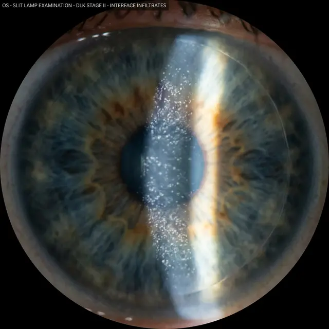

Если через пару дней после операции зрение начало не улучшаться, а затуманиваться, это может быть признаком опасного осложнения — **диффузного ламеллярного кератита (ДЛК)**. В офтальмологии его называют «Пески Сахары».

<figure style="text-align: center;">
  
  <figcaption>Клиническая картина ДЛК: под прозрачным лоскутом видны мелкие белесые включения, напоминающие рассыпанный песок.</figcaption>
</figure>

### Что это такое?

Это неинфекционное воспаление, которое возникает в пространстве между срезанным лоскутом (флэпом) и основным слоем роговицы. Ваш организм по какой-то причине начинает атаковать зону операции, направляя туда лейкоциты.

### Почему это происходит?

Причин может быть много, и часто они не зависят от хирурга:

1.  **Реакция на инструменты:** Микрочастицы металла, масла или дезинфицирующих средств, попавшие на лезвие микрокератома или головку лазера.
2.  **Эндотоксины:** Ошметки погибших бактерий, которые могут присутствовать даже в стерилизованных инструментах.
3.  **Индивидуальная реакция:** Аллергия на используемые капли или просто слишком бурный ответ иммунной системы на травму.

### Стадии и риски

- **1-я и 2-я стадии:** Проявляются только легким туманом. Обычно лечатся ударными дозами гормональных капель (Дексаметазон).
- **3-я и 4-я стадии:** Это уже катастрофа. Воспаление становится настолько сильным, что ткань роговицы начинает «плавиться» и разрушаться. Это ведет к потере прозрачности глаза и необратимому падению зрения.

### Симптомы, которые нельзя игнорировать:

- Зрение стало мутнее, чем в первый день после операции.
- Появилось ощущение инородного тела.
- Глаз покраснел и стал болезненно реагировать на свет.
- Эффект «взгляда через запотевшее стекло».

### Что делать?

Если вы подозреваете ДЛК, **бегите в клинику немедленно!** Счет идет на часы. В запущенных случаях хирургу приходится заново поднимать лоскут и промывать пространство под ним антибиотиками и гормонами.

Правильно диагностированный и пролеченный на ранней стадии ДЛК обычно проходит бесследно, но если упустить время — прозрачность роговицы может не восстановиться никогда.
