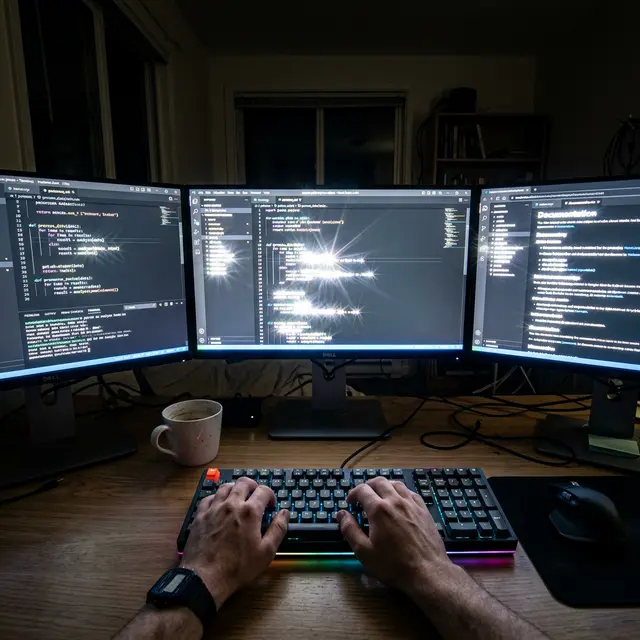

Для программиста глаза — это основной рабочий инструмент. И если этот инструмент дает сбой, карьера может оказаться под угрозой. Многие айтишники идут на операцию ради комфорта, но получают «ад» вместо кода.

<figure style="text-align: center;">
  
  <figcaption>Типичный вид IDE после неудачной коррекции: текст «двоит», буквы светятся (starbursts), а контрастность падает настолько, что глаза устают за 5 минут.</figcaption>
</figure>

### Почему «единица» не гарантирует работу?

В кабинете врача вы читаете черные буквы на идеально белом фоне. Это **максимальная контрастность**. Но работа кодера — это:

- Темные темы оформления (Dark Mode) — худший сценарий после ЛКЗ.
- Мелкий шрифт и тонкие линии.
- Десятки часов в неделю под синим светом монитора.

### Главные враги айтишника:

#### 1. Потеря контрастной чувствительности

После срезания лоскута (LASIK) или удаления лентикулы (SMILE) роговица перестает быть идеальной линзой. Свет рассеивается. На мониторе это проявляется как «грязный» фон и нечеткие края букв. Программист видит текст как через тонкий слой вазелина.

#### 2. Дикая сухость (Computer Vision Syndrome + LASIK)

Моргание за монитором сокращается в 3 раза. Если добавить к этому перерезанные лазером нервы (которые должны подавать сигнал о сухости), глаз превращается в пустыню за 10 минут работы. Роговица сохнет, зрение «плывет», концентрация падает.

#### 3. Аберрации высшего порядка (HOA)

В темной комнате зрачок расширяется, захватывая зону края операции. Результат: вокруг каждой буквы в коде появляются «хвосты» и блики. Читать код становится физически больно, мозг перегружается.

### Как выжить, если вы уже сделали операцию?

- **Капли без консервантов:** Флакон должен стоять у клавиатуры. Капать каждые 30–60 минут, не дожидаясь боли.
- **Увлажнитель воздуха:** В комнате должно быть 50%+ влажности.
- **Отказ от Dark Mode:** Как ни парадоксально, светлые темы со шрифтом без засечек после операции читаются легче, так как зрачок сужен и «отсекает» краевые искажения.
- **Желтые очки:** Блокировка синего спектра может немного снизить раздражение.

**Вывод:** Если вы программист и ваше зрение позволяет работать в очках или линзах — **бегите от лазерного хирурга**. Риск потерять работоспособность ради «красоты» без очков в вашей профессии неоправданно велик.
