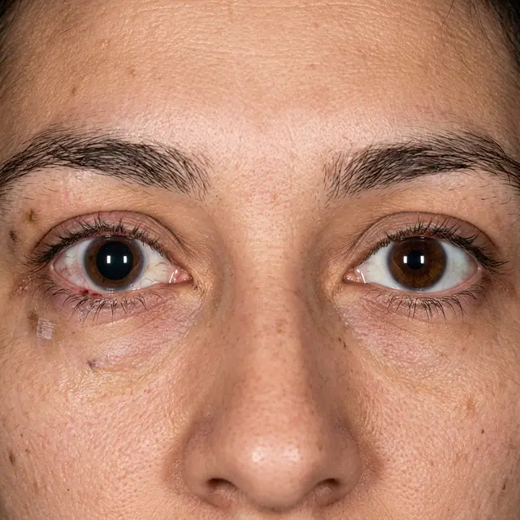

Нередко на форумах можно встретить пугающие сообщения: «Сделал ЛКЗ, прошло два месяца, и заметил, что один зрачок шире другого. Это нормально?» Ситуация, когда зрачки имеют разный диаметр, называется **анизокорией**.

<figure style="text-align: center;">
  
  <figcaption>Анизокория после операции: заметная разница в диаметре зрачков может быть следствием медикаментозного воздействия или травмы.</figcaption>
</figure>

В большинстве случаев клиники списывают это на «индивидуальные особенности», но если раньше ваши зрачки были одинаковыми, стоит разобраться в реальных причинах.

### 1. Медикаментозное влияние (Дексаметазон и др.)

Самая частая и «безобидная» причина в раннем послеоперационном периоде. Некоторые противовоспалительные и антибактериальные капли могут косвенно влиять на тонус мышц зрачка. Обычно это проходит через несколько недель после отмены препаратов.

### 2. Травма сфинктера зрачка

Во время операции LASIK или Femto-LASIK на глаз накладывается вакуумное кольцо. Оно создает очень высокое давление внутри глаза. В редких случаях это давление может привести к микротравме **сфинктера зрачка** — мышцы, которая отвечает за его сужение. Если мышца повреждена, зрачок перестает адекватно реагировать на свет и остается расширенным.

### 3. Раздражение симпатической нервной системы

Травматизация роговицы (срезание флэпа или формирование лентикулы) — это мощный шок для нервных окончаний. В ответ на хроническое раздражение или выраженный синдром сухого глаза глаз может поддерживать зрачок в расширенном состоянии.

### 4. Выявление старой проблемы

Часто люди начинают разглядывать свои глаза в зеркало с фанатизмом только _после_ операции. Легкая анизокория (до 1 мм) встречается у 20% здоровых людей. Возможно, она была у вас всегда, но заметили вы её только сейчас, когда стали беспокоиться о результате ЛКЗ.

### Что делать?

Если вы заметили разницу в размере зрачков:

1.  **Проверьте реакцию на свет:** Посветите фонариком в оба глаза. Если «широкий» зрачок вообще не сужается — это повод для срочного визита к нейроофтальмологу.
2.  **Сравните со старыми фото:** Найдите крупные селфи до операции.
3.  **Исключите неврологию:** Анизокория может быть симптомом серьезных проблем с мозгом (аневризмы, опухоли), которые никак не связаны с лазером, но случайно совпали по времени.

**Важно:** Если расширение зрачка сопровождается опущением века (птозом) или двоением, немедленно обратитесь к врачу — это может быть признаком поражения глазодвигательного нерва.
