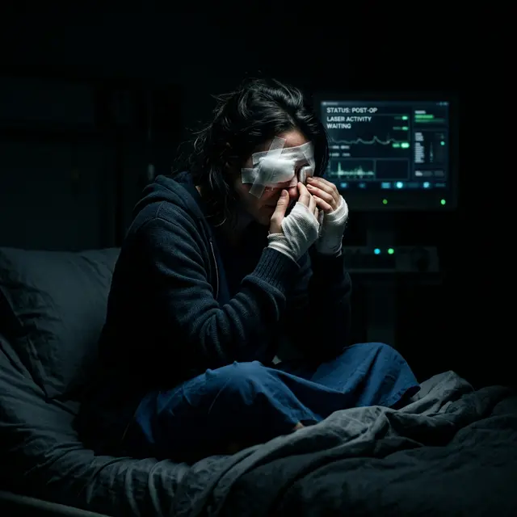

Один из самых частых страхов перед операцией — проснуться после нее в полной темноте. Клиники уверяют, что «шанс ослепнуть равен нулю». Но правда в деталях: что именно считать слепотой?

<figure style="text-align: center;">
  
  <figcaption>Полная слепота сразу после лазерной коррекции — казуистика, но частичная потеря зрения и инвалидизация — реальный риск.</figcaption>
</figure>

### Мировая статистика

Если мы говорим о «мгновенной» слепоте прямо на операционном столе, то таких случаев практически не зафиксировано за всю 30-летнюю историю LASIK. Современные лазеры имеют многоуровневую защиту и просто отключаются при любой нештатной ситуации.

Однако, если понимать под слепотой **невозможность видеть четко даже в очках или линзах**, то статистика становится менее радужной.

### Риск потери зрения через годы (Кератоэктазия)

Самое опасное осложнение — **ятрогенная кератэктазия** (вторичный кератоконус). Это ситуация, когда роговица становится слишком тонкой после лазера и начинает «выпячиваться» под действием глазного давления.

- Это осложнение может проявиться через 1, 5 или даже **20 лет после операции**.
- Зрение при этом падает катастрофически, появляется двоение и искажения, которые не убираются очками.
- В худшем случае это ведет к необходимости пересадки роговицы.

### Шанс ослепнуть через 20 лет: возможно ли это?

Да, если у пациента была склонность к кератоконусу, которую хирург пропустил (или намеренно проигнорировал ради прибыли). С возрастом роговица может ослабнуть, и старая операция даст о себе знать. Также после ЛЗК сложнее рассчитывать искусственные хрусталики при катаракте, что повышает риск врачебных ошибок в старости.

### Инфекции: когда глаз можно потерять

Тяжелый кератит (инфекционное воспаление) под лоскутом или в зоне SMILE может привести к расплавлению роговицы за несколько суток. Если пациент не обратится к врачу при первых признаках боли и покраснения, инфекция может привести к потере глаза как органа.

### Итог: каков реальный риск?

- **Полная слепота:** Близка к нулю (1 на миллион и ниже).
- **Потеря качества зрения (инвалидизация):** Оценивается разными исследованиями от 1% до 3%. Это те люди, кто жалуется на сильнейшие гало, двоение и невозможность водить машину ночью, несмотря на «100% строчки» в кабинете врача.

**Помните:** Лазерная коррекция — это косметическая операция на здоровом органе. Риск потери зрения в 1% кажется маленьким, пока вы не попадаете в этот процент.
