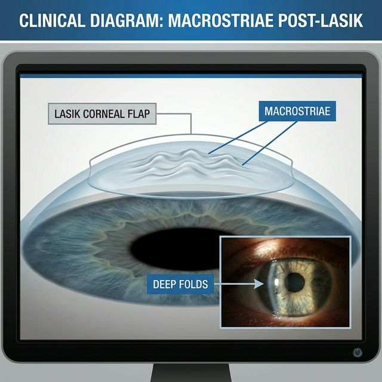
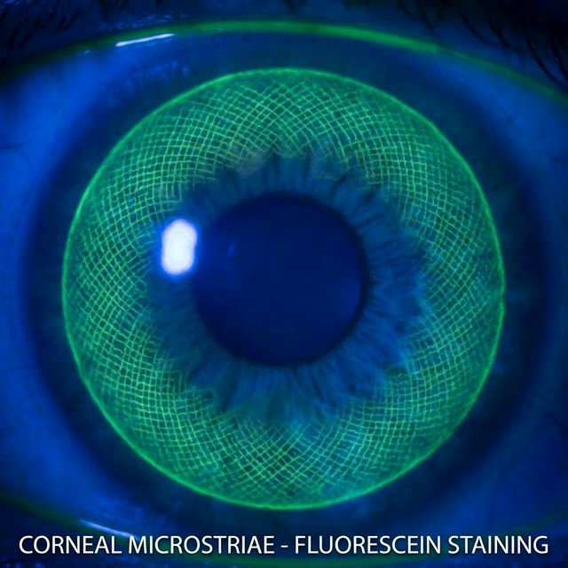
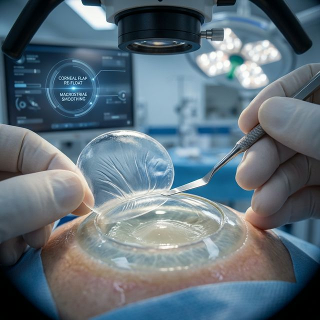
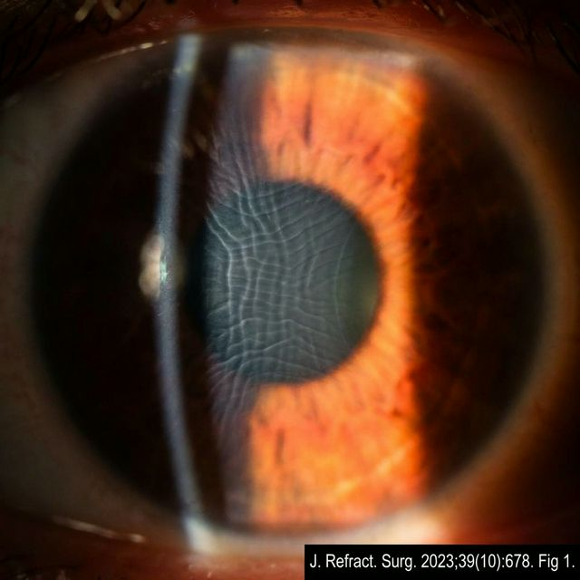

Вы сделали лазерную коррекцию. Проходит несколько дней или недель. Вы замечаете, что зрение нечёткое, буквы двоятся, а посмотрев в зеркало при боковом освещении, вы видите **полосы или морщинки на роговице**.

Вы едете к хирургу. Он смотрит в щелевую лампу 10 секунд и говорит: «Всё нормально, острота единица. Это особенности заживления, скоро пройдёт».

**Он врёт.**

У вас есть примерно месяц, чтобы исправить складки лоскута. После этого срока эпителий намертво фиксирует их — и зрение останется искажённым **навсегда**.

---

## Что такое складки лоскута и почему они возникают

При LASIK хирург вырезает лоскут роговицы (флэп) толщиной ~100 мкм, откидывает его, выпаривает лазером часть стромы и укладывает флэп обратно. При SMILE/CLEAR вырезается кэп толщиной ~120–130 мкм, через который извлекают лентикулу.

В обоих случаях ткань должна лечь **идеально ровно** на новое ложе. Но новая поверхность роговицы — более плоская, чем исходная (вы убрали минус — роговица уплостилась). Лоскут, вырезанный для старой, более крутой кривизны, оказывается «велик». Он **сморщивается**, образуя складки.

Это называется **эффект несоответствия** (tent effect). Лишняя ткань никуда не девается — она собирается в морщины.

Вот как это выглядит под микроскопом:

*Макрострии (крупные складки) после LASIK. Хорошо видны даже невооружённым глазом при боковом освещении.*

*Микрострии — тонкая «паутина» на поверхности лоскута. Именно их врачи чаще всего «не видят» на осмотре.*

---

## Критический срок: почему именно месяц

### Первые 24–48 часов

Лоскут держится **исключительно** на капиллярном присасывании и отрицательном давлении. Он подвижен. Если складку заметили в этот период — хирург может поднять флэп, промыть ложе и переуложить его заново. Это относительно простая процедура.

### От 2 дней до 2 недель

По краю флэпа начинает нарастать эпителий — поверхностный слой клеток роговицы. Он работает как «пластырь», фиксируя край лоскута. Поднять флэп всё ещё можно, но уже сложнее — эпителий приходится отслаивать. Риск **эпителиального врастания** (клетки попадают под лоскут и размножаются там) резко возрастает.

### От 2 недель до 1 месяца

**Это последний реальный шанс.** Эпителий уже покрыл край флэпа толстым слоем и начинает прорастать **внутрь складок**. Каждая морщинка заполняется эпителиальными клетками, которые там размножаются и выделяют базальную мембрану — тонкий слой коллагена, который намертво цементирует складку в её текущем положении.

Флэп ещё можно поднять, но:
- Процедура значительно травматичнее;
- Риск врастания эпителия под лоскут — до 40–60%;
- Даже после разглаживания микрорельеф может остаться неровным.

### После 1 месяца

**Эпителий полностью зафиксировал складки.** Поднять флэп и разгладить его до идеальной гладкости уже невозможно. Хирург может:
- Наложить **швы**, натягивая лоскут (швы на роговице = гарантированный астигматизм);
- Сделать **ФТК** — «подшлифовать» поверхность эксимерным лазером (истончает и без того тонкую роговицу);
- Предложить **пересадку роговицы** в особо тяжёлых случаях.

Но **идеального зрения уже не будет**. Вы останетесь с искажениями на всю жизнь.

*Процедура flap-lift: лоскут поднимают шпателем, промывают, натягивают и укладывают заново. Эффективна только в первые недели.*

---

## Почему врачи говорят «всё нормально»

Вы приходите на осмотр. Хирург сажает вас за таблицу Сивцева. Вы называете строчки до 1,0. Врач улыбается: «Отличный результат, острота 100%».

Но вы-то видите, что буквы **двоятся**. Что вокруг фонарей — **ореолы и лучи**. Что при боковом свете на роговице видны **полосы**.

Почему врач вас игнорирует? Причины простые и циничные:

1. **Таблица Сивцева не показывает качество зрения.** Острота 1,0 и складки на флэпе — не взаимоисключающие вещи. Вы можете читать 10-ю строчку и одновременно страдать от гостинга (двоения), потери контрастности и старберстов.

2. **Признать складки = признать косяк.** Если врач скажет: «Да, у вас микрострии», это означает, что операция прошла неидеально. А это — потеря репутации, риск судебного иска, внутреннее расследование в клинике. Гораздо проще сказать: «Всё нормально, это пройдёт».

3. **Они надеются, что «само рассосётся».** Часть микроскладок действительно может сгладиться со временем за счёт перераспределения эпителия. Но макрострии — никогда. И пока врач ждёт, что «само пройдёт», ваш месячный срок уходит.

4. **Повторное вмешательство — это риск для клиники.** Flap-lift в поздние сроки несёт риск осложнений (врастание эпителия, DLK, инфицирование). Клинике проще убедить вас, что проблемы нет, чем брать на себя эти риски.

> «Участник чата: микроскладки лоскута обнаружены только в другой клинике. В оперировавшей — всё "нормально"».  
> — [Чат пострадавших, март 2025](https://t.me/lasik_chat)

Это **типичный сценарий** газлайтинга. Пациенту говорят, что он «придумывает», «слишком требователен», «у всех так бывает». А тем временем эпителий цементирует складки.

---

## Как выглядят складки кэпа после SMILE

SMILE позиционируется как «безлоскутный» метод. Это маркетинг. В SMILE есть **кэп** — верхняя крышка роговицы, которая по сути тот же флэп, только без бокового шарнира. После удаления лентикулы кэп **проседает** в образовавшуюся полость.

Поскольку кэп сохранил исходную кривизну, а ложе стало более плоским — возникает **эффект палатки**. Лишняя ткань собирается в параллельные складки.

*Микрострии кэпа после SMILE. Тонкие параллельные складки из-за эффекта «провисания палатки».*

Особенность складок кэпа в том, что **доступа к ним нет** — в SMILE нет большого разреза, флэп не откидывается. Если складки зафиксировались, исправить их практически невозможно. Репозиция интерфейса через микроразрез даёт минимальный эффект.

> «После репозиции кэпа — повторное вмешательство не помогло, микроскладки зафиксировались».  
> — [Чат пострадавших, май 2026](https://t.me/lasik_chat)

---

## Как самому проверить, есть ли складки

Вам не нужно быть офтальмологом, чтобы заподозрить проблему.

**Визуальный тест (с зеркалом):**
- Встаньте перед зеркалом в тёмной комнате;
- Посветите фонариком телефона сбоку, под острым углом к глазу;
- Посмотрите на поверхность роговицы напротив источника света;
- Если вы видите **линии, полосы, морщинки или «паутину»** на поверхности — это складки.

**Функциональный тест (на зрение):**
- Посмотрите на светодиодный фонарь в темноте;
- Если вокруг него есть **ореолы, лучи в одном направлении**, или сам источник «размножается» — вероятная причина в складках;
- Посмотрите на чёрный текст на белом фоне — если буквы «двоятся» вверх или вбок (особенно одним глазом) — это гостинг от микрострий.

---

## Реальные истории из чата пострадавших

**История 1.** Девушка после LASIK заметила, что левый глаз видит хуже правого. Буквы на вывесках «расплывались». Хирург на трёх осмотрах подряд говорил: «Всё отлично, острота 0,9–1,0, это отёк, пройдёт». Через 2 месяца она пошла в другую клинику. Диагноз: **макрострии флэпа, зафиксированные эпителием**. Flap-lift на таком сроке уже не дал результата. Осталась с постоянным гостингом в левом глазу.

**История 2.** Пациент после Фемто-LASIK с первого дня видел «полосы» при боковом свете. Хирург сказал: «Это нормально, лоскут ещё не прирос, скоро разгладится». Через 3 недели полосы стали заметнее. Пациент потребовал репозицию. Хирург согласился только после письменной претензии. Flap-lift на 4-й неделе прошёл с частичным успехом — крупные складки ушли, микрострьи остались. Зрение 0,8 с искажениями.

**История 3.** Молодой человек после SMILE жаловался на троение (три копии каждого объекта). Врач сказал, что «мозг адаптируется». Через 2 месяца троение не прошло. Аберрометрия показала **высшие аберрации от складок кэпа**. Исправить уже ничего нельзя — кэп зафиксирован.

**История 4.** Женщина обратилась в независимую клинику через 1,5 года после LASIK с жалобами на «странные тени от букв». При осмотре с флуоресцеином обнаружены **микрострии в оптической зоне** — их не видели на осмотрах в оперировавшей клинике (или «не замечали»). Складки полностью эпителизированы. Врач сказал: «Исправить уже нельзя. Живите так».

---

## Что делать, если вы видите складки

### Немедленно (первые дни)

1. **Требуйте осмотра с флуоресцеином.** Простая щелевая лампа может не показать микрострьи. Флуоресцеин затекает в «долины» между складками и делает их видимыми под синим светом.
2. **Требуйте ОКТ переднего отрезка.** Это срез роговицы, на котором глубина складок видна в микронах.
3. **Не принимайте ответ «всё нормально».** Если вы видите полосы — они есть. Острота 1,0 не отменяет складок.
4. **Если хирург отказывается признавать — идите в другую клинику.** Счёт идёт на дни.

### Если прошло больше 2 недель

- **Пишите письменную претензию в клинику.** Зафиксируйте, что вы сообщали о проблеме, а вам отказывали в диагностике.
- **Требуйте копии всей медицинской документации** (по ФЗ-323 и приказу Минздрава №789н).
- **Ищите хирурга, специализирующегося на осложнениях ЛКЗ.** Обычный офтальмолог или хирург из той же клиники вам не помогут.

### Если прошёл месяц

Шансы на полное исправление минимальны. Но бороться всё равно стоит:
- **ФТК** может сгладить микрорельеф;
- **Склеральные линзы** могут компенсировать нерегулярный астигматизм;
- **Юридический путь** — подача иска о некачественной медицинской услуге.

---

## Вывод

Складки лоскута после лазерной коррекции — это не «особенность заживления». Это **деформация оптической поверхности глаза**, которая сама не проходит.

У вас есть примерно **месяц**, чтобы заставить врача признать проблему и исправить её хирургически. После этого срока эпителий намертво фиксирует складки, и ваше зрение останется искажённым на всю оставшуюся жизнь.

Не верьте хирургу, который говорит «всё нормально», если вы своими глазами видите полосы на роговице. Он защищает не ваше зрение — он защищает себя от ответственности за неудачную операцию.

---

*Все истории взяты из открытого чата пострадавших после лазерной коррекции: [@lasik_chat](https://t.me/lasik_chat).*
