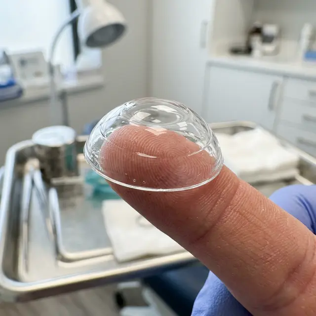

Многие пациенты после неудачного LASIK сталкиваются с шокирующим фактом: **даже самые дорогие очки больше не помогают**. Когда лазер делает роговицу слишком тонкой или неровной (индуцированная эктазия), свет преломляется хаотично. Обычные линзы не держатся на деформированном глазу, а очки просто транслируют искаженную картинку.

В этот момент в жизни пациента появляется термин **«Склеральные линзы»**. Это не просто «контактные линзы», это сложный медицинский протез и последний шанс на нормальное зрение.

## Что это такое?

Склеральная линза — это огромная (15-20 мм в диаметре) жесткая линза, которая не касается роговицы. Она опирается на склеру (белок глаза), а пространство между линзой и глазом заполняется физраствором.

Фактически, линза создает **новую искусственную поверхность глаза**, заменяя вашу испорченную роговицу идеально ровной оптикой.

## Цена «свободы от очков»

Ирония ситуации в том, что люди делают лазерную коррекцию, чтобы забыть о линзах. Но в случае осложнений они получают:

1.  **Запредельную стоимость:** Одна пара индивидуальных склеральных линз в России стоит от **60 000 до 150 000 рублей**.
2.  **Срок службы:** Линзы нужно менять ежегодно.
3.  **Сложность подбора:** Обычный окулист вам не поможет. Вам нужен узкий специалист (контактолог), которых в стране единицы. Процесс подбора может занять 3-5 месяцев.

## Образ жизни: добро пожаловать в ад

Если вы думали, что ухаживать за мягкими линзами сложно, забудьте об этом. Склеральные линзы — это ритуал:

- Их нельзя надеть «просто так». Нужно залить внутрь физраствор без консервантов так, чтобы не осталось ни одного пузырька воздуха. Пузырек под линзой — это слепое пятно и отек через 30 минут.
- Линзы нужно снимать и перенадевать (менять раствор) каждые 4-6 часов, иначе роговица начинает «задыхаться» под стеклянным куполом.
- Снять их пальцами невозможно — нужна специальная присоска (манипулятор), которую вы всегда должны носить с собой.

## Почему это единственный выход?

При кератоэктазии (состоянии, когда роговица выпячивается вперед под давлением глаза) роговица становится похожа на помятую пластиковую бутылку. Лазером это исправить нельзя — ткани и так слишком мало.

Склеральная линза — единственный способ подавить эти неровности и дать мозгу четкую картинку. Без них человек видит мир как через замерзшее стекло.

## Итог

Когда клиника обещает вам «жизнь без линз», они забывают добавить звездочку: _«...или жизнь в склеральных линзах за 100 тысяч рублей в год, если мы промахнемся»_. Если вам предложили склеральные линзы после операции — это официальное признание того, что ваша роговица разрушена.
