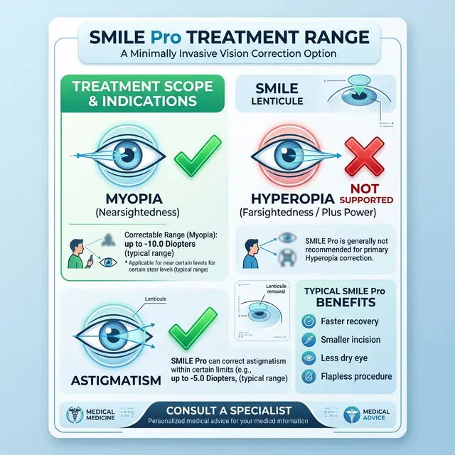

Реклама SMILE Pro обещает «самую совершенную коррекцию». Но если у вас дальнозоркость (гиперметропия), этот метод, скорее всего, вам откажет. Разберемся, почему даже новейший лазер VisuMax 800 пасует перед «плюсом».

<figure style="text-align: center;">
  
  <figcaption>Типичный диапазон применения SMILE Pro: идеален для «минуса», но имеет серьезные пробелы в коррекции «плюсового» зрения.</figcaption>
</figure>

### Геометрическая ловушка

Технология SMILE основана на вырезании внутри роговицы линзы (лентикулы), которую затем удаляют через крошечный разрез.

- **При близорукости (-):** Лентикула толще в центре и тоньше к краям. Ее легко сформировать и вытащить.
- **При дальнозоркости (+):** Чтобы исправить «плюс», нужно сделать роговицу более крутой, выпуклой. Для этого линза должна быть **тонкой в центре и толстой по краям**.

### В чем проблема вырезать «обратную» линзу?

1.  **Диаметр разреза:** Чтобы убрать ткань по периферии (как нужно при дальнозоркости), требуется гораздо большая зона воздействия. Это снижает прочность роговицы и увеличивает риск осложнений.
2.  **Техническая сложность:** Вытаскивать лентикулу, которая имеет форму кольца или «бублика» (тонкая в центре), крайне сложно. Велик риск разрыва ткани или того, что кусок останется внутри.
3.  **Регресс:** Глаз гораздо агрессивнее пытается «заживить» периферийные изменения. Результат при коррекции «плюса» методом Смайл часто оказывается нестабильным.

### Есть ли надежда?

На данный момент SMILE для гиперметропии находится в стадии клинических испытаний или ограниченного применения в некоторых странах. Но массово клиники этот метод для «плюса» не используют.

### Что делать, если у вас «плюс»?

Если вам говорят «Смайл вам не подходит», это не значит, что вы безнадежны. Для гиперметропии золотым стандартом остаются:

- **Femto-LASIK:** Позволяет работать на периферии роговицы гораздо эффективнее.
- **Фактичные линзы:** Если «плюс» очень высокий.
- **Замена хрусталика:** Если вы старше 45 лет и зрение падает из-за пресбиопии.

**Вывод:** Не ведитесь на бренд «SMILE Pro», если у вас дальнозоркость. Это будет неоправданно дорого и технически рискованно. Доверяйте проверенному Фемто-Ласику в этом конкретном случае.
