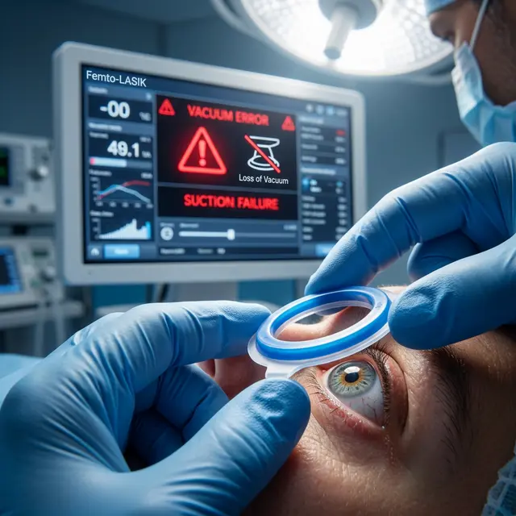

Один из самых пугающих моментов во время операции Фемто-Ласик — когда хирург внезапно замирает, лазер останавливается, и вы слышите тревожный звуковой сигнал аппарата. Одной из частых причин такой заминки является **потеря вакуума** (Suction Loss).

<figure style="text-align: center;">
  
  <figcaption>Критический момент: если вакуумное кольцо смещается или теряет герметичность, лазер немедленно прекращает работу для предотвращения травмы.</figcaption>
</figure>

### Почему вакуум не «присасывается» или срывается?

Аспирационное кольцо — это деталь, которая удерживает ваш глаз в неподвижном состоянии и создает базу для работы фемтосекундного лазера. Если присасывание не удается или прерывается, работа лазера блокируется.

**Основные причины:**

1.  **Анатомия глаза:** Слишком крутая роговица, плоская роговица или узкая глазная щель могут мешать кольцу плотно прилечь.
2.  **Движения пациента:** Резкое зажмуривание, попытка увести взгляд или паническая атака могут сорвать кольцо.
3.  **Инородные тела:** Слеза, слизь или частички косметики (если вы плохо ее смыли) могут нарушить герметичность.
4.  **Отек конъюнктивы:** Если ткани вокруг роговицы рыхлые, вакуум может «сползти».

### Чем это грозит?

Последствия зависят от того, **в какой момент** произошел срыв:

- **До начала работы лазера:** Ничем не грозит. Хирург просто попробует наложить кольцо еще раз (иногда требуется смена размера кольца).
- **В процессе формирования флэпа (лоскута):** Это самый опасный вариант. Возникает **неполный срез** или «ступенька» на роговице. В этом случае операцию продолжать нельзя. Хирург укладывает недорезанный лоскут на место, и вам придется ждать от 3 до 6 месяцев, пока ткани срастутся, чтобы попробовать еще раз.
- **После того, как флэп готов, но до коррекции зрения:** Процедуру могут продолжить, если лоскут сформирован качественно.

### Риск «Газовых пузырьков» (Opaque Bubble Layer)

При срыве вакуума в слоях роговицы могут остаться микроскопические пузырьки газа, которые мешают лазеру «видеть» зрачок. Это также может стать причиной отмены операции в этот день.

### Что должен сделать хирург?

Грамотный врач не будет пытаться «дорезать на глаз». Если вакуум сорван на этапе реза, стандарт безопасности — **стоп-операция**. Любая попытка продолжить немедленно ведет к риску получения рваного лоскута (Buttonhole), который навсегда испортит ваше зрение.

**Важно:** Если у вас случился срыв вакуума, это не значит, что вы ослепнете. Но это значит, что в этот день вы уйдете домой со старым зрением и легким покраснением глаза. Это обидно, но гораздо безопаснее, чем оперировать на «гуляющем» глазу.
