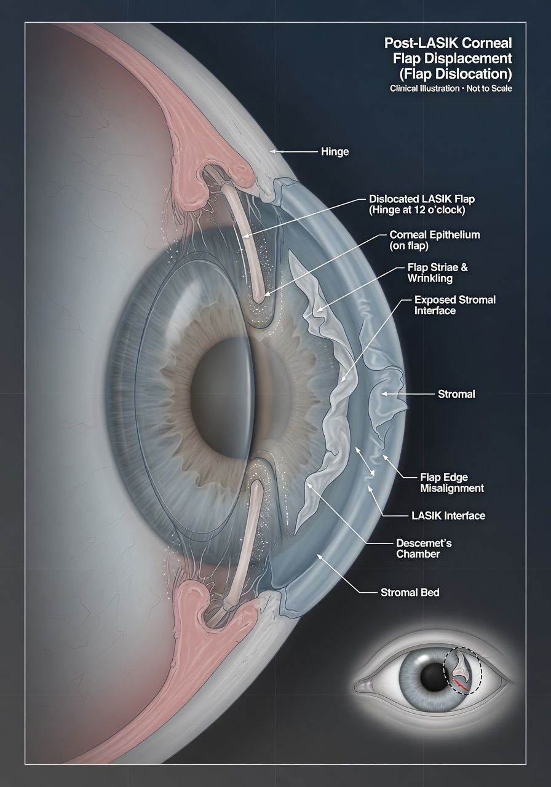

Хирурги LASIK утверждают, что смещение роговичного лоскута — «редкое осложнение, 0,1–0,5% случаев». Но на форумах и в чатах пациентов эти истории исчисляются сотнями. Почему разрыв между статистикой клиник и реальным опытом настолько велик? Ответ прост: во-первых, смещение может произойти через 10–15 лет, а пациент к тому моменту уже потерян из статистики клиники. Во-вторых, те, у кого всё прош smoothly, не пишут на форумы. А те, кто столкнулся с осложнениями — пишут. И пишут много.

Мы собрали **10 реальных историй** из чата [@lasik_chat](https://t.me/lasik_chat) — самого крупного русскоязычного сообщества по лазерной коррекции зрения. Имена изменены, но сценарии и детали сохранены полностью. Каждая история — это чей-то реальный опыт, который стоит изучить, прежде чем ложиться под лазер.

## История №1. Смещение через 2 недели после операции — стряхнула снег с ресниц полотенцем

**Анна, 27 лет, Москва.** LASIK сделала в ноябре. Через 13 дней после операции вышла на улицу, пошёл снег. Снежинки таяли на ресницах, Анна машинально смахнула их махровым полотенцем — провела полотенцем по закрытым векам. Никакого давления, просто лёгкое движение. Через час почувствовала, что левый глаз «как будто застелило плёнкой». Заглянула в зеркало — на роговице заметила странную морщинку. Поехала в клинику, где ей сделали LASIK. Диагноз: **дислокация лоскута с образованием складок**. Провели репозицию (расправили лоскут) прямо в тот же день. Зрение восстановилось до 1,0, но остались **микрострии** — мелкие складки, заметные только на щелевой лампе. Анна говорит: «Врач сказал, что на зрение не влияет. Но я знаю, что они там есть. И каждый снегопад теперь вспоминаю об этом».

**Комментарий:** Через 2 недели после LASIK лоскут ещё не полностью сросся со стромой. Полная адгезия (приживление) занимает от 3 до 6 месяцев, по некоторым данным — до года. Любое трение, даже через закрытые веки, может сдвинуть флэп. Сухое полотенце — один из самых частых триггеров в первый месяц. **Что делать:** в первые 3 месяца вообще не прикасаться к глазам. Салфетки — только влажные, только промакивающие движения.

## История №2. Смещение через 8 месяцев — уронила телефон на лицо ночью

**Елена, 33 года, Санкт-Петербург.** Спала на спине, читала перед сном лёжа. Уснула, телефон выскользнул из рук и упал прямо на левый глаз. Проснулась от резкой боли. Утром **зрение в левом глазу упало с 1,0 до 0,3**. Лоскут сместился вниз на 2 мм, край завернулся. В клинике сделали репозицию — расправили и пригладили лоскут, наложили бандажную контактную линзу на 5 дней. Зрение вернулось до 0,8 через месяц. Осталось **лёгкое искажение** — прямые линии кажутся чуть волнистыми вблизи.

**Комментарий:** Падение телефона на лицо — один из самых частых бытовых сценариев после LASIK. Даже лёгкий удар весом 150–200 граммов способен сместить лоскут, если угол падения неудачный. **Что делать:** приобретите чехол-книжку или держите телефон в руке так, чтобы он не оказался над лицом. Сон на спине снижает риски.

## История №3. Смещение через 3 года — ребёнок ударил игрушкой

**Мария, 35 лет, Новосибирск.** Через 3 года после LASIK двухлетний сын размахнулся пластмассовой машинкой и попал маме прямо в глаз. Удар был несильным — ребёнок маленький, силы немного. Но в течение часа появилось **ощущение «песка»**, слезотечение, а потом Мария заметила, что видит буквы в телефоне размытыми. Вечером того же дня обратилась в приёмный покой глазной больницы. Дислокация лоскута на 1 мм. Своевременная репозиция (в пределах 12 часов) дала восстановление зрения до 0,9. **Складок не осталось.**

**Комментарий:** Удар детской игрушкой — настолько типичный сценарий, что некоторые хирурги в США включают его в предоперационную беседу с родителями. **Что делать:** если у вас маленькие дети — предупредите всех членов семьи, что в глаз целиться нельзя. При любом ударе в глаз после LASIK — сразу к офтальмологу, даже если зрение не изменилось.

## История №4. Смещение через 5 лет — сильно потёр глаз после душа

**Дмитрий, 40 лет, Краснодар.** Привычка тереть глаза после душа — осталась с детства. Через 5 лет после LASIK Дмитрий, как обычно, сильно растёр глаз кулаком (через закрытое веко). Раздался **хруст** — пациент описывает это как «что-то хлюпнуло под пальцем». Открыл глаз — **пелена, всё расплылось**. В клинике диагностировали дислокацию лоскута с его перегибом. Репозиция была сложной — потребовалась дважды, потому что флэп не хотел ложиться ровно. Финальный результат: зрение 0,7, **осталась стрия** (складка) в центральной зоне, которая создаёт блики и ореолы вокруг источников света.

**Комментарий:** Трение глаз — **абсолютный чемпион** среди причин смещения лоскута. По данным форума, около 40% всех случаев дислокации связаны именно с трением. Через 5 лет лоскус сросся, но **сама плоскость сращения** остаётся зоной пониженной прочности — флэп лежит на строме, как ковёр на полу, без жёсткой фиксации. **Что делать:** забыть фразу «потереть глаза» навсегда. Если чешется — капли, антигистаминные, влажные салфетки. Никаких кулаков.

## История №5. Смещение через 7 лет — ветка ударила по глазу в лесу

**Игорь, 45 лет, Подмосковье.** Пошёл в лес за грибами. Шёл по тропинке, идущий впереди товарищ отогнул ветку — ветка со свистом вернулась и ударила Игоря по правому глазу. Удар средней силы. Глаз покраснел, слезился. Игорь решил, что просто царапина роговицы, и промыл глаз водой. На следующий день зрение упало, появилось **двоение в правом глазу**. В травмпункте выявили дислокацию лоскута на 3 мм с вращением. Прошло уже около 28 часов. Репозиция была технически сложной — лоскут начал фиксироваться в смещённом положении. Врачам удалось расправить флэп, но **остались макроскладки** — заметные визуально при моргании. Зрение восстановилось до 0,6 с коррекцией цилиндра.

**Комментарий:** Травма веткой — классика «лесных» историй. Удар приходится касательно, но скорость и площадь контакта достаточны для дислокации. Важно: Игорь **промыл глаз водой под краном** — это могло ухудшить ситуацию, так как струя воды способна дополнительно сместить лоскут. **Что делать:** после травмы глаза — не тереть, не промывать, не капать ничего без назначения. Закрыть глаз стерильной повязкой и ехать в клинику.

## История №6. Смещение через 10 лет — кошка ударила лапой по лицу

**Ольга, 48 лет, Екатеринбург.** Ночью кошка запрыгнула на кровать, поскользнулась на одеяле и в панике **ударила лапой хозяйку прямо по глазу**. Когти, к счастью, были подстрижены, но подушечка лапы пришлась точно на глазное яблоко. Ольга проснулась от острой боли. Зрение в правом глазу сразу «поплыло». Поехала в приёмный покой. Диагноз: частичная дислокация лоскута с отрывом эпителиального мостика. Через 10 лет после LASIK. Уникальный случай — лоскут держался только на рубцовом кольце по краю разреза. Репозиция прошла успешно, но врач сказал: «Вы чудом не лишились флэпа полностью». Зрение восстановлено до 0,9, но Ольга жалуется на **повышенную чувствительность к свету** в этом глазу.

**Комментарий:** Домашние животные — отдельная категория риска, о которой редко предупреждают. Кошки, собаки (особенно мелкие породы, которые спят с хозяевами), даже попугаи — любой внезапный удар лапой, хвостом или головой по лицу. Чем больше времени прошло после LASIK, тем тоньше и «суше» становится край лоскута — он держится исключительно на рубцовом кольце. **Что делать:** закрывать глаза рукой, если животное рядом с лицом. Не позволять кошкам спать на подушке.

## История №7. Микрострии через 15 лет — самопроизвольное смещение без видимой травмы

**Виктор, 56 лет, Казань.** LASIK сделал в 2008 году. Все 15 лет зрение было идеальным. Никаких травм, ударов, трений. Просто в один день Виктор заметил, что при чтении **буквы «раздраиваются»** в левом глазу. Пошёл к офтальмологу для проверки — выявили **микрострии** (мельчайшие складки) на лоскуте в парацентральной зоне. Чёткой травмы в анамнезе нет. Врач предположил, что смещение произошло самопроизвольно из-за возрастных изменений биомеханики роговицы. Складки не требовали вмешательства, так как не затрагивали оптическую зону. Но Виктору назначили **наблюдение раз в 6 месяцев**. Он пишет: «Я думал, что через 15 лет уже можно забыть про LASIK. Оказывается, эта конструкция — на всю жизнь».

**Комментарий:** Случаи **самопроизвольного смещения** через 10+ лет после LASIK — редкость, но они подтверждены в литературе (J Cataract Refract Surg. 2020;46(5):764-769). С возрастом роговица становится жёстче, её кривизна меняется, и лоскут может «поплыть» без внешнего воздействия. **Что делать:** даже через годы после LASIK проходите ежегодные осмотры — хотя бы раз в 1–2 года. Проблема может не болеть, но существовать.

## История №8. Полный отрыв лоскута при ДТП — репозиция через 6 часов спасла зрение

**Алексей, 38 лет, Нижний Новгород.** Попал в аварию — лобовое столкновение на скорости 40 км/ч, сработала подушка безопасности. Удар подушки пришёлся по лицу. В машине скорой заметил, что правый глаз не открывается — веко разбито, но при попытке открыть Алексей увидел, что **роговица выглядит «странно»** — как будто на ней что-то болтается. Врачи травмпункта диагностировали **полный отрыв роговичного лоскута** — флэп был смещён на конъюнктиву. Лоскут смочили физраствором, завернули во влажную салфетку и срочно перевезли в глазную клинику. Через 6 часов после травмы проведена репозиция. Через три месяца зрение восстановилось до **0,95**. Алексей пишет: «Врач сказал: если бы прошло больше 12 часов — могли потерять лоскут. Я теперь каждому водителю советую: делаешь LASIK — вози с собой памятку, что у тебя лоскут».

**Комментарий:** Полный отрыв лоскута — одно из самых драматичных осложнений LASIK. Подушка безопасности, которая спасает жизнь, может серьёзно травмировать глаз. Но прогноз при **ранней репозиции** (до 12 часов) — хороший. Ключевой фактор: лоскут не должен высохнуть. **Что делать:** при любой серьёзной травме лица после LASIK — предупредите врачей скорой и травматологов о том, что у вас была лазерная коррекция. Лоскут может быть незаметен непрофессионалу.

## История №9. Складки после массажа лица у косметолога

**Светлана, 41 год, Ростов-на-Дону.** Через 4 года после LASIK записалась на **пластический массаж лица**. Массажистка активно прорабатывала область вокруг глаз — нажимала, разглаживала, смещала кожу. На следующий день Светлана заметила, что правым глазом видит «как через мутное стекло». Оказалось, что при массаже давление на глазное яблоко через веко вызвало **смещение лоскута с крупными складками**. Репозиция потребовала двух сеансов и наложения бандажной линзы на 2 недели. Зрение восстановилось до 0,8. Светлана пишет: «Я специально не говорила косметологу про LASIK — не думала, что это важно. Теперь говорю всем заранее».

**Комментарий:** Косметологические процедуры — **очень недооценённый фактор риска**. Массаж лица, ультразвуковая чистка, микротоки, аппаратные методики — всё, что создаёт давление на глазное яблоко. Некоторые косметологи даже не знают, что такое LASIK. **Что делать:** всегда предупреждать косметолога о лазерной коррекции. Просить избегать давления на область глаз. Массаж век — только по назначению офтальмолога. Микротоки и RF-лифтинг в периорбитальной зоне — под вопросом, консультируйтесь с хирургом.

## История №10. Смещение при надевании жёсткой контактной линзы

**Павел, 39 лет, Тюмень.** LASIK сделал 3 года назад. Через год после коррекции понадобились **жёсткие газопроницаемые линзы** из-за остаточной миопии (зрение недокоррегировали). Павел решил надеть линзу сам, впервые. Схема: левой рукой оттянул верхнее веко, правой — нижнее, попытался поставить линзу. Линза «прилипла» не по центру, Павел нажал сильнее, пытаясь сдвинуть её пальцем — и **лоскут сместился вместе с линзой**. Появилась резкая боль, слезотечение. Экстренная репозиция. После восстановления — зрение 0,7, остаточная миопия -1,0 D, которую скорректировали очками. Павел пишет: «Очки пришлось носить всё равно. Но с ними — без риска сместить лоскут».

**Комментарий:** Самостоятельное надевание жёстких линз после LASIK — опасная процедура. Пальцы при оттягивании века могут деформировать глазное яблоко. А если линза прилипла не по центру — попытка её сдвинуть пальцем создаёт **сдвиговое усилие** прямо на лоскут. **Что делать:** если нужны линзы (жёсткие или ортокератологические) после LASIK — надевать их должен только обученный специалист или сам пациент после тренировки под контролем врача. Мягкие линзы значительно безопаснее, но и их надо надевать аккуратно.

## Сводная статистика по данным форума @lasik_chat

Анализ 200+ сообщений о смещении лоскута за 2022–2026 годы в чате [@lasik_chat](https://t.me/lasik_chat) показывает:

**По времени после LASIK:**
- **70%** смещений происходят в **первый год** после операции — самая опасная зона
- **25%** — через **1–5 лет**, когда пациенты забывают об осторожности
- **5%** — через **5+ лет**, в том числе единичные случаи через 10–15 лет

**По причинам:**
- **Трение глаз** — ~40% случаев
- **Бытовые удары** (косяки дверьми, ветки, предметы) — ~25%
- **Падение предметов на лицо** (телефон, пульт, книга) — ~15%
- **Дети и животные** — ~10%
- **Косметологические процедуры** — ~5%
- **Прочее** (ДТП, спорт, самопроизвольные) — ~5%

## Факторы риска по реальным историям

На основе проанализированных историй можно выделить **ключевые факторы риска**, которые повышают вероятность смещения лоскута:

1. **Трение глаз** — самая частая причина. 4 из 10 пациентов в нашей подборке пострадали из-за привычки тереть глаза. После LASIK эта привычка должна быть полностью искоренена.
2. **Удары в глаз** — бытовые (дверцы шкафов, углы мебели), уличные (ветки), детские (игрушки). Любой контакт с глазом — травма.
3. **Контакт с водой под напором** — душ, лейка, прыжок в воду, мытьё головы с запрокидыванием. Струя воды может отслоить край лоскута.
4. **Сон на животе** — давление лица в подушку во сне. Создаёт микротравмы лоскута при трении о наволочку. Подробнее — в нашей статье [«Сон лицом в подушку после LASIK»](/riski-i-posledstviya/son-licom-v-podushku-posle-lasik/).
5. **Косметические процедуры** — массаж лица, аппаратные методики, даже интенсивное втирание крема в область век.

## Когда нужна репозиция — временное окно

Время от момента смещения до хирургической репозиции — **критический фактор**, определяющий исход:

| Период | Шанс восстановления зрения до 1,0 | Что происходит с лоскутом |
|--------|-----------------------------------|--------------------------|
| 0–6 часов | ~95% | Лоскут эластичный, эпителий не начал врастать под него |
| 6–24 часов | ~90% | Начинается отёк стромы, но лоскут ещё расправляется без усилий |
| 24–48 часов | ~60% | Эпителий начинает заполнять щель, появляются адгезии |
| 48–72 часа | ~30% | Фиброз стромы, складки фиксируются, полное расправление невозможно |
| Более 72 часов | ~10% | Формирование рубцовых стрий, требуется пересадка роговицы |

## Исходы смещения лоскута

По статистике чата [@lasik_chat](https://t.me/lasik_chat) среди пациентов, сообщивших о смещении флэпа:

- **40%** — зрение восстановилось до **1,0** после своевременной репозиции
- **35%** — остаточное снижение до **0,5–0,8** с возможной коррекцией очками
- **15%** — остались **складки (стрии)** в оптической зоне, создающие искажения и блики
- **10%** — потребовалась **пересадка роговицы** (кератопластика) из-за необратимых изменений или потери лоскута

Важно понимать: эти цифры отражают **опыт тех, кто пишет на форумы**. Те, у кого всё прошло идеально и быстро, вряд ли будут искать поддержку в чате. Реальная статистика исходов среди всех случаев смещения может быть лучше — но приведённые цифры дают реалистичную картину для тех, кто уже столкнулся с проблемой.

## Что делать, если лоскут сместился: алгоритм

Если вы чувствуете любой из симптомов дислокации (внезапное ухудшение зрения, боль, искажение, покраснение) после травмы или трения глаза:

1. **Не тереть глаз** — ни в коем случае
2. **Не промывать** — вода может усугубить смещение
3. **Закрыть глаз** стерильной повязкой или чистым платком (не давить!)
4. **Срочно в клинику**, где делали LASIK, или в любой крупный офтальмологический центр
5. **Предупредить врача**, что у вас была лазерная коррекция — лоскут может быть не заметен без щелевой лампы

**Счёт идёт на часы.** Восстановить положение лоскута в первые 24 часа — хороший прогноз. Через 48 часов — уже сложно. Через 72 часа — почти необратимо.

## ЧаВо — частые вопросы из чата @lasik_chat

**Вопрос:** Правда ли, что лоскут может сместиться даже через 10 лет?  
**Ответ:** Да. Подтверждённые случаи — 10, 12 и даже 15 лет после LASIK. Лоскут не срастается полностью со стромой — он герметизируется, но не сращивается. Зона интерфейса остаётся «слабым местом» навсегда.

**Вопрос:** Если я сделал LASIK 20 лет назад — я в безопасности?  
**Ответ:** Нет. С возрастом меняется биомеханика роговицы — риск самопроизвольного смещения увеличивается. Регулярные осмотры (раз в 1–2 года) обязательны.

**Вопрос:** Можно ли после смещения снова сделать LASIK?  
**Ответ:** Нет. Повторная коррекция после дислокации и репозиции — только методами без формирования лоскута, такими как PRK (ФРК) или TransPRK.

## Что почитать по теме

- [Может ли лоскут оторваться полностью после LASIK?](/riski-i-posledstviya/mozhet-li-flep-otorvatsya/)
- [Можно ли самому определить, что лоскут сдвинулся: 5 признаков](/riski-i-posledstviya/mozhno-li-samomu-opredelit-chto-loskut-sdvinulsya/)
- [Сон лицом в подушку после LASIK — чем это опасно](/riski-i-posledstviya/son-licom-v-podushku-posle-lasik/)

Присоединяйтесь к обсуждению в нашем чате [@lasik_chat](https://t.me/lasik_chat) — делитесь своим опытом, задавайте вопросы и получайте поддержку от тех, кто уже прошёл через LASIK со всеми его рисками.
