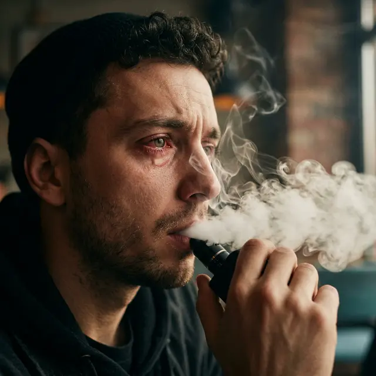

Многие курильщики считают, что если операция была на глазах, то курение никак не повлияет на результат. Это опасное заблуждение. Дым и пар — это агрессивные химические раздражители, которые могут превратить процесс заживления в мучение.

<figure style="text-align: center;">
  
  <figcaption>Клубы густого пара (вейпа) создают на поверхности прооперированного глаза пленку из глицерина и пропиленгликоля, что усиливает сухость и раздражение.</figcaption>
</figure>

### Почему дым и пар опасны?

#### 1. Синдром Сухого Глаза (ССГ)

Никотин вызывает сужение сосудов, что ухудшает питание тканей. Но главная проблема — внешнее воздействие. Табачный дым и пар от вейпа разрушают липидный (жировой) слой слезной пленки. Слеза испаряется мгновенно, оставляя глаз беззащитным.

#### 2. Химическое раздражение роговицы

После LASIK или SMILE роговица лишена нормальной чувствительности. Вы можете не заметить, как дым «разъедает» поверхность глаза, пока не станет слишком поздно. Химические вещества из жидкости для вейпа оседают на свежем разрезе, вызывая микровоспаления.

#### 3. Рефлекторное моргание и зажмуривание

При попадании дыма в глаза мы инстинктивно жмуримся. В первые дни после ЛКЗ резкое сжатие век может привести к **смещению лоскута (флэпа)**.

### В чем коварство вейпа?

Пациенты часто думают, что вейп — это просто «пар», и он безопасен. На самом деле:

- **Глицерин** делает слезную пленку липкой и неоднородной, что затуманивает зрение.
- **Ароматизаторы** могут вызывать аллергическую реакцию конъюнктивы, имитируя инфекцию.

### Реальные риски:

- **Замедленное заживление:** Клетки эпителия медленнее нарастают на поврежденную область.
- **Риск инфекции:** Курильщики чаще трогают лицо и глаза руками, занося бактерии.
- **Постоянная краснота:** Глаза выглядят воспаленными неделями вместо 2–3 дней.

### Рекомендации:

1.  **Первые 48 часов:** Категорический запрет на любое курение и нахождение в накуренных помещениях.
2.  **Первые 2 недели:** Если курить бросить не удается, делайте это на открытом воздухе, чтобы дым не попадал в глаза. Используйте защитные очки.
3.  **Увлажнение:** Если вы курите, количество закапываний увлажняющих капель нужно увеличить вдвое.

**Итог:** Дым в глазах — это прямой путь к осложнениям. Постарайтесь использовать этот период как повод бросить курить или хотя бы максимально ограничить привычку ради своих глаз.
