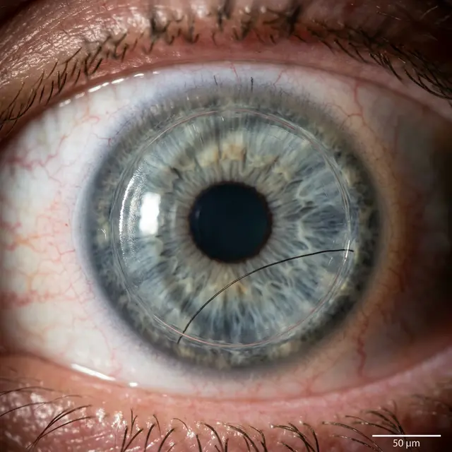

Ситуация, когда под роговичный лоскут (флэп) попадает микроскопическое инородное тело — волос, ресница, ворсинка от медицинской одежды или частица пыли — является классическим интраоперационным или ранним послеоперационным осложнением. Несмотря на то, что это случается редко, последствия для зрения могут быть фатальными при отсутствии своевременной реакции.

## Как это происходит?

Чаще всего «незваный гость» попадает в интерфейс (пространство между лоскутом и основным слоем роговицы) двумя путями:

1.  **Интраоперационно:** Из-за недостаточной гигиены операционного поля, некачественных расходных материалов (ворсистые салфетки) или ошибки ассистента хирурга.
2.  **Сразу после операции:** Если пациент нарушил запрет и коснулся глаза, под лоскут может забиться ресница или частица косметики.

## Чем это грозит?

Организм воспринимает любой посторонний предмет как враждебный агент. Основные риски:

- **Синдром «песков Сахары» (ДЛК):** Диффузный ламеллярный кератит — это стерильное воспаление, которое начинается как реакция на инородное тело. Без лечения это приводит к помутнению роговицы и расплавлению её ткани.
- **Индуцированный астигматизм:** Даже микроскопическая ворсинка создает «бугорок», который искажает поверхность роговицы. Вы будете видеть двоение или мутные пятна.
- **Врастание эпителия:** Если волосинка мешает флэпу плотно прилечь, клетки эпителия с поверхности могут начать расти внутрь, что потребует повторной сложной операции.

## Что делать?

Если вы чувствуете резкое жжение, «песок» или видите странную тень в поле зрения — **срочно к врачу**.

**Алгоритм действий хирурга в клинике:**

1.  **Диагностика:** Осмотр на щелевой лампе под большим увеличением.
2.  **Relifting (поднятие лоскута):** Хирург заново поднимает флэп (дистанция времени здесь критична — чем раньше, тем лучше).
3.  **Промывание интерфейса:** С помощью специального инструмента и стерильного раствора инородное тело вымывается.
4.  **Репозиция:** Лоскут укладывается на место и разглаживается.

## Вердикт

Попадание волосинки под флэп — это не повод для паники, но повод для немедленной ревизии лоскута. Попытки «проморгаться» или закапать капли дома бесполезны: инородное тело находится **внутри** ткани глаза, и достать его может только хирург.
