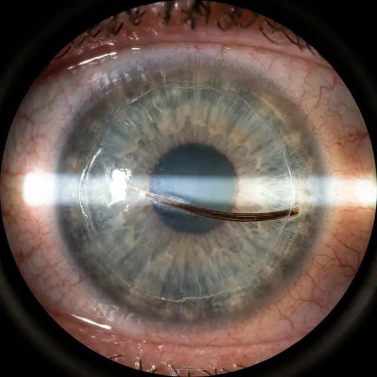

Операционная — это стерильное место, но человек — источник микрочастиц. Иногда под роговичный лоскут (флэп) попадает микроскопический ворс от салфетки, волосок с одежды или собственная ресница пациента. Это серьезное осложнение «интерфейса».

<figure style="text-align: center;">
  
  <figcaption>Крупный план через щелевую лампу: под прозрачным слоем роговицы виден темный волосок. Каждая секунда его нахождения там усиливает риск воспаления.</figcaption>
</figure>

### Как она туда попадает?

1.  **Потоки воздуха:** Статическое электричество может притянуть пылинку или ворс в момент, когда лоскут поднят.
2.  **Инструменты:** Микроворсинки с расходных материалов.
3.  **Ошибка ассистента:** Плохо изолированные ресницы пациента.

### Симптомы «лишнего» под лоскутом:

- Постоянное ощущение песка или колющей боли в конкретной точке.
- Зрение мутное или «двоит» в одном направлении.
- Глаз красный и не успокаивается через 24 часа после операции.
- Светобоязнь выше нормы.

### Чем это грозит?

Волосок — это чужеродный материал.

- **ДЛК (Диффузный ламеллярный кератит):** Мощная иммунная реакция «Пески Сахары».
- **Инфекция:** Волосок не стерилен. Под лоскутом идеальная среда для размножения бактерий.
- **Расплавление стромы:** В тяжелых случаях ткань роговицы может начать разрушаться вокруг инородного тела.

### Лечение: единственный путь

Само не выйдет и не рассосется.
Хирургу необходимо:

1.  Снова зайти в операционную.
2.  Поднять лоскут (флэп).
3.  Тщательно промыть интерфейс антисептическим раствором и удалить волосок специальным пинцетом или канюлей.
4.  Уложить лоскут обратно.

**Хорошая новость:** Если инородное тело удалено в первые 1–2 дня, зрение обычно восстанавливается полностью без последствий.
**Плохая новость:** Если «тянуть» и ждать, что само пройдет, можно получить шрам в центре оптической зоны, который останется с вами навсегда.

**Совет:** Если после LASIK вы чувствуете точечную «колющую» боль — не верьте, что это «просто заживает». Настаивайте на осмотре под микроскопом (щелевой лампой) с пристрастием.
